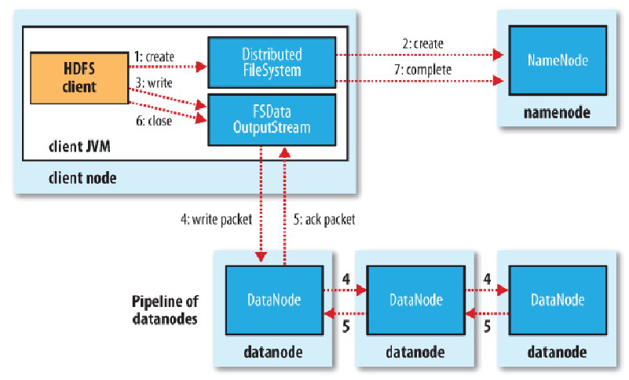
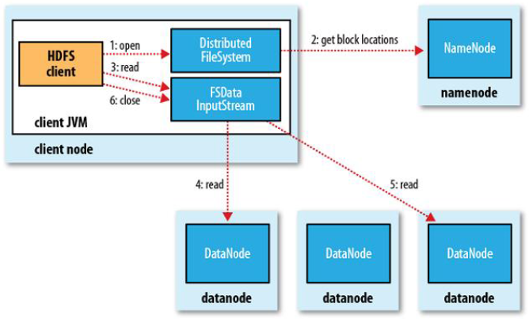
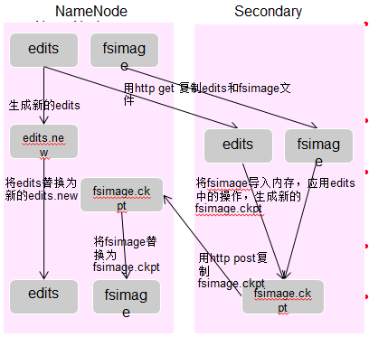
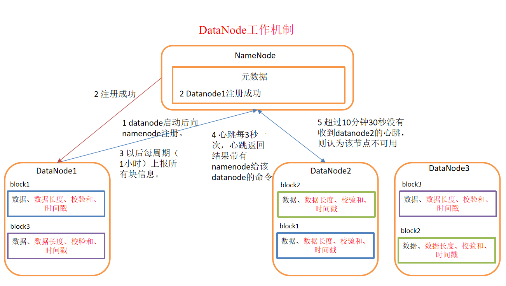
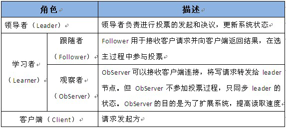
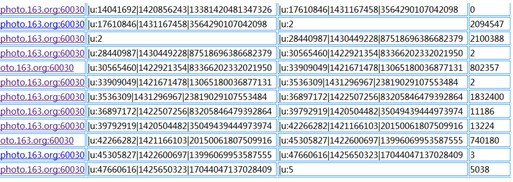

#面试题最终整理
##hadoop联邦机制？小文件处理
##1、hadoop
###1.1 HDFS
==**HDFS的写流程**==
	

	1、hdfs　Client　创建DistributeFileSystem对象,
	２、调用namenode对象，namenode创建一个没有blocks关联的新文件，并且检查该文件是否存在，并且检查客户端是否有权限写入文件，若存在则返回*IO*异常信息,检验通过后，在自己的元数据中为新文件分配文件名，同时为此文件分配数据块的备份数（此备份数可以在搭建时的参数文件中设定，也可以后来改变，系统默认3份），并为不同的备份副本分配不同的DataNode，并生成列表，将列表返回客户端并创建一个FSDataOutputStream对象
	３、FSDataOutputStream协调namenode与datanode向Distribute对象的buffer中写入数据，然后数据被切分为一个个packet，形成data queue 与namenode通信，获取该队列的新的block适合往那些datanode中写入，然后把他们排成pipline，
	４.DataStreamer把packet按队列输出到管道的第一个DataNode中，同时把NameNode生成的列表也带给第一个DataNode，当第1个packet传递完成时（注意是packet而不是整个数据传递完成），第一个DataNode传递信息给第二个DataNode开始把传递完成的pakage以管道的形式再传递给第二个DataNode，同时把除掉第一个DataNode节点信息的列表把传给第二个DataNode，依此类推，直到传递到最后一个DataNode，它会返回Akc到前一个DataNode，
	５、最终由Pipeline中第一个DataNode节点将Pipeline ack发送给Client(此时packet等待队列会将这个packet删除)。
	６.完成向文件写入数据，Client在文件输出流（FSDataOutputStream）对象上调用close方法，关闭流
	７、调用DistributedFileSystem对象的complete方法，通知NameNode文件写入成功。
==**HDFS的读流程**==

	
	１、客户端调用open方法，创建DistributedFileSystem对象
	２、他与nameNode RPC通信，得到块的位置信息(会检查客户端的权限，与是否存在元数据)，同一个块会有多个块位置，但是利用hadoop扩普结构，将离客户端的最近的块位置放在最前面，此时会返回一个FSDATAInputStream对象,该对象可以方便的管理datanode,namenode数据流
	３．客户端调用read方法，FSSteam会选取离client最近的datanode进行连接
	４、数据此时源源不断的流向客户端，
	５、此时如果第一个数据块读完，会立马读取下一个
	６、如果第一批的块读完，会获取下一批的blocks
	７、如果数据块全部读完会关闭所有流

==注意：如果在读数据的时候，DFSInputStream和datanode的通讯发生异常　会尝试正在读的block的排第二近的datanode，并且会记录哪个datanode发生错误，剩余的blocks读的时候就会直接跳过该datanode。
　DFSInputStream也会检查block数据校验和，如果发现一个坏的block,就会先报告到namenode节点，然后DFSInputStream在其他的datanode上读该block的镜像。
该设计的方向就是客户端直接连接datanode来检索数据并且namenode来负责为每一个block提供最优的datanode，namenode仅仅处理block location的请求，这些信息都加载在namenode的内存中，hdfs通过datanode集群可以承受大量客户端的并发访问。
==

==**NAMENODE职责**==
		
		１、NameNode用于存储文件系统的元数据（Metadata）
	文件信息（name、updates、replication factor（副本因子）等）
	文件块的信息和位置 
	文件的访问权限
	集群中文件的数量
	集群中DataNode的数量
		２、负责客户端请求的响应
		３、接受datanode心跳信息＋
==**NAMENODE工作机制**==

		a、第一次启动namenode格式化后，创建fsimage和edits文件，如果不是第一次启动，则直接加载日志和镜像文件到内存
		c、namenode操作日志，更新滚动日志
		d、namenode在内存中对数据进行相应的操作
		e、namenode与secondarynamenode通信是否需要checkpoint
		
==**NAMENODE启动流程**==
namenode保存文件系统的元数据，namenode在内存及磁盘（fsimage 和　editslog）上分别保存一份元数据镜像文件，内存中的元数据镜像保证了hdfs文件系统访问效率，namenode在磁盘上的元数据镜像保证了文件系统的安全性
==fsimage文件==：保存文件系统至上次checkpoint为止目录和文件的元数据
==edits文件==:保存文件系统从上次checkpoint对hdfs所有操作记录日志信息
			
		首次启动：
			格式化namenode,生成fsimage
			将文件系统的fsimage加载到内存中
			启动datanode
			datanode向namenode注册
			datanode向namenode发送块报告
		再次启动：
		　加载磁盘中的fsimage文件与edits日志文件
		　等待	datanode注册信息，与块状态报告，在这个３０s内hdfs在安全模式下，只能读不可以写，datanode3秒内会发送心跳，如果十分钟namenode没收到则　这个datanode不可用。
		　在namenode启动的时候，datanode会收集块信息，如果然后向namenode发送块报告，默认是一个小时一次，如果namenode的收到的块报告与内存元数据的块信息不一致的话，也就是损坏的块，会通过心跳信息告诉datanode删除块，然后退出安全模式
	
==**SecondnameNode工作机制与合并日志流程**==

**工作机制　**
		１、协助Namenode恢复元数据信息
		２、定期合并fsimage与edits文件
		３、保存最新检查点目录与namenode目录相同
		

			

**日志合并**

		１、NameNode相应SecondaryNameNode的checkpoint请求
		２、NameNode生成新的edits文件，NameNode通过http　get方法依次将fsimage,edits文件发送给secondarynamenode
		３、SecondaryNameNode会依次收到fsimage,edits文件存入磁盘
		４、然后在本地中拉取这以上两个文件，进行合并，生成新的镜像文件，并且覆盖旧的fsimage文件（上次checkpoint保存的镜像文件），并将这个镜像文件通过http post发送给namenode（此时secondarynamenode会有两个镜像文件，一个是新生成的，一个是这次拉取到的最新的）
		5、拉取合并后的fimage文件到NN节点，取名：fsimage.ckpt，并放置到current目录中，删除fsimage文件，并更名fsimage.ckpt为fsimage文件，修改edits.new为edits
**datanode工作机制**
	
	
		１、数据块文件的形式保存在本地磁盘上，一个是数据的本身，一个是数据的元信息（数据块的大小，时间戳，以及块数据的校验和）
		２、datanode启动会向namenode注册，并且默认一个小时提供块状态报告，每隔3秒钟主动向namenode发送一个“心跳”，将自己的状态信息告诉master，然后master也是通过这个心跳的返回值，向datanode节点传达指令。如如果十分钟没有收到心跳则认为该datanode不可用

==**怎么离开安全模式**==

##MapReduce
###MR中可干预的组件
###job提交流程
###MR中默认的分区是如何分区的，默认的排序是如何排序的
###两个类TextInputFormat和KeyValueInputFormat的区别是什么？
###什么情况下会进入安全模式
##Yarn
###Yarn的调度方式
FIFO
		最简单、也是默认的调度器。只有一个队列，所有用户共享。
		资源分配的过程也非常简单，先到先得，所以很容易出现一个用户占满集群所有资源的情况。
		可以设置ACL，但不能设置各个用户的优先级。

		优点是简单好理解，缺点是无法控制每个用户的资源使用。
		一般不能用于生产环境中。

CapacityScheduler
		
		在FIFO的基础上，增加多用户支持，最大化集群吞吐量和利用率。它基于一个很朴素的思想：每个用户都可以使用特定量的资源，但集群空闲时，也可以使用整个集群的资源。也就是说，单用户的情况下，和FIFO差不多。
		这种设计是为了提高整个集群的利用率，避免集群有资源但不能提交任务的情况。

		特点：

		划分队列使用xml文件配置，每个队列可以使用特定百分比的资源
		队列可以是树状结构，子队列资源之和不能超过父队列。所有叶子节点的资源之和必须是100%，只有叶子节点能提交任务
		可以为每个队列设置ACL，哪些用户可以提交任务，哪些用户有admin权限。ACL可以继承
		队列资源可以动态变化。最多可以占用100%的资源。管理员也可以手动设置上限。
		配置可以动态加载，但只能添加队列，不能删除
		可以限制整个集群或每个队列的并发任务数量
		可以限定AM使用的资源比例，避免所有资源用来执行AM而只能无限期等待的情况
		当选择队列分配资源时，CapacityScheduler会优先选择资源用量在规定量以下的。
		当选择一个队列中的application分配资源时，CapacityScheduler默认使用FIFO的规则，也可以设定每个app最多占用队列资源的百分比。

		关于CapacityScheduler一个比较重要问题就是百分比是如何计算的。默认的算法是DefaultResourceCalculator类的ratio方法，只考虑了内存。也就是说CapacityScheduler调度时是只考虑内存的。管理员也可以手动设置选择其他算法。

		优点：灵活、集群的利用率高
		缺点：也是灵活。某个用户的程序最多可以占用100%的资源，如果他一直不释放，其他用户只能等待，因为CapacityScheduler不支持抢占式调度，必须等上一个任务主动释放资源。

FairScheduler
		我们一直在用的调度器。设计思路和CapacityScheduler不同，优先保证“公平”，每个用户只有特定数量的资源可以用，不可能超出这个限制，即使集群整体很空闲。

		特点：

		使用xml文件配置，每个队列可以使用特定数量的内存和CPU
		队列是树状结构。只有叶子节点能提交任务
		可以为每个队列设置ACL
		可以设置每个队列的权重
		配置可以动态加载
		可以限制集群、队列、用户的并发任务数量
		支持抢占式调度
		优点：稳定、管理方便、运维成本低
		缺点：相对CapacityScheduler，牺牲了灵活性。经常出现某个队列资源用满，但集群整体还有空闲的情况。整体的资源利用率不高
##ZOOKEEPER
###zookeeper的特性

		a、全局一致性：每个server都保存一份相同的数据，client无论连接那台服务器，都可以得到相同的数据
		b、分布式读写:更新请求转发，有leader实施更新的写操作
		c、更新请求按顺序读写来自同一份的client的更新请求，会按照顺序执行
		d、数据更新原子性：一次数据要么成功，要么失败
		e、实时性:在一定时间范围内，client读的都是最新的
		
###zookeeper的应用场景
####数据的发布与订阅
顾名思义就是同步数据，生产者就消息或者配置信息发布在zookeeper上供订阅者去消费
		
		应用１：日志的存储，可以将产生的日志放在zookeeper上，供其他消费者去存储	
		应用２：业务逻辑上的全局变量，比如消息消息中间键的offset，这样当前zk集群发送者知道发送进度
		应用３：集群的节点状态保存，供客户端使用

####分布的通知/协调
	ZooKeeper 中特有watcher注册与异步通知机制，能够很好的实现分布式环境下不同系统之间的通知与协调，实现对数据变更的实时处理，采用分布式通知协调更好的降低了不同系统的耦合性。

####分布式锁
得益于zookeeper的强一致性，任一时刻一个zkServer上的node上的数据一定相同

		保持独占：通常获取对一个znode操作就只有一个创建这个节点的客户端获取了这个锁
		控制时序：
==实现原理：==

####集群管理
集群机器的监控：如果某节点发生变化，会及时告诉客户端

	利用ZooKeeper有两个特性，就可以实时另一种集群机器存活性监控系统：a. 客户端在节点 x 上注册一个Watcher，那么如果 x 的子节点变化了，会通知该客户端。b. 创建EPHEMERAL类型的节点，一旦客户端和服务器的会话结束或过期，那么该节点就会消失
　
　master的选举:
　
		对于同一业务逻辑，会交给一个节点去完成，其他节点共享这个结果，减少了IO,提高了性能，这也是master集群的好处
	
###zookeeper的命名服务？
	
		在zookeeper的文件系统里创建一个目录，有唯一的目录，可以通过path互相探索发现
		这个主要是作为分布式命名服务。通过调用create node api ，能够很容易创建一个全局唯一的path，这个path可以作为一个名称
###configuration 配置管理？

		把这下配置都放在zookeeper上，保存在zooKepeer上的某个目录节点，然后相关应用对这个目录节点进行监听，一旦配置信息发生变化，每个应用程序都会收到ZooKeeeper的通知,然后把最新的析配置信息应用带系统中就好。

###GroupMembers 集群管理？
zookepeer的集群关，管理关心两点：是否有机器加入,选举master
		
		第一点：所有机器都约定在GroupMember下创建临时目录节点，然后父目录节点的子节点变化消息，一旦有机器挂掉，该机器与zookeeper断开连接，他创建的临时目录节点会被删除，所有其他机器都收到通知：某个兄弟目录被删除，于是所有人知道了。加入新机器也是
		第二点：所有机器创建临时顺序编号目录节点，通过master选举算法选举出来

####zookeeper是怎么保证自身高可用的？
####Observer有什么作用
####描述zookeeper都有那些角色啊？

####描述znode的数据在哪里存放？
####描述HA，怎么预防脑裂？怎么解决脑裂的（Fencing机制）？HA怎么使用联邦机制（Federation机制）？
#####为什么是HA?
在HDFS中，存在一个namenode与secondary保存了对元数据的可靠性，但是可用性存在问题，如果nameNode单点故障。所以就引入了HA

在HA架构中有一个非常重非要的问题，就是需要保证同一时刻只有一个处于Active状态的Namenode，否则机会出现两个Namenode同时修改命名空间的问，也就是脑裂（Split-brain）。脑裂的HDFS集群很可能造成数据块的丢失，以及向Datanode下发错误的指令等异常情况　　　　　　　　　　　　　　　　　　　　　　　　
	这是个大问题：
	
	
		
####zookeeper的leader选举机制？
zookeeper提供了三种leader选举机制
	１、LeaderElection
	2、AuthFastLeaderElection
	3、FastLeaderElection
	默认的的第三种，这里就研究第三种
	
		选举中涉及的概念：
			a、服务器ID：编号越大，在选择算法的中的权重就越大
			b、数据ID：服务器中存放的最大数据ID，服务器状态更新一次就加一次,值越大说明这个数据越新，在选举过程中数据越新，则他权重就越大
			c、逻辑时钟（投票的次数）:同一轮中投票的过程中的逻辑时钟值是相同的。每投完一次逻辑时钟就会增加，然后与其他服务器返回的投票信息中的数据相比，根据不同的值做出不同的判断
			d、＋选举状态:
				Looking:竞选状态
				Following:随从状态，参与选举
				Observing:观察状态，不参与选举
				Leading:领导者状态
		投票完后会将以下的投票消息发送给所有的服务器
				服务器ID
				数据ID
				逻辑时钟
				选举状态
		××××刚开始启动的时候选举过程：
			1、首先会给自己投一票，逻辑时钟加一次，然后广播投票信息，获取其他服务器的投票信息，
			２、接收来自各个服务器的投票 
			每个服务器都会接收来自其他服务器的投票。集群中的每个服务器在接收到投票后，先判断该投票的有效性，包括检查是否是本轮投票（逻辑时钟）、是否来自LOOKING状态的服务器
			３、处理投票 
			在接收到来自其他服务器的投票后，针对每一个投票，服务器都需要将别人的投票和自己的投票进行PK，PK的规则如下 优先检查ZXID（数据版本）。ZXID比较大的服务器优先作为Leader 如果ZXID相同的话，那么就比较myid。myid比较大的服务器作为Leader服务器，如果投票结果与上一次一样就发送上次结果。
			４、统计投票
				每次投票后，服务器都会统计所有投票，判断是否已经有过半的机器接收到相同的投票信息
				满足（n/2+1)　>２ 
			5、改变服务器状态 
			一旦确定了Leader，每个服务器就会更新自己的状态：如果是Follower,那么就变更为FOLLOWING,如果是Leader，那么就变更为LEADING.
		
		

		
		
1、通过get方式，指定rowkey获取唯一一条记录 
2、通过scan方式，设置startRow和stopRow参数进行范围匹配 
3、全表扫描，即直接扫描整张表中所有行记录
	
###1.1 HBASE
####rowkey的设计？
#####为什么要对rowkey进行设计？

	
		上面是HBase下某张表的region请求分布情况，从中我们明显可以看到，部分region的请求数量为0，而部分的请求数量可以上百万，这是一个典型的热点问题。 
		what热点问题：
			HBase中的行是按照rowkey的字典顺序排序的，这种设计优化了scan操作，可以将相关的行以及会被一起读取的行存取在临近位置，便于scan。然而糟糕的rowkey设计是热点的源头。热点发生在大量的client直接访问集群的一个或极少数个节点（访问可能是读，写或者其他操作）。大量访问会使热点region所在的单个机器超出自身承受能力，引起性能下降甚至region不可用，这也会影响同一个RegionServer上的其他region，由于主机无法服务其他region的请求。设计良好的数据访问模式以使集群被充分，均衡的利用。为了避免写热点，设计rowkey使得不同行在同一个region，但是在更多数据情况下，数据应该被写入集群的多个region，而不是一个。

==RowKey的设计原则：==
	rowkey长度原则:长度不益过大，过大导致才rowkey会占一定的存储空间影响HFILE的存储效率，Memstore也不会缓存太多
	rowkey散列原则:将前缀散列，可以对regionserver负载均衡
	rowkey唯一原则:必须在设计上保证其唯一性，rowkey是按照字典顺序排序存储的，因此，设计rowkey的时候，要充分利用这个排序的特点，将经常读取的数据存储到一块，将最近可能会被访问的数据放到一块。

==常见的手段==

		加盐操作:前面加随机数，直接打乱
		哈希:前缀加hash码，可以通过hash码重构，查找出来
		反转:讲最没有意义的字符或者数字放在前面 ,应为rowkey的堆积一般都在最后
		时间戳反转: 
			目的：快速获取数据的最近版本　【userid反转】[long.maxvalue-时间戳]　，这也可以查出某个用户的某段时间的数据
			

	
	