### mapreduce快速入门


#### 第一节：mapreduce概述

mapreduce：分布式并行离线计算框架，是一个分布式运算程序的编程框架，是用户开发“基于hadoop的数据分析应用”的核心框架；Mapreduce核心功能是将用户编写的业务逻辑代码和自带默认组件整合成一个完整的分布式运算程序，并发运行在一个hadoop集群上；

- 与HDFS解决问题的原理类似，HDFS是将大的文件切分成若干小文件，然后将它们分别存储到集群中各个主机中。
- 同样原理，mapreduce是将一个复杂的运算切分成若个子运算，然后将它们分别交给集群中各个主机，由各个主机并行运算。

##### 1.1 mapreduce产生的背景

- 海量数据在单机上处理因为硬件资源限制，无法胜任。
- 而一旦将单机版程序扩展到集群来分布式运行，将极大增加程序的复杂度和开发难度。
- 引入mapreduce框架后，开发人员可以将绝大部分工作集中在业务逻辑的开发上，而将分布式计算中的复杂性交由框架来处理。

##### 1.2 mapreduce编程模型

- 一种分布式计算模型。

- MapReduce将这个并行计算过程抽象到两个函数。

  - Map（映射）：对一些独立元素组成的列表的每一个元素进行指定的操作，可以高度并行。
  - Reduce（化简 归约）：对一个列表的元素进行合并。

- 一个简单的MapReduce程序只需要指定map（）、reduce（）、input和output，剩下的事由框架完成。

  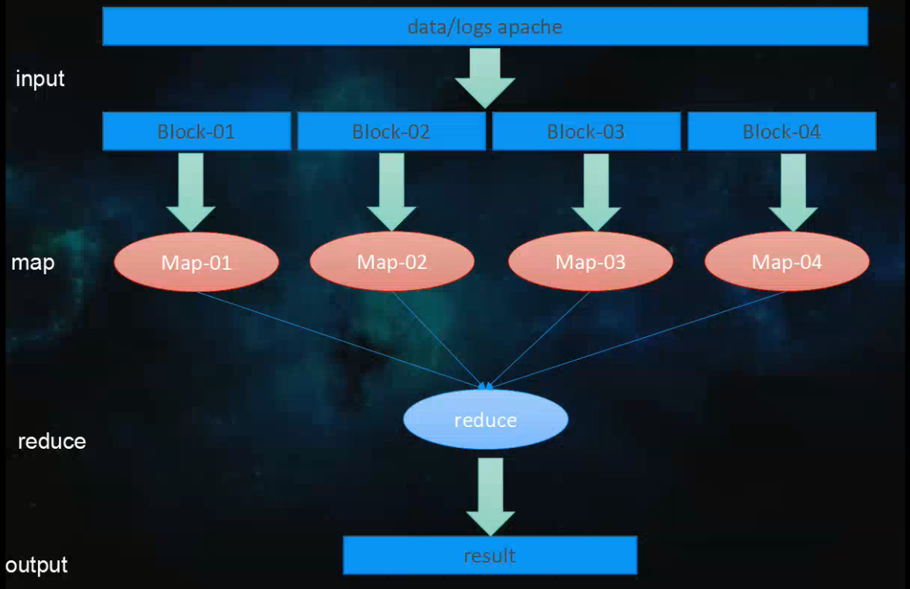

  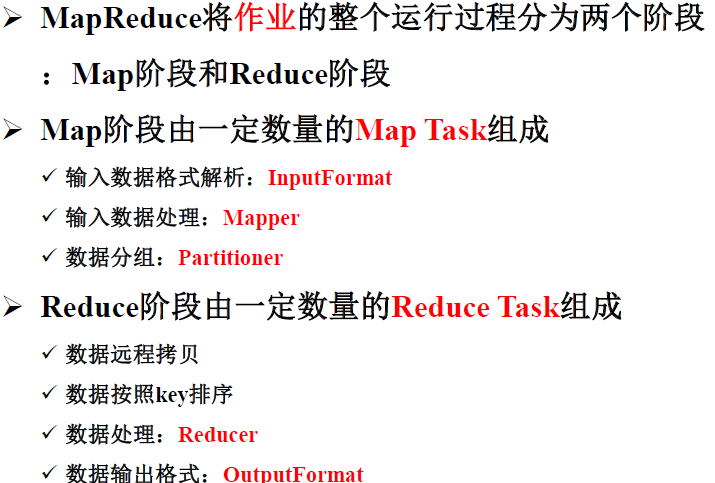


##### 1.3 Mapreduce的几个关键名词

- Job ：用户的每一个计算请求称为一个作业。
- Task：每一个作业，都需要拆分开了，交由多个主机来完成，拆分出来的执行单位就是任务。
- Task又分为如下三种类型的任务：
  - Map：负责map阶段的整个数据处理流程

  - Reduce：负责reduce阶段的整个数据处理流程

  - MRAppMaster：负责整个程序的过程调度及状态协调

    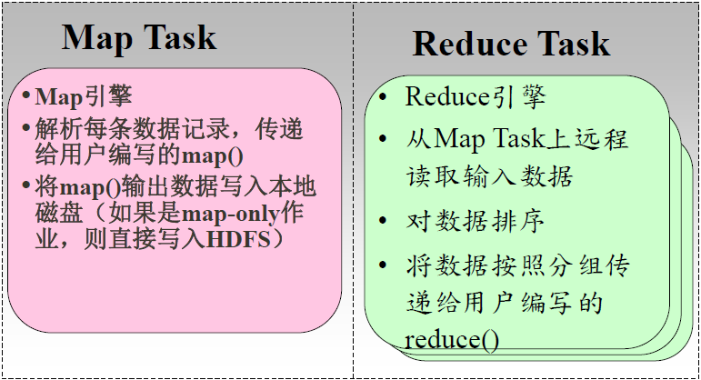

##### 1.4 mapreduce程序运行流程

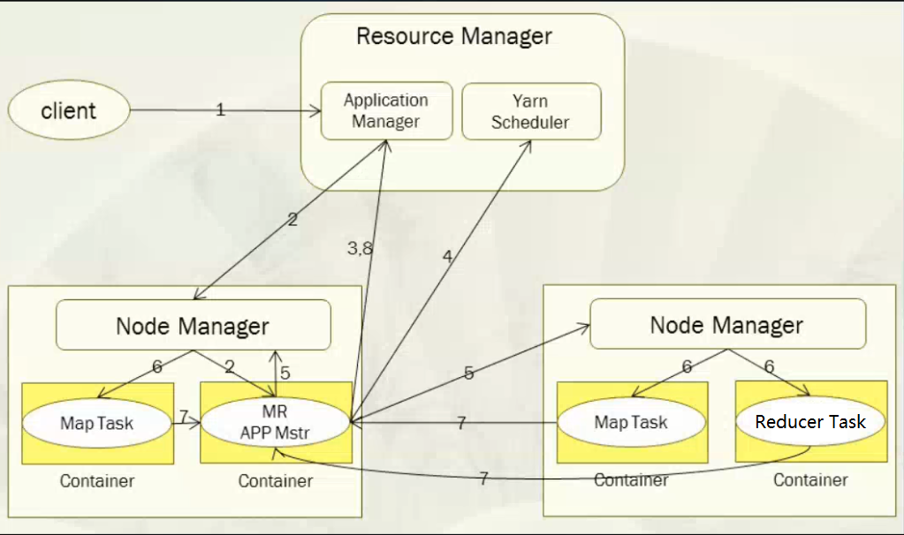

具体流程说明：

1.  一个mr程序启动的时候，最先启动的是MRAppMaster，MRAppMaster启动后根据本次job的描述信息，计算出需要的maptask实例数量，然后向集群申请机器启动相应数量的maptask进程
2. maptask进程启动之后，根据给定的数据切片范围进行数据处理，主体流程为：
   - 利用客户指定的inputformat来获取RecordReader读取数据，形成输入KV对。
   - 将输入KV（k是文件的行号，v是文件一行的数据）对传递给客户定义的map()方法，做逻辑运算，并将map()方法输出的KV对收集到缓存。
   - 将缓存中的KV对按照K分区排序后不断溢写到磁盘文件
3.  MRAppMaster监控到所有maptask进程任务完成之后，会根据客户指定的参数启动相应数量的reducetask进程，并告知reducetask进程要处理的数据范围（数据分区）
4. Reducetask进程启动之后，根据MRAppMaster告知的待处理数据所在位置，从若干台maptask运行所在机器上获取到若干个maptask输出结果文件，并在本地进行重新归并排序，然后按照相同key的KV为一个组，调用客户定义的reduce()方法进行逻辑运算，并收集运算输出的结果KV，然后调用客户指定的outputformat将结果数据输出到外部存储

##### 1.5 编写MapReduce程序

- 基于MapReduce 计算模型编写分布式并行程序非常简单，程序员的主要编码工作就是实现Map 和Reduce函数。

- 其它的并行编程中的种种复杂问题，如分布式存储，工作调度，负载平衡，容错处理，网络通信等，均由YARN框架负责处理。

- MapReduce中，map和reduce函数遵循如下常规格式：

  ```java
  map: (K1, V1) → list(K2, V2)
  reduce: (K2, list(V2)) → list(K3, V3)
  ```

- Mapper的接口：

  ```java
  protected void map(KEY key, VALUE value, Context context) 
      throws IOException, InterruptedException {  
  }
  ```

-  Reduce的接口：

  ```java
  protected void reduce(KEY key, Iterable<VALUE> values,
  		 Context context) throws IOException, InterruptedException { 
  }
  ```

- Mapreduce程序代码基本结构

  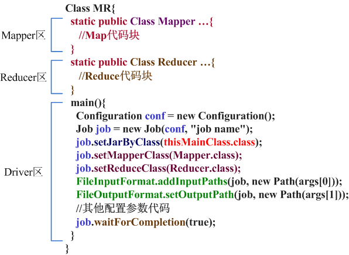


#### 第二节 maprecue实例开发

##### 2.1 编程步骤

1. 用户编写的程序分成三个部分：Mapper，Reducer，Driver(提交运行mr程序的客户端)

2. Mapper的输入数据是KV对的形式（KV的类型可自定义）

3. Mapper的输出数据是KV对的形式（KV的类型可自定义）

4. Mapper中的业务逻辑写在map()方法中

5. map()方法（maptask进程）对每一个<K,V>调用一次

6. Reducer的输入数据类型对应Mapper的输出数据类型，也是KV

7. Reducer的业务逻辑写在reduce()方法中

8. Reducetask进程对每一组相同k的<k,v>组调用一次reduce()方法

9. 用户自定义的Mapper和Reducer都要继承各自的父类

10. 整个程序需要一个Drvier来进行提交，提交的是一个描述了各种必要信息的job对象

    

##### 2.2 经典的wordcount程序编写

1. 需求：有一批文件（规模为TB级或者PB级），如何统计这些文件中所有单词出现次数

   如有三个文件，文件名是qf_course.txt、qf_stu.txt 和 qf_teacher

   qf_course.txt内容：

   ```
   php java linux
   bigdata VR
   C C++ java web
   linux shell
   ```

   qf_stu.txt内容：

   ```
   tom jim lucy
   lily sally
   andy
   tom jim sally
   ```

   qf_teacher内容：

   ```
   jerry Lucy tom
   jim
   ```

2. 方案

   - 分别统计每个文件中单词出现次数 - map（）
   - 累加不同文件中同一个单词出现次数 - reduce（）

3. 实现代码

   - [ ] 创建一个简单的maven项目

   - [ ] 添加hadoop client依赖的jar，pom.xml主要内容如下：

     ```xml
     <dependencies>
     		<dependency>
     			<groupId>org.apache.hadoop</groupId>
     			<artifactId>hadoop-client</artifactId>
     			<version>2.7.1</version>
     		</dependency>
     		
     		<dependency>
     			<groupId>junit</groupId>
     			<artifactId>junit</artifactId>
     			<version>4.11</version>
     			<scope>test</scope>
     		</dependency>		
     </dependencies>
     ```

     ​

   - [ ] 编写代码

   - 自定义一个mapper类

     ```java
     import java.io.IOException;
     
       import org.apache.hadoop.io.IntWritable;
       import org.apache.hadoop.io.LongWritable;
       import org.apache.hadoop.io.Text;
       import org.apache.hadoop.mapreduce.Mapper;
     
       /**
        * Maper里面的泛型的四个类型从左到右依次是：
        * 
        * LongWritable KEYIN: 默认情况下，是mr框架所读到的一行文本的起始偏移量，Long,  类似于行号但是在hadoop中有自己的更精简的序列化接口，所以不直接用Long，而用LongWritable 
        * Text VALUEIN:默认情况下，是mr框架所读到的一行文本的内容，String，同上，用Text
        *
        * Text KEYOUT：是用户自定义逻辑处理完成之后输出数据中的key，在此处是单词，String，同上，用Text
        * IntWritable VALUEOUT：是用户自定义逻辑处理完成之后输出数据中的value，在此处是单词次数，Integer，同上，用IntWritable
        */
       public class WordcountMapper extends Mapper<LongWritable, Text, Text, IntWritable>{
     
       	/**
       	 * map阶段的业务逻辑就写在自定义的map()方法中
       	 * maptask会对每一行输入数据调用一次我们自定义的map()方法
       	 */
       	@Override
       	protected void map(LongWritable key, Text value, Context context) throws IOException, InterruptedException {
       		
       		//将maptask传给我们的一行的文本内容先转换成String
       		String line = value.toString();
       		//根据空格将这一行切分成单词
       		String[] words = line.split(" ");
       	
       		/**
       		 *将单词输出为<单词，1> 
       		 *如<lily,1> <lucy,1>  <c,1> <c++,1> <tom,1> 
       		 */
       		for(String word:words){
       			//将单词作为key，将次数1作为value，以便于后续的数据分发，可以根据单词分发，以便于相同单词会到相同的reduce task
       			context.write(new Text(word), new IntWritable(1));
       		}
       	}
       }
     ```

     ​

   - 自定义一个reduce类

     ```java
      import java.io.IOException;
     
       import org.apache.hadoop.io.IntWritable;
       import org.apache.hadoop.io.Text;
       import org.apache.hadoop.mapreduce.Reducer;
     
       /**
        * Reducer里面的泛型的四个类型从左到右依次是：
        * 	Text KEYIN: 对应mapper输出的KEYOUT
        * 	IntWritable VALUEIN: 对应mapper输出的VALUEOUT
        * 
        * 	KEYOUT, 是单词
        * 	VALUEOUT 是自定义reduce逻辑处理结果的输出数据类型，是总次数
        */
       public class WordcountReducer extends Reducer<Text, IntWritable, Text, IntWritable>{
     
       	/**
       	 * <tom,1>
       	 * <tom,1>
       	 * <linux,1>
       	 * <banana,1>
       	 * <banana,1>
       	 * <banana,1>
       	 * 入参key，是一组相同单词kv对的key
       	 * values是若干相同key的value集合
       	 * 如 <tom,[1,1]>   <linux,[1]>   <banana,[1,1,1]>
       	 */
       	@Override
       	protected void reduce(Text key, Iterable<IntWritable> values, Context context) throws IOException, InterruptedException {
     
       		int count=0;  //累加单词的出现的次数
       		
       		for(IntWritable value:values){
       			count += value.get();
       		}
       		context.write(key, new IntWritable(count));	
       	}	
       }
     ```

     ​

   - 编写一个Driver类

     ~~~java
       import org.apache.hadoop.conf.Configuration;
       import org.apache.hadoop.fs.Path;
       import org.apache.hadoop.io.IntWritable;
       import org.apache.hadoop.io.Text;
       import org.apache.hadoop.mapreduce.Job;
       import org.apache.hadoop.mapreduce.lib.input.FileInputFormat;
       import org.apache.hadoop.mapreduce.lib.output.FileOutputFormat;
     
       /**
        * 相当于一个yarn集群的客户端
        * 需要在此封装我们的mr程序的相关运行参数，指定jar包
        * 最后提交给yarn
        */
       public class WordcountDriver {
       	/**
       	 * 该类是运行在hadoop客户端的，main一运行，yarn客户端就启动起来了，与yarn服务器端通信
       	 * yarn服务器端负责启动mapreduce程序并使用WordcountMapper和WordcountReducer类
       	 */
       	public static void main(String[] args) throws Exception {
       		//此代码需要两个输入参数  第一个参数支持要处理的源文件；第二个参数是处理结果的输出路径
       		if (args == null || args.length == 0) {
       			args = new String[2];
                  //路径都是 hdfs系统的文件路径
       			args[0] = "hdfs://192.168.18.64:9000/wordcount/input/";
       			args[1] = "hdfs://192.168.18.64:9000/wordcount/output";
       		}
       		/**
       		 * 什么也不设置时，如果在安装了hadoop的机器上运行时，自动读取
       		 * /home/hadoop/app/hadoop-2.7.1/etc/hadoop/core-site.xml
       		 * 文件放入Configuration中
       		 */
       		Configuration conf = new Configuration();
       		Job job = Job.getInstance(conf);
       		
       		//指定本程序的jar包所在的本地路径
       		job.setJarByClass(WordcountDriver.class);
       		
       		//指定本业务job要使用的mapper业务类
       		job.setMapperClass(WordcountMapper.class);
       		//指定mapper输出数据的kv类型
       		job.setMapOutputKeyClass(Text.class);
       		job.setMapOutputValueClass(IntWritable.class);
             
              //指定本业务job要使用的Reducer业务类
              job.setReducerClass(WordcountReducer.class);
       		//指定最终输出的数据的kv类型
       		job.setOutputKeyClass(Text.class);
       		job.setOutputValueClass(IntWritable.class);
       		
       		//指定job的输入原始文件所在目录
       		FileInputFormat.setInputPaths(job, new Path(args[0]));
       		//指定job的输出结果所在目录
       		FileOutputFormat.setOutputPath(job, new Path(args[1]));
       		
       		//将job中配置的相关参数，以及job所用的java类所在的jar包，提交给yarn去运行
       		/*job.submit();*/
       		boolean res = job.waitForCompletion(true);
       		System.exit(res?0:1);	
       	}
       }
     ~~~

   - [ ] 运行此程序的步骤

     1. 将此程序打包  名为wordcount.jar  

        第一步

        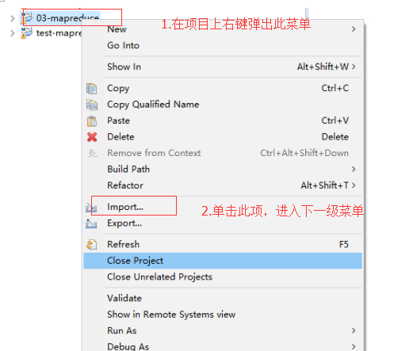

        第二步

        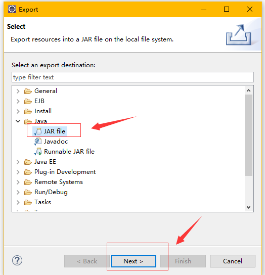

        第三步

        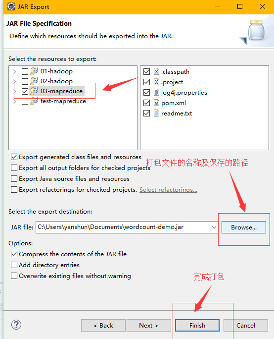

        

     2. 上传wordcount.jar到名为min1机器的/home/hadoop目录下

        

     3. 在hdfs上创建文件夹“/wordcount/input”，并将三个文件（qf_course.txt、qf_stu.txt 和 qf_teacher）上传到hdfs的“/wordcount/input”目录下

        ```shell
        hadoop  fs  mkdir  -p  /wordcount/input
        hadoop  fs  –put  qf_course.txt  /wordcount/input
        hadoop  fs  –put  qf_stu.txt  /wordcount/input
        hadoop  fs  –put  qf_teacher.txt  /wordcount/input
        ```

     4. 在/home/hadoop下启动wordcount.jar运行

        ```shell
        hadoop jar wordcount.jar 包名.WordcountDriver /wordcount/input  /wordcount/output
        或者
        yarn  jar wordcount.jar 包名.WordcountDriver /wordcount/input  /wordcount/output
        ```

     5. 在hadoop的/wordcount/output下生成两个文件  如下：

        ​	_SUCCESS      //表示计算成功

        ​	part-r-00000  //处理结果文件 

     6. 查看结果    

        ```shell
        hadoop fs -cat /wordcount/output/part-r-00000		#结果如下
        	Hello 4
        	ketty 2
        	tom   2
        	jim   1
        	word  1
        ```
        

4. wordcount处理过程

   1. 将文件拆分成splits，由于测试用的文件较小，所以每个文件为一个split，并将文件按行分割形成<key,value>对，下图所示。这一步由MapReduce框架自动完成，其中偏移量（即key值）包括了回车所占的字符数（Windows/Linux环境不同）。

   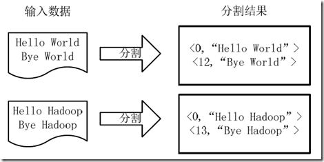

   2. 将分割好的<key,value>对交给用户定义的map方法进行处理，生成新的<key,value>对，下图所示。

      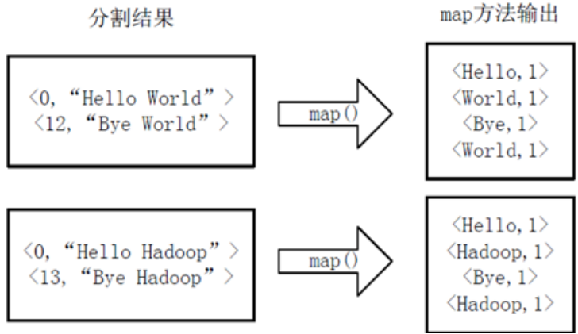

   3. 得到map方法输出的<key,value>对后，Mapper会将它们按照key值进行排序，并执行Combine过程，将key至相同value值累加，得到Mapper的最终输出结果。下图所示。

      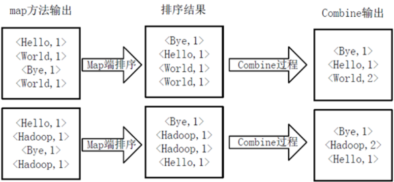

   4. Reducer先对从Mapper接收的数据进行排序，再交由用户自定义的reduce方法进行处理，得到新的<key,value>对，并作为WordCount的输出结果，下图所示。

      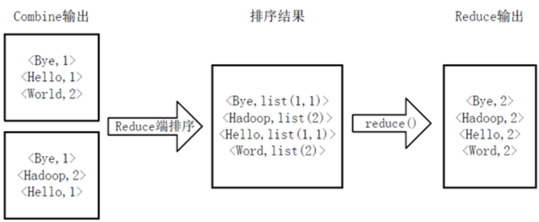


##### 2.3 案例-统计最高温度

1. 需求：求给定日期的最高温度

   待处理数据内容：

   ```text
   201701082.6
   201701066
   2017020810                   				
   2017030816.33
   2017060833.0               
   ```

   每一行的前8位是日期，从第8位往后是温度

   

2. 思路

   ```
   （1）在map中，将每行的内容截取第8位到最后一位的内容，获取温度的值
   （2）在map中，将温度值以key-value形式输出
   		思考这个温度值作为key呢还是作为value呢？
   （3）在reduce中取出温度值最大的那个，并输出出去。
   ```

   

3. 代码

   ```java
   import java.io.IOException;
   import org.apache.hadoop.conf.Configuration;
   import org.apache.hadoop.fs.Path;
   import org.apache.hadoop.io.Text;
   import org.apache.hadoop.mapreduce.Job;
   import org.apache.hadoop.mapreduce.Mapper;
   import org.apache.hadoop.mapreduce.Reducer;
   import org.apache.hadoop.mapreduce.lib.input.FileInputFormat;
   import org.apache.hadoop.mapreduce.lib.output.FileOutputFormat;
   
   public class HighTem {
       
   	public static class MyMapper extends Mapper<Object, Text, Text,Text>{
   		@Override
   		protected void map(Object key, Text value,Context context)
   				throws IOException, InterruptedException {
   			String line = value.toString();
   			String tmp = line.substring(8, line.length());
   			context.write(new Text(""), new Text(tmp));
   		}
   	}
   	
   	public static class MyReducer extends Reducer<Text, Text, Text, Text>{
           /**
   		* map传递过来的数据格式   < "" , {2.6,6,10} >
   		*/
   		@Override
   		protected void reduce(Text key, Iterable<Text> value,Context context)
   				throws IOException, InterruptedException {
   			
   			double max = Double.MIN_VALUE;
   			//获取最大值
   			for (Text t : value) {
   				if(max < Double.parseDouble(t.toString())){
   					max = Double.parseDouble(t.toString());
   				}
   			}
   			context.write(new Text(max+""), new Text(""));
   		}
   	}
   	
   	public static void main(String[] args) {
   		try {
   			Configuration conf = new Configuration();
   		
   			Job job = new Job(conf, "HighTemp");
   			job.setJarByClass(HighTem.class);
   			
   			//当map的输出类型与reduce的输出类型完全相同时，设置map的输出类型语句可以省略
                //本例的map与reduce输出的key类型是Text，value的类型是Text；输出类型一致
   			job.setMapperClass(MyMapper.class);
   			FileInputFormat.addInputPath(job, new Path(args[0]));
   			
   			job.setReducerClass(MyReducer.class);
   			job.setOutputKeyClass(Text.class);
   			job.setOutputValueClass(Text.class);
   			FileOutputFormat.setOutputPath(job, new Path(args[1]));
   			
   			int isok = job.waitForCompletion(true)?0:1;
   			//退出job
   			System.exit(isok);
   			
   		} catch (IOException | ClassNotFoundException | InterruptedException e) {
   			e.printStackTrace();
   		}
   	}
   }
   
   ```

4. 思考：

   上述算法有什么问题吗？

   ​	待处理文件非常非常大，是不是将所有计算压力都放在了reduce端？那能不能在每个map中求出一个最高温度，然后再reduce中比较每个map的最高温度，再计算出所有数据的最高温度呢！

   

   

##### 2.4 案例-求平均成绩

1. 待处理数据内容：

   ```
   名字    语文     数学    英语     
    lh 92 68 70     
   zyt 94 88 75
    ls 96 78 78
   hgw 90 70 56
   yxx 80 88 73
    hz 90 98 70
   xyd 60 88 73
   hj 90 58 70
   cs 50 58 11
   ```

   

2. 需求：算每个人的平均成绩？

3. 思路：将每个人的成绩相加，除以3即可

4. 代码

   ```java
   import java.io.IOException;
   import org.apache.hadoop.conf.Configuration;
   import org.apache.hadoop.fs.Path;
   import org.apache.hadoop.io.LongWritable;
   import org.apache.hadoop.io.Text;
   import org.apache.hadoop.mapreduce.Job;
   import org.apache.hadoop.mapreduce.Mapper;
   import org.apache.hadoop.mapreduce.lib.input.FileInputFormat;
   import org.apache.hadoop.mapreduce.lib.output.FileOutputFormat;
   
   public class AvgDemo {
       
   		//自定义myMapper
   		public static class MyMapper extends Mapper<LongWritable, Text, Text, Text>{
   			//只在map方法运行之前执行一次。(仅执行一次)
   			@Override
   			protected void setup(Context context)
   					throws IOException, InterruptedException {
   			}
   			
   			Text k = new Text();
   			Text v = new Text();
   			
   			@Override
   			protected void map(LongWritable key, Text value,Context context)
   					throws IOException, InterruptedException {
   				String line = value.toString();
   				String [] scores = line.split("\t");
   				String name = scores[0];
   				String chinese = scores[1];
   				String math = scores[2];
   				String english = scores[3];
   				double avg = (Integer.parseInt(chinese) + Integer.parseInt(math) + 
   						Integer.parseInt(english)) / ((scores.length-1)*1.0);
   				k.set(name);
   				v.set(avg+"");
   				context.write(k,v);
   				
   			}
   			
   			//map方法运行完后执行一次(仅执行一次)
   			@Override
   			protected void cleanup(Context context)
   					throws IOException, InterruptedException {
   			}
   		}
   		/*
   		//自定义myReducer，本例直接使用mapper就可以处理业务逻辑，因此reducer可以省略
   		public static class MyReducer extends Reducer<Text, Text, Text, Text>{
   			//在reduce方法执行之前执行一次。(仅一次)
   			@Override
   			protected void setup(Context context)
   					throws IOException, InterruptedException {
   			}
   
   			@Override
   			protected void reduce(Text key, Iterable<Text> value,Context context)
   					throws IOException, InterruptedException {
   			}
   			//在reduce方法执行之后执行一次。(仅一次)
   			@Override
   			protected void cleanup(Context context)
   					throws IOException, InterruptedException {
   			}
   		}
   		*/
   		/**
   		 * job的驱动方法
   		 * @param args
   		 */
   		public static void main(String[] args) {
   			try {
   				//1、获取Conf
   				Configuration conf = new Configuration();
   				//2、创建job
   				Job job = Job.getInstance(conf, "model01");
   				//3、设置运行job的class
   				job.setJarByClass(AvgDemo.class);
   				//4、设置map相关属性
   				job.setMapperClass(MyMapper.class);
   				job.setMapOutputKeyClass(Text.class);
   				job.setMapOutputValueClass(Text.class);
   				FileInputFormat.addInputPath(job, new Path(args[0]));
   				
   				//5、设置reduce相关属性
   				/*job.setReducerClass(MyReducer.class);
   				job.setOutputKeyClass(Text.class);
   				job.setOutputValueClass(Text.class);*/
   				FileOutputFormat.setOutputPath(job, new Path(args[1]));
   				
   				//6、提交运行job
   				int isok = job.waitForCompletion(true) ? 0 : 1;
   				
   				//退出
   				System.exit(isok);
   				
   			} catch (IOException | ClassNotFoundException | InterruptedException e) {
   				e.printStackTrace();
   			}
   		}
   }
   ```

   

##### 2.5 案例-求每个学科的平均成绩

1. 测试数据同上

2. 思路：将各科成绩累加后，除以总人数

   注意：当所有学生的数据，由一个map处理的话比较简单，当由多个map处理的话，相应的算法要调整，否则会得出错误的结论。

3. 代码

   ```java
   import java.io.IOException;
   import org.apache.hadoop.conf.Configuration;
   import org.apache.hadoop.fs.Path;
   import org.apache.hadoop.io.LongWritable;
   import org.apache.hadoop.io.Text;
   import org.apache.hadoop.mapreduce.Job;
   import org.apache.hadoop.mapreduce.Mapper;
   import org.apache.hadoop.mapreduce.Reducer;
   import org.apache.hadoop.mapreduce.lib.input.FileInputFormat;
   import org.apache.hadoop.mapreduce.lib.output.FileOutputFormat;
   /**
   	每个学科的平均成绩？
   		语文	数学	英语
   		 76   89	90
    */
   public class AvgDemo02 {
   	//自定义myMapper
   		public static class MyMapper extends Mapper<LongWritable, Text, Text, Text>{
   			//只在map方法运行之前执行一次。(仅执行一次)
   			@Override
   			protected void setup(Context context)
   					throws IOException, InterruptedException {
   			}
   			
   			Text k = new Text();
   			Text v = new Text();
   			@Override
   			protected void map(LongWritable key, Text value,Context context)
   					throws IOException, InterruptedException {
   				String line = value.toString();
   				String scores [] = line.split("\t");
   				String chinese = scores[1];
   				String math = scores[2];
   				String english = scores[3];
   				k.set("_");
   				v.set(chinese+"_"+math+"_"+english);
   				context.write(k, v);
   			}
   			
   			//map方法运行完后执行一次(仅执行一次)
   			@Override
   			protected void cleanup(Context context)
   					throws IOException, InterruptedException {
   			
   			}
   		}
   		
   		//自定义myReducer
   		public static class MyReducer extends Reducer<Text, Text, Text, Text>{
   			//在reduce方法执行之前执行一次。(仅一次)
   			@Override
   			protected void setup(Context context)
   					throws IOException, InterruptedException {
   				context.write(new Text("语文"+"\t"+"数学"+"\t"+"英语"), new Text(""));
   			}
   
   			@Override
   			protected void reduce(Text key, Iterable<Text> value,Context context)
   					throws IOException, InterruptedException {
   				int counter = 0;
   				double c = 0;
   				double m = 0;
   				double e = 0;
   				for (Text t : value) {
   					String scores [] =  t.toString().split("_");
   					c += Double.parseDouble(scores[0]);
   					m += Double.parseDouble(scores[1]);
   					e += Double.parseDouble(scores[2]);
   					counter ++;
   				}
   				context.write(new Text(c/counter+"\t"+m/counter+"\t"+e/counter), new Text(""));
   			
   			}
   			//在reduce方法执行之后执行一次。(仅一次)
   			@Override
   			protected void cleanup(Context context)
   					throws IOException, InterruptedException {
   			}
   		}
   		
   		/**
   		 * job的驱动方法
   		 * @param args
   		 */
   		public static void main(String[] args) {
   			try {
   				//1、获取Conf
   				Configuration conf = new Configuration();
   				//2、创建job
   				Job job = Job.getInstance(conf, "model01");
   				//3、设置运行job的class
   				job.setJarByClass(AvgDemo02.class);
   				//4、设置map相关属性
   				job.setMapperClass(MyMapper.class);
   				job.setMapOutputKeyClass(Text.class);
   				job.setMapOutputValueClass(Text.class);
   				FileInputFormat.addInputPath(job, new Path(args[0]));
   				
   				//5、设置reduce相关属性
   				job.setReducerClass(MyReducer.class);
   				job.setOutputKeyClass(Text.class);
   				job.setOutputValueClass(Text.class);
   				FileOutputFormat.setOutputPath(job, new Path(args[1]));
   				
   				//6、提交运行job
   				int isok = job.waitForCompletion(true) ? 0 : 1;
   				
   				//退出
   				System.exit(isok);
   				
   			} catch (IOException | ClassNotFoundException | InterruptedException e) {
   				e.printStackTrace();
   			}
   		}
   }
   ```
   

##### 2.6 案例-总平均分每个分数段的人数以及百分比

1. 测试数据同上

2. 最终的结果数据：

   分数段    人数     占总数的百分比

   	<60	         1               8%
   	60-70        2             16%
   	70-80        5             33%
   	80-90        2             16%
   	90-100       3             28%
   
   

3. 思路：

   ```
   （1）.在map中求出每个的人平均分，输出如<"<60",1>
   （2）.在reduce中，将每个“分数段”，及“人数”放入一个HashMap中，如 <“<60”,3>
   （3）.将hashMap中的value进行累加，就得出总人数了
   （4）.根据value和总人数就能计算出 “百分比”了
    (5) .在cleanup中将最终结果一次输出
   ```

4. 代码：

   ```java
   import java.io.IOException;
   import java.util.ArrayList;
   import java.util.List;
   
   import org.apache.hadoop.conf.Configuration;
   import org.apache.hadoop.fs.Path;
   import org.apache.hadoop.io.LongWritable;
   import org.apache.hadoop.io.Text;
   import org.apache.hadoop.mapreduce.Job;
   import org.apache.hadoop.mapreduce.Mapper;
   import org.apache.hadoop.mapreduce.Reducer;
   import org.apache.hadoop.mapreduce.lib.input.FileInputFormat;
   import org.apache.hadoop.mapreduce.lib.output.FileOutputFormat;
   
   public class AvgDemo03 {
   	
   		public static class MyMapper extends Mapper<LongWritable, Text, Text, Text>{
   		
   			Text k = new Text();
   			Text v = new Text();
               
   			@Override
   			protected void map(LongWritable key, Text value,Context context)
   					throws IOException, InterruptedException {
                    //一个学生的成绩
   				String line = value.toString();
   				String scores [] = line.split("\t");
   				String chinese = scores[1];
   				String math = scores[2];
   				String english = scores[3];
   				double avg = (Double.parseDouble(chinese) + Double.parseDouble(math) 
   						+ Double.parseDouble(english))/(scores.length-1);
   				
                    //判断
   				if(avg < 60){
   					k.set("<60");
   					v.set("1");
   				} else if(avg >= 60 && avg < 70){
   					k.set("60-70");
   					v.set("1");
   				} else if(avg >= 70 && avg < 80){
   					k.set("70-80");
   					v.set("1");
   				} else if(avg >= 80 && avg < 90){
   					k.set("80-90");
   					v.set("1");
   				} else if(avg >= 90 && avg <= 100){
   					k.set("90-100");
   					v.set("1");
   				} 
   				//context.getConfiguration().setInt("counter", counter);
   				context.write(k, v);
   			}
   		}
   		
   		public static class MyReducer extends Reducer<Text, Text, Text, Text>{
               
   			//在reduce方法执行之前执行一次。(仅一次)
   			@Override
   			protected void setup(Context context)
   					throws IOException, InterruptedException {
   				context.write(new Text("分数段"), new Text("人数"+"\t"+"百分比"));
   			}
   
   			int totalPerson = 0;
   			List<String> li = new ArrayList<String>();
               
   			@Override
   			protected void reduce(Text key, Iterable<Text> value,Context context)
   					throws IOException, InterruptedException {
   				/**
   				 * <60 list(1,1)
   				 */
   				int i = 0;
   				for (Text t : value) {
   					if(key.toString().equals("<60")){
   						//l6 ++;
   						i ++ ;
   					} else if (key.toString().equals("60-70")){
   						//g6l7 ++;
   						i ++ ;
   					}  else if (key.toString().equals("70-80")){
   						//g7l8 ++ ;
   						i ++ ;
   					}  else if (key.toString().equals("80-90")){
   						//g8l9 ++;
   						i ++ ;
   					}  else if (key.toString().equals("90-100")){
   						//g9l10 ++;
   						i ++ ;
   					} 
   					totalPerson ++ ;
   				}
   				li.add(key.toString()+"_"+i);//输出效果  <"<60  3">
   				//context.getConfiguration().get("counter");
   			}
   			//在reduce方法执行之后执行一次。(仅一次)
   			@Override
   			protected void cleanup(Context context)
   					throws IOException, InterruptedException {
   				for (String s : li) {
   					String l [] = s.split("_");
   					context.write(new Text(l[0]), new Text(l[1]+"\t"+Double.parseDouble(l[1])/totalPerson*100+"%"));
   				}
   			}
   		}
   		
   		
   		public static void main(String[] args) {
   			try {
   				//1、获取Conf
   				Configuration conf = new Configuration();
   				//2、创建job
   				Job job = Job.getInstance(conf, "model01");
   				//3、设置运行job的class
   				job.setJarByClass(AvgDemo03.class);
   				//4、设置map相关属性
   				job.setMapperClass(MyMapper.class);
   				job.setMapOutputKeyClass(Text.class);
   				job.setMapOutputValueClass(Text.class);
   				FileInputFormat.addInputPath(job, new Path(args[0]));
   				
   				//5、设置reduce相关属性
   				job.setReducerClass(MyReducer.class);
   				job.setOutputKeyClass(Text.class);
   				job.setOutputValueClass(Text.class);
   				FileOutputFormat.setOutputPath(job, new Path(args[1]));
   				
   				//6、提交运行job
   				int isok = job.waitForCompletion(true) ? 0 : 1;
   				
   				//退出
   				System.exit(isok);
   				
   			} catch (IOException | ClassNotFoundException | InterruptedException e) {
   				e.printStackTrace();
   			}
   		}
   }
   ```


##### 2.7 案例-将三门课程中任意一门不及格的学生过滤出

1. 测试数据同上

2. 思路

   直接使用map就可实现最终结果

3. 代码

   ```java
   import java.io.IOException;
   import java.util.ArrayList;
   import java.util.List;
   
   import org.apache.hadoop.conf.Configuration;
   import org.apache.hadoop.fs.Path;
   import org.apache.hadoop.io.LongWritable;
   import org.apache.hadoop.io.Text;
   import org.apache.hadoop.mapreduce.Job;
   import org.apache.hadoop.mapreduce.Mapper;
   import org.apache.hadoop.mapreduce.Reducer;
   import org.apache.hadoop.mapreduce.lib.input.FileInputFormat;
   import org.apache.hadoop.mapreduce.lib.output.FileOutputFormat;
   
   public class GrepDemo {
   		
   		public static class MyMapper extends Mapper<LongWritable, Text, Text, Text>{
   			
   			Text k = new Text();
   			Text v = new Text();
   			@Override
   			protected void map(LongWritable key, Text value,Context context)
   					throws IOException, InterruptedException {
   				String line = value.toString();
   				String scores [] = line.split("\t");
   				String chinese = scores[1];
   				String math = scores[2];
   				String english = scores[3];
   				if(Double.parseDouble(chinese) < 60 || Double.parseDouble(math) < 60 || Double.parseDouble(english) < 60){
   					context.write(value, new Text(""));
   				}
   			}
   		}
   		
   		public static void main(String[] args) {
   			try {
   				Configuration conf = new Configuration();
   				
   				Job job = Job.getInstance(conf, "model01");
   			
   				job.setJarByClass(GrepDemo.class);
   				
   				job.setMapperClass(MyMapper.class);
   				job.setMapOutputKeyClass(Text.class);
   				job.setMapOutputValueClass(Text.class);
   				FileInputFormat.addInputPath(job, new Path(args[0]));
   				
   				FileOutputFormat.setOutputPath(job, new Path(args[1]));
   				
   				int isok = job.waitForCompletion(true) ? 0 : 1;
   				System.exit(isok);
   			} catch (IOException | ClassNotFoundException | InterruptedException e) {
   				e.printStackTrace();
   			}
   		}
   }
   ```


##### 2.8 案例-统计成材率

1. 每一门成绩都大于60分的人数/总人数

   ​        成材率 88%
   	留级率 12%

2. 思路：将每一个门都大于60分的，输出<"up",1>
   		 非上述情况的  输出 <"down",1>     最用 up+down的值就是总人数

3. 代码

   ```java
   import java.io.IOException;
   import java.util.ArrayList;
   import java.util.List;
   
   import org.apache.hadoop.conf.Configuration;
   import org.apache.hadoop.fs.FileSystem;
   import org.apache.hadoop.fs.Path;
   import org.apache.hadoop.io.LongWritable;
   import org.apache.hadoop.io.Text;
   import org.apache.hadoop.mapreduce.Job;
   import org.apache.hadoop.mapreduce.Mapper;
   import org.apache.hadoop.mapreduce.Reducer;
   import org.apache.hadoop.mapreduce.lib.input.FileInputFormat;
   import org.apache.hadoop.mapreduce.lib.output.FileOutputFormat;
   
   public class SuccessDemo {
   	//static int counter = 0;
   		
   		public static class MyMapper extends Mapper<LongWritable, Text, Text, Text>{
   			
   			@Override
   			protected void map(LongWritable key, Text value,Context context)
   					throws IOException, InterruptedException {
   				String line = value.toString();
   				String scores [] = line.split("\t");
   				String chinese = scores[1];
   				String math = scores[2];
   				String english = scores[3];
   				if(Double.parseDouble(chinese) >= 60 && Double.parseDouble(math) >= 60 && Double.parseDouble(english) >= 60){
   					context.write(new Text("up"), new Text("1"));
   				} else {
   					context.write(new Text("down"), new Text("1"));
   				}	
   			}
   		}
   		
   		public static class MyReducer extends Reducer<Text, Text, Text, Text>{
   			//在reduce方法执行之前执行一次。(仅一次)
   			@Override
   			protected void setup(Context context)
   					throws IOException, InterruptedException {
   				context.write(new Text("分数段"), new Text("人数"+"\t"+"百分比"));
   			}
   
   			int totalPerson = 0;
   			int u = 0;
   			@Override
   			protected void reduce(Text key, Iterable<Text> value,Context context)
   					throws IOException, InterruptedException {
   				for (Text t : value) {
   					if(key.toString().equals("up")){
   						u ++;
   					}
   					totalPerson ++;
   				}
   			}
   			//在reduce方法执行之后执行一次。(仅一次)
   			@Override
   			protected void cleanup(Context context)
   					throws IOException, InterruptedException {
   				context.write(new Text("成才率"), new Text(u*100.0/totalPerson+"%"));
   				context.write(new Text("留级率"), new Text((totalPerson-u)*100.0/totalPerson+"%"));
   			}
   		}
   		
   
   		public static void main(String[] args) {
   			try {
   				
   				Configuration conf = new Configuration();
   				conf.set("fs.defaultFS", "hdfs://hadoop01:9000");
   				
   				Job job = Job.getInstance(conf, "model01");
   				
   				job.setJarByClass(SuccessDemo.class);
   				
   				job.setMapperClass(MyMapper.class);
   				job.setMapOutputKeyClass(Text.class);
   				job.setMapOutputValueClass(Text.class);
   				FileInputFormat.addInputPath(job, new Path(args[0]));
   				
   				job.setReducerClass(MyReducer.class);
   				job.setOutputKeyClass(Text.class);
   				job.setOutputValueClass(Text.class);
                   
   				//判断输出目录是否存在，若存在则删除
   				FileSystem fs = FileSystem.get(conf);
   				if(fs.exists(new Path(args[1]))){
   					fs.delete(new Path(args[2]), true);
   				}
   				FileOutputFormat.setOutputPath(job, new Path(args[1]));
   				
   				int isok = job.waitForCompletion(true) ? 0 : 1;
   				
   				System.exit(isok);
   				
   			} catch (IOException | ClassNotFoundException | InterruptedException e) {
   				e.printStackTrace();
   			}
   		}
   }
   ```


#### 第三节：一些必要知识

##### 3.1 hadoop集群各主机时间要一致

```shell
#时间同步：
#1、date -s ""
#2、基于ntp服务的时间同步  (c/s)
#3、将配置好的ntp用脚本做定时任务

rpm -q ntp  #查询是否安装
#ntp配置：
#选择作为ntpserver的服务器进行配置
vi /etc/ntp.conf


#启动停止命令：
service ntpd status/start/stop/restart

#在client端执行：
ntpdate hadoop01

#注意：
#ntpserver需要启动，而client不能启动
#配置文件中/etc/ntp.conf   server 127.127.1.0
#不要在ntpserver服务器上来同步时间
*/1 * * * * /usr/sbin/ntpdate hadoop01 >> /dev/null
```


##### 3.2 yarn的聚合日志

​	yarn的聚合日志：job运行的详细记录。
​	需要启动jobhistoryserver
​	需要配置yarn-site.xml

##### 3.3 awk（sed） 和 mr

​	awk与mr处理问题的思路相同，只是前者适合处理数据量较小的单机环境；而后者适合处理数据量大的集群环境中。


​

​

​	

​	


​

​


​

​


