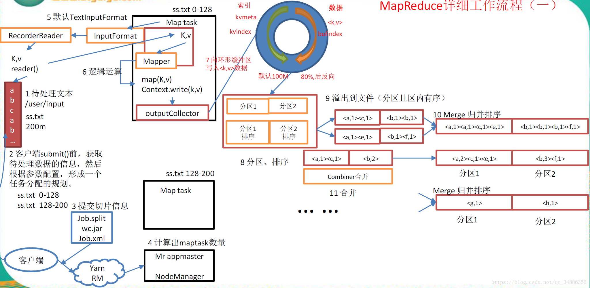

# MR的工作流程

前言

我们了解MR的工作流程能帮助我们更好的优化我们的程序，充分利用资源，而且对自己的业务逻辑会有更清楚的认识。在面试中这是被经常问到的

首先我们先看下面的图，我从网上摘取的。作者不祥！

这张图说的还是比较细的，所以我打算用文字来讨论这个问题，客户端向yarn RM 提交作业我们已经在MR的运行流程.md中已经讨论过了，所以我们直接讨论mapreduce的工作流程也就是计算过程，当然我会加入这张图没有提及的知识点！



## mapTask

### read阶段

Map Task 通过用户编写的 RecordReader实现类（），从输入 InputSplit 中解析出 切片数组,然后通过inputformat将KV对交给Maptask。

```
 ※1个FileSplit是由文件路径，分片开始位置，分片大小和存储分片数据的hosts列表组成，由这些信息我们就可以从输入文件中切分出提供给单个Mapper的输入数据。
※（划重点）CombineFileSplit：为小文件而生。不会将一个小文件化为这task
※InputFormat
	 1、验证作业的输入的正确性

 	 2、将输入文件切分成逻辑的InputSplits，一个InputSplit将被分配给一个单独的Mapper task

  	3、提供RecordReader的实现，这个RecordReader会从InputSplit中正确读出一条一条的Ｋ－Ｖ对供Mapper使用。
```


### map阶段

​	该节点主要是将解析出的 key/value 交给用户编写 map()函数处理，并 产生一系列新的 key/value。

### collect阶段

​	在用户编写 map()函数中，当数据处理完成后，一般会调用 OutputCollector.collect()输出结果。在该函数内部，它会将生成的 key/value 分区（调用 Partitioner），并写入一个环形内存缓冲区中。

```
所以我们写好的分区是在这里凸显？分区？
```


### 溢写阶段

​	即“溢写”，当环形缓冲区满后，MapReduce 会将数据写到本地磁盘上， 生成一个临时文件。需要注意的是，将数据写入本地磁盘之前，先要对数据进行一次本地排 序，并在必要时对数据进行合并、压缩等操作。

```
溢写阶段详情：
步骤 1：利用快速排序算法(所以要会写快速排序算法哦，在算法栏目去看吧，)对环形缓存区内的数据进行排序，排序方式是，先按照分区编号
partition 进行排序，然后按照 key 进行排序。这样，经过排序后，数据以分区为单位聚集在
一起，且同一分区内所有数据按照 key 有序。
步骤 2：按照分区编号由小到大依次将每个分区中的数据写入任务工作目录下的临时文
件 output/spillN.out（N 表示当前溢写次数）中。如果用户设置了 Combiner，则写入文件之
前，对每个分区中的数据进行一次聚集操作。
信息包括在临时文件中的偏移量、压缩前数据大小和压缩后数据大小。如果当前内存索引大
小超过 1MB，则将内存索引写到文件 output/spillN.out.index 中。
```


### Combine阶段

划重点：

```
所以我们在优化的时候，尤其在做去重的操作时，会重写combiner方法，他会继承reduce方法，做一次本地合并，减少IO。，他不能影响业务逻辑实战演练在本目录的Mr的介绍。
```

当所有数据处理完成后，MapTask 对所有临时文件进行一次合并，
以确保最终只会生成一个数据文件。  
当所有数据处理完后，MapTask 会将所有临时文件合并成一个大文件，并保存到文件output/file.out 中，同时生成相应的索引文件 output/file.out.index。
在进行文件合并过程中，MapTask 以分区为单位进行合并。对于某个分区，它将采用多轮递归合并的方式。每轮合并 io.sort.factor（默认 100）个文件，并将产生的文件重新加入待合并列表中，对文件排序后，重复以上过程，直到最终得到一个大文件。让每个 MapTask 最终只生成一个数据文件，可避免同时打开大量文件和同时读取大量

## ReduceTask

### Copy阶段：

ReduceTask从各个MapTask上远程拷贝一片数据，并针对某一片数据，如果其大小超过一定阈值，则写到磁盘上，否则直接放到内存中。

```
疑惑？这个阀值是多大
```


###  Merge阶段：

在远程拷贝数据的同时，ReduceTask启动了两个后台线程对内存和磁盘上的文件进行合并，以防止内存使用过多或磁盘上文件过多。

###  Sort阶段：

按照MapReduce语义，用户编写reduce()函数输入数据是按key进行聚集的一组数据。为了将key相同的数据聚在一起，Hadoop采用了基于排序的策略。由于各个MapTask已经实现对自己的处理结果进行了局部排序，因此，ReduceTask只需对所有数据进行一次归并排序即可。

```
所以手写归并排序没啥问题吧？
```

###   Reduce阶段

​    reduce()函数，会通过Outpuformat类根据我们设置的输出路径将计算结果写到HDFS上。 


# MapRedcue程序可干预组件

1.combiner：相当于一个reduce，在map端后，可以大大的减少IO
2.partition:分区，默认是根据key的hash值%reduce的数量，自定义分区是继承Partitioner类，重写getPartition（）分区的方法，自定义分区可以有效的解决数据倾斜问题
3.group：分组，继承WritableComparetor类，重写compare（）方法，自定义分组（就是定义reduce输入的数据分组规则）
4.sort：排序，继承WritableComparetor类，重写compare（）方法，根据自定义的排序方法，将reduce的输出结果进行排序
（如果没有继承WritableComparetor类的话，分组跟排序分组规则跟排序规则都一样，可以自己写一个看看，一般key完全一样才能分到一个组； 继承的话，根据自己定义的方法来决定）

5.分片：可以通过调整客户端的blocksize，minsize，maxSize


​	


