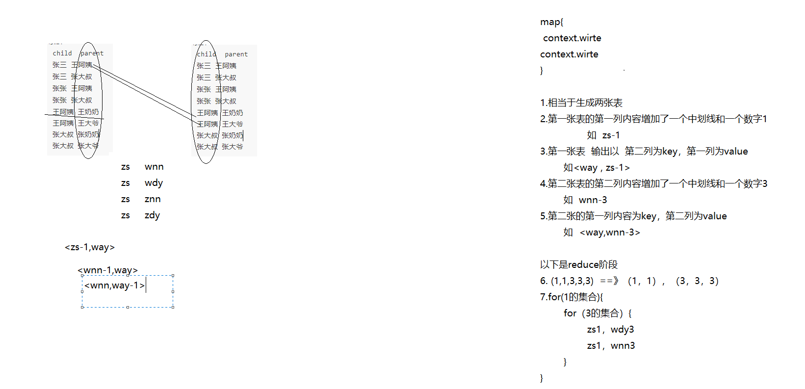
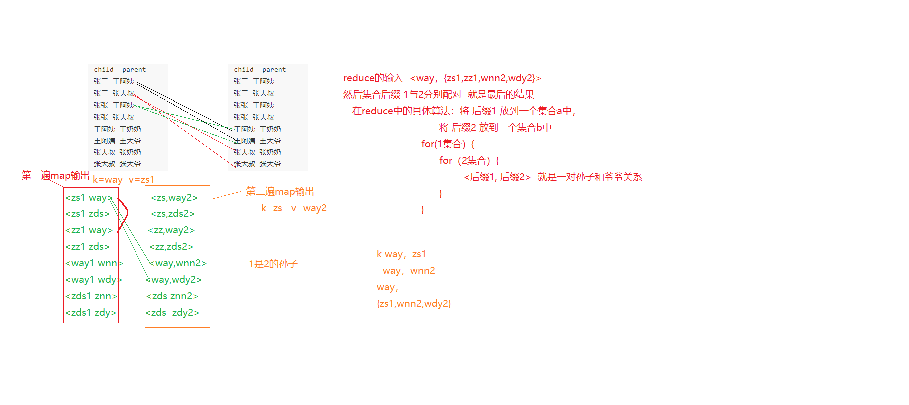

### mapreduce高级特性2

#### 回顾：

#### 今天任务

```
mr各种应用场景的例子
```

#### 教学目标

```
熟练掌握mr各种应用场景的例子
```

#### 第一节：结合案例讲解mr重要知识点

##### 1.1  内存排序

 TOP N 

 数据：
 	 hello qianfeng hello qianfeng qianfeng is best qianfeng better
	 hadoop is good
	 spark is nice

 取统计后的前三名：
	 qianfeng 4
	 is 3
	 hello 2

思路：

​	1.map阶段处理逻辑与wordcount一致

​	2.reduce阶段前半部分逻辑也wordcount一致，只是不输出，而是将<"is",3>封装成"3_is"形式放入集合中。

​	3.在cleanUp中队集合根据数字（如“3_is”中的3）进行降序排序，然后将三个元素输出

​		可以自己写排序算法，也可以TreeSet实现自定排序

```java
import java.io.IOException;
import java.util.ArrayList;
import java.util.List;

import org.apache.hadoop.conf.Configuration;
import org.apache.hadoop.fs.FileSystem;
import org.apache.hadoop.fs.Path;
import org.apache.hadoop.io.IntWritable;
import org.apache.hadoop.io.LongWritable;
import org.apache.hadoop.io.MapWritable;
import org.apache.hadoop.io.ShortWritable;
import org.apache.hadoop.io.Text;
import org.apache.hadoop.io.VIntWritable;
import org.apache.hadoop.mapreduce.Job;
import org.apache.hadoop.mapreduce.Mapper;
import org.apache.hadoop.mapreduce.Reducer;
import org.apache.hadoop.mapreduce.lib.input.FileInputFormat;
import org.apache.hadoop.mapreduce.lib.output.FileOutputFormat;
import org.apache.hadoop.util.GenericOptionsParser;
import org.apache.hadoop.util.Tool;
import org.apache.hadoop.util.ToolRunner;


public class MemSort  extends ToolRunner implements Tool{

	/**
	 * 自定义的myMapper
	 */
	static class MyMapper extends Mapper<LongWritable, Text, Text, Text>{
		
		Text k = new Text();
		Text v = new Text("1");
        
		@Override
		protected void map(LongWritable key, Text value,Context context)
				throws IOException, InterruptedException {
			String line = value.toString();
			String lines [] = line.split(" ");
			for (String s : lines) {
				k.set(s);
				context.write(k, v);
			}
		}
	}
	
	/**
	 * 自定义MyReducer
	 */
	static class MyReducer extends Reducer<Text, Text, Text, Text>{
		
		List<String> li = new ArrayList<String>();
        
		@Override
		protected void reduce(Text key, Iterable<Text> value,Context context)
				throws IOException, InterruptedException {
			int counter = 0;
			for (Text t : value) {
				counter += Integer.parseInt(t.toString());
			}
			//context.write(new Text(counter+""), key);
			li.add(key.toString()+"_"+counter);
			/**
			 * li(qianfeng_4,is_3,hello_2)
			 */
		}
		
		@Override
		protected void cleanup(Context context)throws IOException, InterruptedException {
			//对ist中的元素的第二个进行排序
			for (int i = 0; i < li.size()-1; i++) {
				for (int j = i+1; j < li.size(); j++) {
					//判断
					if(Integer.parseInt(li.get(i).split("_")[1]) <
							Integer.parseInt(li.get(j).split("_")[1])){
						String tmp = "";
						tmp = li.get(i);
						li.set(i, li.get(j));
						li.set(j, tmp);
					}
				}
			}
			//输出
			for (int i = 0; i < 3; i++) {
				String l [] = li.get(i).split("_");
				context.write(new Text(l[0]), new Text(l[1]));
			}
		}
	}
	
	
	@Override
	public void setConf(Configuration conf) {
		conf.set("fs.defaultFS", "hdfs://hadoop01:9000");
	}

	@Override
	public Configuration getConf() {
		return new Configuration();
	}
	
	/**
	 * 驱动方法
	 */
	@Override
	public int run(String[] args) throws Exception {
		//1、获取conf对象
		Configuration conf = getConf();
		//2、创建job
		Job job = Job.getInstance(conf, "model01");
		//3、设置运行job的class
		job.setJarByClass(MemSort.class);
		//4、设置map相关属性
		job.setMapperClass(MyMapper.class);
		job.setMapOutputKeyClass(Text.class);
		job.setMapOutputValueClass(Text.class);
		FileInputFormat.addInputPath(job, new Path(args[0]));
		
		//5、设置reduce相关属性
		job.setReducerClass(MyReducer.class);
		job.setOutputKeyClass(Text.class);
		job.setOutputValueClass(Text.class);
		//判断输出目录是否存在，若存在则删除
		FileSystem fs = FileSystem.get(conf);
		if(fs.exists(new Path(args[1]))){
			fs.delete(new Path(args[1]), true);
		}
		FileOutputFormat.setOutputPath(job, new Path(args[1]));
		
		//6、提交运行job
		int isok = job.waitForCompletion(true) ? 0 : 1;
		return isok;
	}
	
	/**
	 * job的主入口
	 * @param args
	 */
	public static void main(String[] args) {
		try {
			//对输入参数作解析
			String [] argss = new GenericOptionsParser(new Configuration(), args).getRemainingArgs();
			System.exit(ToolRunner.run(new MemSort(), argss));
		} catch (Exception e) {
			e.printStackTrace();
		}
	}
}
```

##### 1.2 mr数据类型

mr数据类型都实现了writable接口，以便用这些类型定义的数据可以被序列化进行网络传输和文件存储

基本数据类型：

- BooleanWriable：标准布尔型数
- ByteWriable：单字节数
- DoubleWriable：双字节数值
- FloatWriable：浮点数
- IntWriable：整型数
- LongWriable：长整型数
- Text：使用UTF8格式存储的文本
- NullWriable：当<key，value>中的key或value为空时使用

这些数据都实现了Writable接口


##### 1.3 自定义mr数据类型

重写Writable接口

如下代码就是自定义mr数据类型，在wordcount类使用它。

WordCountWritable

```java
import java.io.DataInput;
import java.io.DataOutput;
import java.io.IOException;
import org.apache.hadoop.io.Writable;


/**
 * 自定义wc的数据类型：
 * @author lyd
 */
public class WordCountWritable implements Writable{
    
	public String word;
	public int counter;
	
	public WordCountWritable(){}
	
	public WordCountWritable(String word, int counter) {
		this.word = word;
		this.counter = counter;
	}
	/**
	 * 写
	 */
	@Override
	public void write(DataOutput out) throws IOException {
		out.writeUTF(word);
		out.writeInt(counter);
	}
	/**
	 * 读
	 */
	@Override
	public void readFields(DataInput in) throws IOException {
		this.word = in.readUTF();
		this.counter = in.readInt();
	}
	public String getWord() {
		return word;
	}
	public void setWord(String word) {
		this.word = word;
	}
	public int getCounter() {
		return counter;
	}
	public void setCounter(int counter) {
		this.counter = counter;
	}
	@Override
	public String toString() {
		return word + ":" + counter;
	}
}

```

WordCount

```java
import java.io.IOException;
import org.apache.hadoop.conf.Configuration;
import org.apache.hadoop.fs.Path;
import org.apache.hadoop.io.IntWritable;
import org.apache.hadoop.io.LongWritable;
import org.apache.hadoop.io.NullWritable;
import org.apache.hadoop.io.Text;
import org.apache.hadoop.mapreduce.Job;
import org.apache.hadoop.mapreduce.Mapper;
import org.apache.hadoop.mapreduce.Reducer;
import org.apache.hadoop.mapreduce.lib.input.FileInputFormat;
import org.apache.hadoop.mapreduce.lib.output.FileOutputFormat;

import edu.qianfeng.mr.day01.WordCountWritable;

public class WordCount {
public static class MyMapper extends Mapper<LongWritable, Text, Text, IntWritable>{
	
	Text word = new Text();
	IntWritable one = new IntWritable(1);
	
	@Override
	protected void map(LongWritable key, Text value,Context context)
			throws IOException, InterruptedException {
		//获取行数据
		String line = value.toString();
		//对数据进行拆分   [hello,qianfeng,hi,qianfeng] [hello,1603] [hi,hadoop,hi,spark]
		String []  words = line.split(" ");
		//循环数组
		for (String s : words) {
			word.set(s);
			context.write(word, one);
		}
	}
}

/**
 * 自定义reducer类
 */
public static class MyReducer extends Reducer<Text, IntWritable, WordCountWritable, NullWritable>{
	
	@Override
	protected void reduce(Text key, Iterable<IntWritable> value,Context context)
			throws IOException, InterruptedException {
		//定义一个计数器
		int counter = 0;
		//循环奇数
		for (IntWritable i : value) {
			counter += i.get();
		}
		//创建数据类型对象
		WordCountWritable wc = new WordCountWritable(key.toString(), counter);
		//reduce阶段的最终输出    
		context.write(wc, null);
	}
}

/**
 * job的主入口
 * @param args
 */
public static void main(String[] args) {
	
	try {
		//获取配置对象
		Configuration conf = new Configuration();
		//创建job
		Job job = new Job(conf, "wordcount");
		//为job设置运行主类
		job.setJarByClass(WordCount.class);
		
		//设置map阶段的属性
		job.setMapperClass(MyMapper.class);
		job.setMapOutputKeyClass(Text.class);
		job.setMapOutputValueClass(IntWritable.class);
		FileInputFormat.addInputPath(job, new Path(args[0]));
		
		
		//设置reduce阶段的属性
		job.setReducerClass(MyReducer.class);
		job.setOutputKeyClass(WordCountWritable.class);
		job.setOutputValueClass(NullWritable.class);
		FileOutputFormat.setOutputPath(job, new Path(args[1]));
		
		//提交运行作业job 并打印信息
		int isok = job.waitForCompletion(true)?0:1;
		//退出job
		System.exit(isok);
		
	} catch (IOException | ClassNotFoundException | InterruptedException e) {
		e.printStackTrace();
	}
	}
}
```


##### 1.4 使用自定义数据实现内存排序

功能同 1.1

自定义数据WCData

```java
import java.io.DataInput;
import java.io.DataOutput;
import java.io.IOException;
import org.apache.hadoop.io.WritableComparable;

/**
 * 自定义数据类型
 * @author lyd
 *
 */
public class WCData implements WritableComparable<WCData>{

	public String word;
	public int counter;
	
	public WCData(){
		
	}
	
	public WCData(String word, int counter) {
		this.word = word;
		this.counter = counter;
	}

	@Override
	public void write(DataOutput out) throws IOException {
		out.writeUTF(word);
		out.writeInt(counter);
	}

	@Override
	public void readFields(DataInput in) throws IOException {
		this.word = in.readUTF();
		this.counter = in.readInt();
	}

	@Override
	public int compareTo(WCData o) {
		int tmp = o.counter - this.counter; //降序
		//int tmp = this.counter - o.counter; //升序
		if(tmp != 0){
			return tmp;
		} 
		return 0;
	}

	public String getWord() {
		return word;
	}

	public void setWord(String word) {
		this.word = word;
	}


	public int getCounter() {
		return counter;
	}

	public void setCounter(int counter) {
		this.counter = counter;
	}

	@Override
	public String toString() {
		return word + ":" + counter;
	}
}
```

mr类

```java
 import java.io.IOException;
import java.util.TreeSet;
import java.util.concurrent.ConcurrentHashMap;

import org.apache.hadoop.conf.Configuration;
import org.apache.hadoop.fs.FileSystem;
import org.apache.hadoop.fs.Path;
import org.apache.hadoop.io.LongWritable;
import org.apache.hadoop.io.NullWritable;
import org.apache.hadoop.io.Text;
import org.apache.hadoop.mapreduce.Job;
import org.apache.hadoop.mapreduce.Mapper;
import org.apache.hadoop.mapreduce.Reducer;
import org.apache.hadoop.mapreduce.Reducer.Context;
import org.apache.hadoop.mapreduce.lib.input.FileInputFormat;
import org.apache.hadoop.mapreduce.lib.output.FileOutputFormat;
import org.apache.hadoop.util.GenericOptionsParser;
import org.apache.hadoop.util.Tool;
import org.apache.hadoop.util.ToolRunner;

import edu.qianfeng.mr.day01.WordCountWritable;


/**
 * 
 * @author lyd
 *
 *TOP-N
 *求前几名
 * 数据：
 hello qianfeng hello qianfeng qianfeng is best qianfeng better
 hadoop is good
 spark is nice
 
 取统计后的前三名：
 qianfeng 4
 is 3
 hello 2
 */
public class TopN extends ToolRunner implements Tool{

	/**
	 * 自定义的myMapper
	 */
	static class MyMapper extends Mapper<LongWritable, Text, Text, Text>{

		@Override
		protected void map(LongWritable key, Text value,Context context)
				throws IOException, InterruptedException {
			String line = value.toString();
			String lines [] = line.split(" ");
			for (String s: lines) {
				context.write(new Text(s), new Text(1+""));
			}
		}
	}
	
	/**
	 * 自定义MyReducer
	 */
	static class MyReducer extends Reducer<Text, Text, WCData, NullWritable>{

		//获取treeset对象
		TreeSet<WCData> ts = new TreeSet<WCData>();
		public static final int k = 5;
		@Override
		protected void reduce(Text key, Iterable<Text> value,Context context)
				throws IOException, InterruptedException {
			int counter = 0;
			for (Text t : value) {
				counter += Integer.parseInt(t.toString());
			}
			
			//创建数据对象
			WCData wc = new WCData(key.toString(), counter);
			//将数据对象放到treeset中
			ts.add(wc);
			if(ts.size() > k){
				//移除元素
				ts.remove(ts.last());
			}
			//
			//context.write(wc, null);
		}
		
		@Override
		protected void cleanup(Context context)throws IOException, InterruptedException {
			for (WCData wcData : ts) {
				context.write(wcData, null);
			}
		}
	}
	
	
	@Override
	public void setConf(Configuration conf) {
		conf.set("fs.defaultFS", "hdfs://hadoop01:9000");
	}

	@Override
	public Configuration getConf() {
		return new Configuration();
	}
	
	/**
	 * 驱动方法
	 */
	@Override
	public int run(String[] args) throws Exception {
		//1、获取conf对象
		Configuration conf = getConf();
		//2、创建job
		Job job = Job.getInstance(conf, "model01");
		//3、设置运行job的class
		job.setJarByClass(TopN.class);
		//4、设置map相关属性
		job.setMapperClass(MyMapper.class);
		job.setMapOutputKeyClass(Text.class);
		job.setMapOutputValueClass(Text.class);
		FileInputFormat.addInputPath(job, new Path(args[0]));
		
		//5、设置reduce相关属性
		job.setReducerClass(MyReducer.class);
		job.setOutputKeyClass(WCData.class);
		job.setOutputValueClass(NullWritable.class);
		//判断输出目录是否存在，若存在则删除
		FileSystem fs = FileSystem.get(conf);
		if(fs.exists(new Path(args[1]))){
			fs.delete(new Path(args[1]), true);
		}
		FileOutputFormat.setOutputPath(job, new Path(args[1]));
		
		//6、提交运行job
		int isok = job.waitForCompletion(true) ? 0 : 1;
		return isok;
	}
	
	/**
	 * job的主入口
	 * @param args
	 */
	public static void main(String[] args) {
		try {
			//对输入参数作解析
			String [] argss = new GenericOptionsParser(new Configuration(), args).getRemainingArgs();
			System.exit(ToolRunner.run(new TopN(), argss));
		} catch (Exception e) {
			e.printStackTrace();
		}
	}

}

```

##### 1.5 二次排序

待处理数据  内容如下

```
二次排序：
23 321
23 290
23 567
78 650
78 554
78 756
16 18
16 16
16 15
9 8
9 0
9 3
```

处理后的数据 内容如下

```
输出数据：
-----------
9 0
9 3
9 8
-----------
16	15
16	16
16	18
----------
23	290
23	321
23	567
-----------
78	554
78	650
78	756
```

思路：

1.在map输出<9,0><9,3><16,15>  自动按key排序

2.在reduce端将<9,{0,3}>中的value放到集合，然后对集合排序，最终以<9,0><9,3>的形式输出

```java
import java.io.IOException;
import java.util.ArrayList;
import java.util.Collections;
import java.util.List;

import org.apache.hadoop.conf.Configuration;
import org.apache.hadoop.fs.FileSystem;
import org.apache.hadoop.fs.Path;
import org.apache.hadoop.io.IntWritable;
import org.apache.hadoop.io.LongWritable;
import org.apache.hadoop.io.NullWritable;
import org.apache.hadoop.io.Text;
import org.apache.hadoop.mapreduce.Job;
import org.apache.hadoop.mapreduce.Mapper;
import org.apache.hadoop.mapreduce.Reducer;
import org.apache.hadoop.mapreduce.Reducer.Context;
import org.apache.hadoop.mapreduce.lib.input.FileInputFormat;
import org.apache.hadoop.mapreduce.lib.output.FileOutputFormat;
import org.apache.hadoop.util.GenericOptionsParser;
import org.apache.hadoop.util.Tool;
import org.apache.hadoop.util.ToolRunner;
/** 
二次排序：

任务？？？
23 321 67
23 290 90
23 567 33
78 650 4797
78 554 321
78 756 3214
16 18 451
16 16 654
16 15 52
9 8 321
9 0 654
9 3 1
 *
 */
public class SecondSort extends ToolRunner implements Tool{

	/**
	 * 自定义的myMapper
	 */
	static class MyMapper extends Mapper<LongWritable, Text, IntWritable, Text>{

		@Override
		protected void map(LongWritable key, Text value,Context context)
				throws IOException, InterruptedException {
			String line = value.toString();
			String lines [] = line.split(" ");
			context.write(new IntWritable(Integer.parseInt(lines[0])), new Text(lines[1]));
			/**
                16	15
                16	16
                16	18
			 */
		}
	}
	
	/**
	 * 自定义MyReducer
	 */
	static class MyReducer extends Reducer<IntWritable, Text, Text, NullWritable>{
		
		@Override
		protected void reduce(IntWritable key, Iterable<Text> value,Context context)
				throws IOException, InterruptedException {
		
			/**
			 * 16 list(18,16,15)
			 * 
			-----------
			16	15
			16	16
			16	18
			 */
			List<Integer> li = new ArrayList<Integer>();
			for (Text t : value) {
				li.add(Integer.parseInt(t.toString()));
			}
			//对list升序
			Collections.sort(li);
			//对先排好序的list反转
			Collections.reverse(li);
			//循环数组写出
			context.write(new Text("-----------"), null);
			for (Integer i : li) {
				context.write(new Text(key.get()+"   "+i), null);
			}
		}
	}
	
	
	@Override
	public void setConf(Configuration conf) {
		conf.set("fs.defaultFS", "hdfs://hadoop01:9000");
	}

	@Override
	public Configuration getConf() {
		return new Configuration();
	}
	
	/**
	 * 驱动方法
	 */
	@Override
	public int run(String[] args) throws Exception {
		//1、获取conf对象
		Configuration conf = getConf();
		//2、创建job
		Job job = Job.getInstance(conf, "model01");
		//3、设置运行job的class
		job.setJarByClass(SecondSort.class);
		//4、设置map相关属性
		job.setMapperClass(MyMapper.class);
		job.setMapOutputKeyClass(IntWritable.class);
		job.setMapOutputValueClass(Text.class);
		FileInputFormat.addInputPath(job, new Path(args[0]));
		
		//5、设置reduce相关属性
		job.setReducerClass(MyReducer.class);
		job.setOutputKeyClass(Text.class);
		job.setOutputValueClass(NullWritable.class);
		//判断输出目录是否存在，若存在则删除
		FileSystem fs = FileSystem.get(conf);
		if(fs.exists(new Path(args[1]))){
			fs.delete(new Path(args[1]), true);
		}
		FileOutputFormat.setOutputPath(job, new Path(args[1]));
		
		//6、提交运行job
		int isok = job.waitForCompletion(true) ? 0 : 1;
		return isok;
	}
	
	/**
	 * job的主入口
	 * @param args
	 */
	public static void main(String[] args) {
		try {
			//对输入参数作解析
			String [] argss = new GenericOptionsParser(new Configuration(), args).getRemainingArgs();
			System.exit(ToolRunner.run(new SecondSort(), argss));
		} catch (Exception e) {
			e.printStackTrace();
		}
	}
}

```

##### 1.6 使用自定义mr数据类型实现二次排序

功能：同1.5

自定义数据类型SSData

思路：

1.让将两个数值封装成一个对象，实现comparable接口，compareTo方法中当第一个数相等时再比较第二个数

2.在map中，直接将 该对象作为key输出，这样利用map输出自动对key进行了排序

关键代码

@Override
	public int compareTo(SSData o) { 
		int tmp = this.first - o.first;  //第一列jiang序
		if(tmp != 0){
			return tmp;
		}
		//
		//return o.second.compareTo(this.second);
		return o.second - this.second;   //第2列jiang序
	}

```java
import java.io.DataInput;
import java.io.DataOutput;
import java.io.IOException;
import org.apache.hadoop.io.WritableComparable;

public class SSData implements WritableComparable<SSData>{

	private int first;
	private int second;
	
	public SSData(){}
	
	public SSData(int first, int second) {
		this.first = first;
		this.second = second;
	}

	@Override
	public void write(DataOutput out) throws IOException {
		out.writeInt(first);
		out.writeInt(second);
	}

	@Override
	public void readFields(DataInput in) throws IOException {
		this.first = in.readInt();
		this.second = in.readInt();
	}

	@Override
	public int compareTo(SSData o) { 
		int tmp = this.first - o.first;  //第一列jiang序
		if(tmp != 0){
			return tmp;
		}
		//return o.second.compareTo(this.second);
		return o.second - this.second;   //第2列jiang序
	}
	
	public int getFirst() {
		return first;
	}
	public void setFirst(int first) {
		this.first = first;
    }
	public int getSecond() {
		return second;
	}
	public void setSecond(int second) {
		this.second = second;
	}
	@Override
	public String toString() {
		return "[ "+first + "    " + second+" ]";
	}
}
```

mr类SecondarySort

```java
import java.io.IOException;

import org.apache.hadoop.conf.Configuration;
import org.apache.hadoop.fs.FileSystem;
import org.apache.hadoop.fs.Path;
import org.apache.hadoop.io.IntWritable;
import org.apache.hadoop.io.LongWritable;
import org.apache.hadoop.io.Text;
import org.apache.hadoop.mapreduce.Job;
import org.apache.hadoop.mapreduce.Mapper;
import org.apache.hadoop.mapreduce.Reducer;
import org.apache.hadoop.mapreduce.Reducer.Context;
import org.apache.hadoop.mapreduce.lib.input.FileInputFormat;
import org.apache.hadoop.mapreduce.lib.output.FileOutputFormat;
import org.apache.hadoop.util.GenericOptionsParser;
import org.apache.hadoop.util.Tool;
import org.apache.hadoop.util.ToolRunner;


public class SecondarySort extends ToolRunner implements Tool{

	/**
	 * 自定义的myMapper
	 * @author lyd
	 *
	 */
	static class MyMapper extends Mapper<LongWritable, Text, SSData, IntWritable>{

		@Override
		protected void map(LongWritable key, Text value,Context context)
				throws IOException, InterruptedException {
			String line = value.toString();
			String lines [] = line.split(" ");
			SSData ss = new SSData(Integer.parseInt(lines[0]), Integer.parseInt(lines[1]));
			context.write(ss, new IntWritable(Integer.parseInt(lines[1])));
		}
	}
	
	/**
	 * 自定义MyReducer
	 */
	static class MyReducer extends Reducer<SSData, IntWritable, SSData, Text>{
		@Override
		protected void reduce(SSData key, Iterable<IntWritable> value,Context context)
				throws IOException, InterruptedException {
			
			/*for (IntWritable i : value) {
				SSData ss = new SSData(key.get(), i.get());
				context.write(ss, new Text(""));
			}*/
			
			context.write(key, new Text(""));
		}
	}
	
	
	@Override
	public void setConf(Configuration conf) {
		conf.set("fs.defaultFS", "hdfs://hadoop01:9000");
	}

	@Override
	public Configuration getConf() {
		return new Configuration();
	}
	
	/**
	 * 驱动方法
	 */
	@Override
	public int run(String[] args) throws Exception {
		//1、获取conf对象
		Configuration conf = getConf();
		//2、创建job
		Job job = Job.getInstance(conf, "model01");
		//3、设置运行job的class
		job.setJarByClass(SecondarySort.class);
		//4、设置map相关属性
		job.setMapperClass(MyMapper.class);
		job.setMapOutputKeyClass(SSData.class);
		job.setMapOutputValueClass(IntWritable.class);
		FileInputFormat.addInputPath(job, new Path(args[0]));
		
		//5、设置reduce相关属性
		job.setReducerClass(MyReducer.class);
		job.setOutputKeyClass(SSData.class);
		job.setOutputValueClass(Text.class);
		//判断输出目录是否存在，若存在则删除
		FileSystem fs = FileSystem.get(conf);
		if(fs.exists(new Path(args[1]))){
			fs.delete(new Path(args[1]), true);
		}
		FileOutputFormat.setOutputPath(job, new Path(args[1]));
		
		//6、提交运行job
		int isok = job.waitForCompletion(true) ? 0 : 1;
		return isok;
	}
	
	/**
	 * job的主入口
	 * @param args
	 */
	public static void main(String[] args) {
		try {
			//对输入参数作解析
			String [] argss = new GenericOptionsParser(new Configuration(), args).getRemainingArgs();
			System.exit(ToolRunner.run(new SecondarySort(), argss));
		} catch (Exception e) {
			e.printStackTrace();
		}
	}
}
```

##### 1.7 内存排序找出每一组中的最大值

待处理数据  内容如下

```
二次排序：
23 321
23 290
23 567
78 650
78 554
78 756
16 18
16 16
16 15
9 8
9 0
9 3
```

处理后的数据 内容如下

```
输出数据：
-----------
9 8
-----------
16	18
----------
23	567
-----------
78	756
```

思路：

​	1. map中按<9,8><9,0>,<9,3>输出  默认排序

​        2.在reduce中 将<9 , {8,0,3}}]中value中取出最大值，然后将 <9,8>输出

mr类FindMax

```java
import java.io.IOException;
import java.util.ArrayList;
import java.util.Collections;
import java.util.List;

import org.apache.hadoop.conf.Configuration;
import org.apache.hadoop.fs.FileSystem;
import org.apache.hadoop.fs.Path;
import org.apache.hadoop.io.IntWritable;
import org.apache.hadoop.io.LongWritable;
import org.apache.hadoop.io.Text;
import org.apache.hadoop.mapreduce.Job;
import org.apache.hadoop.mapreduce.Mapper;
import org.apache.hadoop.mapreduce.Reducer;
import org.apache.hadoop.mapreduce.Reducer.Context;
import org.apache.hadoop.mapreduce.lib.input.FileInputFormat;
import org.apache.hadoop.mapreduce.lib.output.FileOutputFormat;
import org.apache.hadoop.util.GenericOptionsParser;
import org.apache.hadoop.util.Tool;
import org.apache.hadoop.util.ToolRunner;


/**
 * 
 * @author lyd
 *
 *
获取每一组中的最大值？？
二次排序：
23 321
23 290
23 567
78 650
78 554
78 756
16 18
16 16
16 15
9 8
9 0
9 3


输出数据：
-----------
9 8
-----------
16	18
----------
23	567
-----------
78	756
 */
public class FindMax extends ToolRunner implements Tool{

	/**
	 * 自定义的myMapper
	 */
	static class MyMapper extends Mapper<LongWritable, Text, IntWritable, IntWritable>{

		@Override
		protected void map(LongWritable key, Text value,Context context)
				throws IOException, InterruptedException {
			String line = value.toString();
			String lines [] = line.split(" ");
			context.write(new IntWritable(Integer.parseInt(lines[0])), new IntWritable(Integer.parseInt(lines[1])));
		}
	}
	
	/**
	 * 自定义MyReducer
	 */
	static class MyReducer extends Reducer<IntWritable, IntWritable, Text, Text>{
		
		@Override
		protected void reduce(IntWritable key, Iterable<IntWritable> value,Context context)
				throws IOException, InterruptedException {
			List<Integer> li = new ArrayList<Integer>();
			for (IntWritable i : value) {
				li.add(i.get());
			}
			//排序
			Collections.sort(li);
			context.write(new Text(key.get()+""), new Text(li.get(li.size()-1)+""));
		}
	}
	
	
	@Override
	public void setConf(Configuration conf) {
		conf.set("fs.defaultFS", "hdfs://hadoop01:9000");
	}

	@Override
	public Configuration getConf() {
		return new Configuration();
	}
	
	/**
	 * 驱动方法
	 */
	@Override
	public int run(String[] args) throws Exception {
		//1、获取conf对象
		Configuration conf = getConf();
		//2、创建job
		Job job = Job.getInstance(conf, "model01");
		//3、设置运行job的class
		job.setJarByClass(FindMax.class);
		//4、设置map相关属性
		job.setMapperClass(MyMapper.class);
		job.setMapOutputKeyClass(IntWritable.class);
		job.setMapOutputValueClass(IntWritable.class);
		FileInputFormat.addInputPath(job, new Path(args[0]));
		
		//5、设置reduce相关属性
		job.setReducerClass(MyReducer.class);
		job.setOutputKeyClass(Text.class);
		job.setOutputValueClass(Text.class);
		//判断输出目录是否存在，若存在则删除
		FileSystem fs = FileSystem.get(conf);
		if(fs.exists(new Path(args[1]))){
			fs.delete(new Path(args[1]), true);
		}
		FileOutputFormat.setOutputPath(job, new Path(args[1]));
		
		//6、提交运行job
		int isok = job.waitForCompletion(true) ? 0 : 1;
		return isok;
	}
	
	/**
	 * job的主入口
	 * @param args
	 */
	public static void main(String[] args) {
		try {
			//对输入参数作解析
			String [] argss = new GenericOptionsParser(new Configuration(), args).getRemainingArgs();
			System.exit(ToolRunner.run(new FindMax(), argss));
		} catch (Exception e) {
			e.printStackTrace();
		}
	}
}
```

##### 1.8 排序找出每一组中的最大值（中间结果不在内存中）

功能：同1.7，只是中间结果不在内存中，避免了数量过大造成内存溢出的问题。

知识点  分组比较器的使用

​	job.setGroupingComparatorClass(GroupingComparator.class);

分组的概念

​		如 {2，3} ，{3，1} ，{2，1}  这组值（一个{}之间的就是一组内容）是不同的值，但我我可以指定  一组中以第一个元素值，作为分组条件，该元素值相同的作为一组，如{2,3}和{2，1}就是一组。指定分组条件由RawComparator来实现


自定义mr类SSData

```java
import java.io.DataInput;
import java.io.DataOutput;
import java.io.IOException;
import org.apache.hadoop.io.WritableComparable;

public class SSData implements WritableComparable<SSData>{

	private int first;
	private int second;
	
	public SSData(){}
	public SSData(int first, int second) {
		this.first = first;
		this.second = second;
	}
	@Override
	public void write(DataOutput out) throws IOException {
		out.writeInt(first);
		out.writeInt(second);
	}
	@Override
	public void readFields(DataInput in) throws IOException {
		this.first = in.readInt();
		this.second = in.readInt();
	}
	@Override
	public int compareTo(SSData o) { 
		int tmp = this.first - o.first;  //第一列jiang序
		if(tmp != 0){
			return tmp;
		}
		//
		//return o.second.compareTo(this.second);
		return o.second - this.second;   //第2列jiang序
	}
	public int getFirst() {
		return first;
	}
	public void setFirst(int first) {
		this.first = first;
	}
	public int getSecond() {
		return second;
	}
	public void setSecond(int second) {
		this.second = second;
	}
	@Override
	public String toString() {
		return "[ "+first + "    " + second+" ]";
	}
}
```

自定义分组比较器

```java
import org.apache.hadoop.io.RawComparator;
import org.apache.hadoop.io.WritableComparator;

/**
 * 分组比较器
 * 1、要求自定分组比较器实现RawComparator
 * 2、实现两个比较方法
 * 3、注意被比较属性的类型(可变长度不行)
 */
public class GroupingComparator implements RawComparator<SSData>{

	//和自定义数据类型里面的compareTo()方法一样。使用的是对象比较
	@Override
	public int compare(SSData o1, SSData o2) {
		return 0;
	}
	/**
	 * 使用字节比较
	 */
	@Override
	public int compare(byte[] b1, int s1, int l1, byte[] b2, int s2, int l2) {
		return WritableComparator.compareBytes(b1, s1, 8, b2, s2, 8);
	}
}

```

mr类FindMax2

```java
import java.io.IOException;
import org.apache.hadoop.conf.Configuration;
import org.apache.hadoop.fs.FileSystem;
import org.apache.hadoop.fs.Path;
import org.apache.hadoop.io.IntWritable;
import org.apache.hadoop.io.LongWritable;
import org.apache.hadoop.io.Text;
import org.apache.hadoop.mapreduce.Job;
import org.apache.hadoop.mapreduce.Mapper;
import org.apache.hadoop.mapreduce.Reducer;
import org.apache.hadoop.mapreduce.lib.input.FileInputFormat;
import org.apache.hadoop.mapreduce.lib.output.FileOutputFormat;
import org.apache.hadoop.util.GenericOptionsParser;
import org.apache.hadoop.util.Tool;
import org.apache.hadoop.util.ToolRunner;


public class FindMax2 extends ToolRunner implements Tool{

	/**
	 * 自定义的myMapper
	 * @author lyd
	 *
	 */
	static class MyMapper extends Mapper<LongWritable, Text, SSData, IntWritable>{

		@Override
		protected void map(LongWritable key, Text value,Context context)
				throws IOException, InterruptedException {
			String line = value.toString();
			String lines [] = line.split(" ");
			//SSData ss = new SSData(Integer.parseInt(lines[0]), Integer.parseInt(lines[1]));
			SSData ss = new SSData(Integer.parseInt(lines[1]), Integer.parseInt(lines[0]));
			context.write(ss, new IntWritable(Integer.parseInt(lines[0])));
			/**
			 * 
			 */
		}
	}
	
	/**
	 * 自定义MyReducer
	 */
	static class MyReducer extends Reducer<SSData, IntWritable, Text, Text>{
		
		@Override
		protected void reduce(SSData key, Iterable<IntWritable> value,Context context)
				throws IOException, InterruptedException {
			context.write(new Text("---------------"), new Text(""));
			context.write(new Text(key.getFirst()+""), new Text(key.getSecond()+""));
		}
	}
	
	
	@Override
	public void setConf(Configuration conf) {
		conf.set("fs.defaultFS", "hdfs://hadoop01:9000");
	}

	@Override
	public Configuration getConf() {
		return new Configuration();
	}
	
	/**
	 * 驱动方法
	 */
	@Override
	public int run(String[] args) throws Exception {
		//1、获取conf对象
		Configuration conf = getConf();
		//2、创建job
		Job job = Job.getInstance(conf, "model01");
		//3、设置运行job的class
		job.setJarByClass(FindMax2.class);
		//4、设置map相关属性
		job.setMapperClass(MyMapper.class);
		job.setMapOutputKeyClass(SSData.class);
		job.setMapOutputValueClass(IntWritable.class);
		FileInputFormat.addInputPath(job, new Path(args[0]));
		
//设置分组比较器
job.setGroupingComparatorClass(GroupingComparator.class);
		
		//5、设置reduce相关属性
		job.setReducerClass(MyReducer.class);
		job.setOutputKeyClass(Text.class);
		job.setOutputValueClass(Text.class);
		//判断输出目录是否存在，若存在则删除
		FileSystem fs = FileSystem.get(conf);
		if(fs.exists(new Path(args[1]))){
			fs.delete(new Path(args[1]), true);
		}
		FileOutputFormat.setOutputPath(job, new Path(args[1]));
		
		//6、提交运行job
		int isok = job.waitForCompletion(true) ? 0 : 1;
		return isok;
	}
	
	/**
	 * job的主入口
	 * @param args
	 */
	public static void main(String[] args) {
		try {
			//对输入参数作解析
			String [] argss = new GenericOptionsParser(new Configuration(), args).getRemainingArgs();
			System.exit(ToolRunner.run(new FindMax2(), argss));
		} catch (Exception e) {
			e.printStackTrace();
		}
	}

}

```

##### 1.9 两个表的简单join操作

待处理数据 内容如下

```
表1：
 child	parent
 张三	王阿姨
 张三	张大叔
 张张	王阿姨
 张张	张大叔
 王阿姨 王奶奶
 王阿姨 王大爷
 张大叔 张奶奶
 张大叔 张大爷
```

处理后的数据 内容如下

```
输出数据：
grandchild grandparent
 *张三	张大爷
 *张三	张奶奶
 *张三	王奶奶
 *张三	王大爷
 *张张	张大爷
 *张张	张奶奶
 *张张	王奶奶
 *张张	王大爷

```





```java
import java.io.IOException;
import java.util.ArrayList;
import java.util.List;

import org.apache.hadoop.conf.Configuration;
import org.apache.hadoop.fs.FileSystem;
import org.apache.hadoop.fs.Path;
import org.apache.hadoop.io.LongWritable;
import org.apache.hadoop.io.Text;
import org.apache.hadoop.mapreduce.Job;
import org.apache.hadoop.mapreduce.Mapper;
import org.apache.hadoop.mapreduce.Reducer;
import org.apache.hadoop.mapreduce.Reducer.Context;
import org.apache.hadoop.mapreduce.lib.input.FileInputFormat;
import org.apache.hadoop.mapreduce.lib.output.FileOutputFormat;
import org.apache.hadoop.util.GenericOptionsParser;
import org.apache.hadoop.util.Tool;
import org.apache.hadoop.util.ToolRunner;

/**
 *reduce端的join：
 *核心思想：在map端对不同来源的数据或者是有不同用处的数据做标记，以便传输到reduce能识别并进行连接找出关系。
 *使用场景：几乎所有业务场景都可以，比较耗时。
 *优点：适用于表全是大表，几乎所有业务场景都可以。
 *缺点：map到reuce的数据传输量大无效数据耗时；在reduce需要对大量无效数据进行连接查找耗时；
 *
 *任务：
 *category
 *cid	parentid	name
 *1		0			家电
 *2		0			服装
 *3		0			食品
 *4		1			洗衣机
 *5		1			冰箱
 *6		2			男装
 *7		2			女装
 *8		3			零食
 *9		3			水果
 *10	4			美的
 *11	5			海尔
 *12	6			衬衫
 *13	7			蓬蓬裙
 *14	8			牛奶
 *
 *
 *输出数据：
 *家电 洗衣机-美的
 *家电 冰箱-海尔
 *服装 男装-衬衫
 *
 *
 *
 */
public class SingleTableDemo  extends ToolRunner implements Tool{

	/**
	 * 自定义的myMapper
	 */
	static class MyMapper extends Mapper<LongWritable, Text, Text, Text>{

		@Override
		protected void map(LongWritable key, Text value,Context context)
				throws IOException, InterruptedException {
			String line = value.toString();
			String lines [] = line.split(" ");
			//定义一个左表 p r-c   父辈 1-孩子   1父关系
			context.write(new Text(lines[1]), new Text("1_"+lines[0]));
			//定义一个右表 c r-p   孩子 2_父母  2 孩子
			context.write(new Text(lines[0]), new Text("2_"+lines[1]));
		}
	}
	
	/**
	 * 自定义MyReducer
	 */
	static class MyReducer extends Reducer<Text, Text, Text, Text>{

		@Override
		protected void reduce(Text key, Iterable<Text> value,Context context)
				throws IOException, InterruptedException {
			//定义一个集合存放孙子辈
			List<String> grandChild = new ArrayList<String>();
			//定义一个集合存放祖辈
			List<String> grandParent = new ArrayList<String>();
			
			for (Text s: value) {
				String strs [] = s.toString().split("_");
				//判断r是1还是2 如果是1，则将他的值放孙子辈，如果是2则放到祖辈
				if(strs[0].equals("1")){
					grandChild.add(strs[1]);
				} else if(strs[0].equals("2")){
					grandParent.add(strs[1]);
				}
			}
			
			//嵌套循环
			for (int i = 0; i < grandChild.size(); i++) {
				for (int j = 0; j < grandParent.size(); j++) {
					context.write(new Text(grandChild.get(i)), new Text(grandParent.get(j)));
				}
			}
		}
	}
	
	
	@Override
	public void setConf(Configuration conf) {
		conf.set("fs.defaultFS", "hdfs://hadoop01:9000");
	}

	@Override
	public Configuration getConf() {
		return new Configuration();
	}
	
	/**
	 * 驱动方法
	 */
	@Override
	public int run(String[] args) throws Exception {
		//1、获取conf对象
		Configuration conf = getConf();
		//2、创建job
		Job job = Job.getInstance(conf, "model01");
		//3、设置运行job的class
		job.setJarByClass(SingleTableDemo.class);
		//4、设置map相关属性
		job.setMapperClass(MyMapper.class);
		job.setMapOutputKeyClass(Text.class);
		job.setMapOutputValueClass(Text.class);
		FileInputFormat.addInputPath(job, new Path(args[0]));
		
		//5、设置reduce相关属性
		job.setReducerClass(MyReducer.class);
		job.setOutputKeyClass(Text.class);
		job.setOutputValueClass(Text.class);
		//判断输出目录是否存在，若存在则删除
		FileSystem fs = FileSystem.get(conf);
		if(fs.exists(new Path(args[1]))){
			fs.delete(new Path(args[1]), true);
		}
		FileOutputFormat.setOutputPath(job, new Path(args[1]));
		
		//6、提交运行job
		int isok = job.waitForCompletion(true) ? 0 : 1;
		return isok;
	}
	
	/**
	 * job的主入口
	 * @param args
	 */
	public static void main(String[] args) {
		try {
			//对输入参数作解析
			String [] argss = new GenericOptionsParser(new Configuration(), args).getRemainingArgs();
			System.exit(ToolRunner.run(new SingleTableDemo(), argss));
		} catch (Exception e) {
			e.printStackTrace();
		}
	}

}


```


