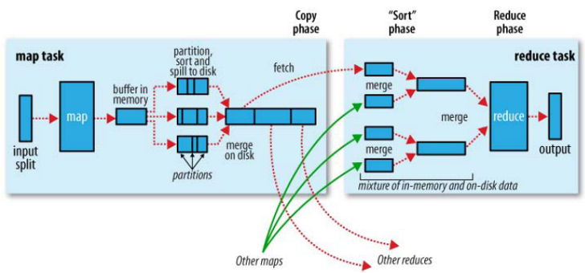
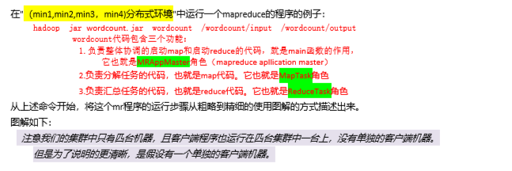
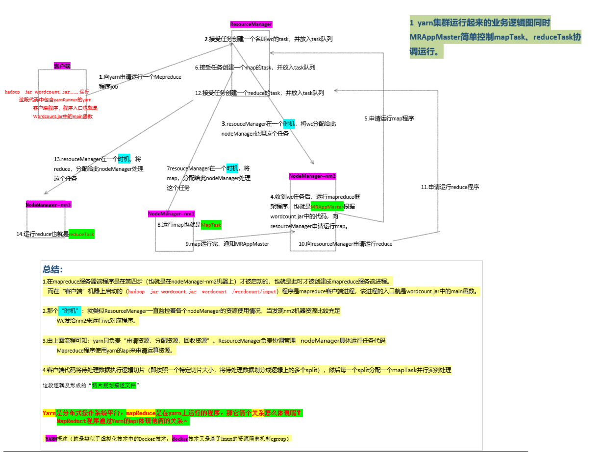
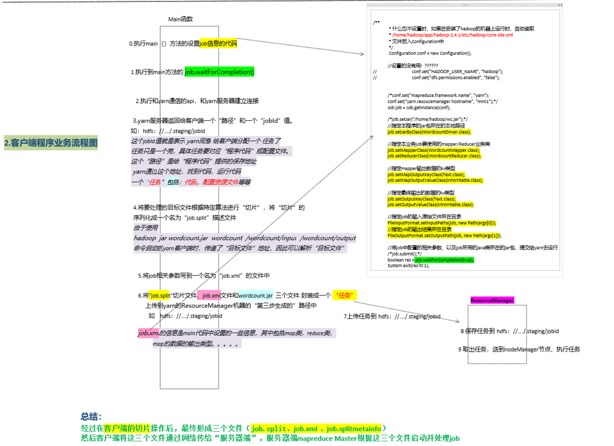
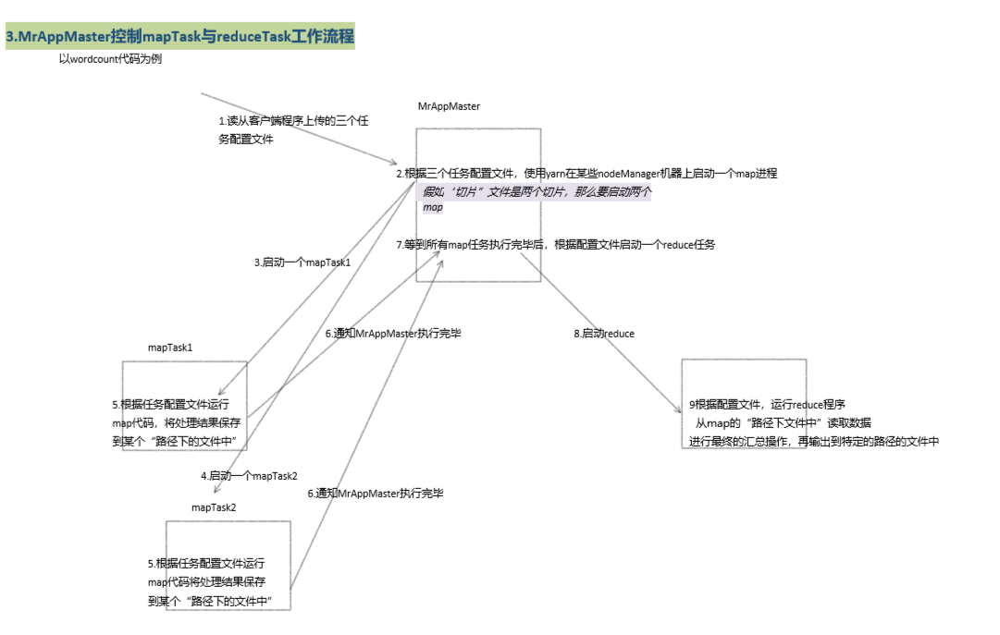
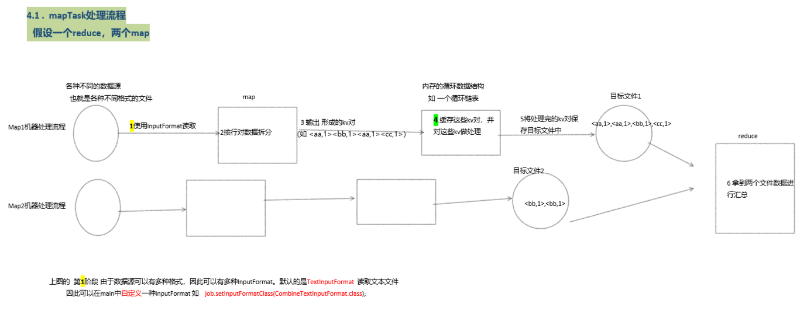
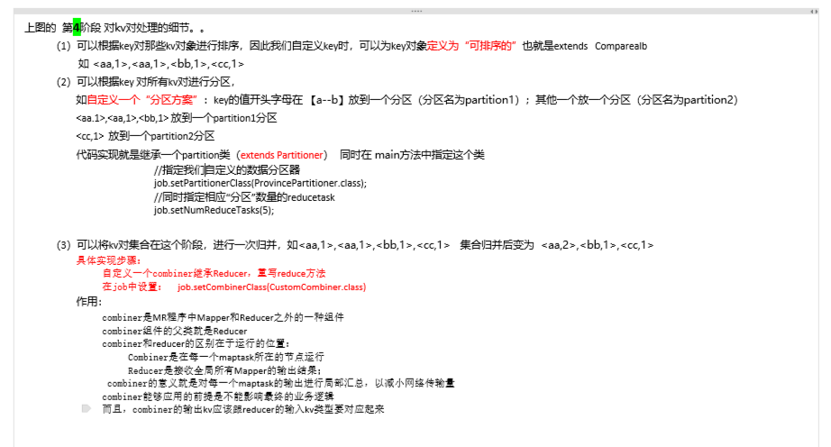
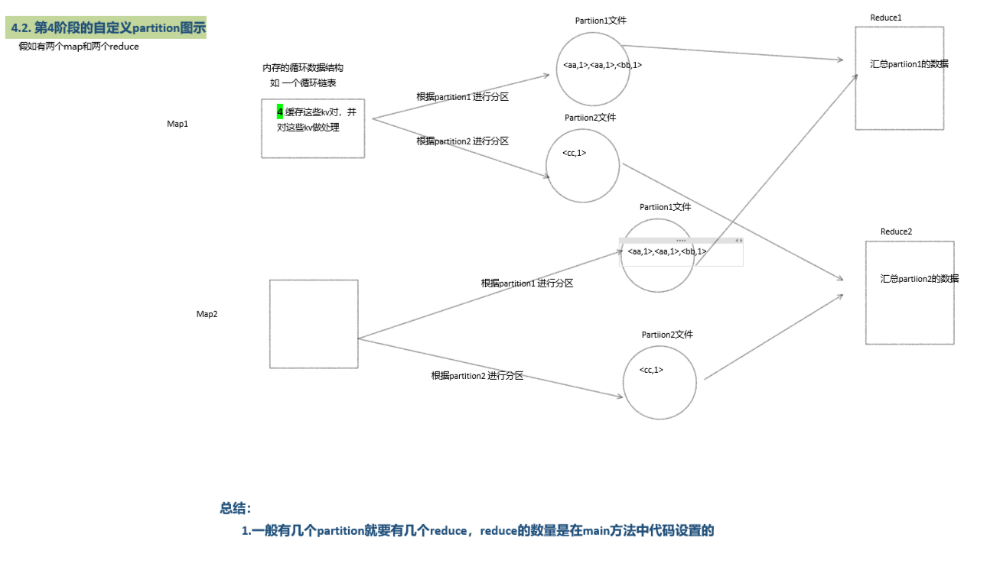
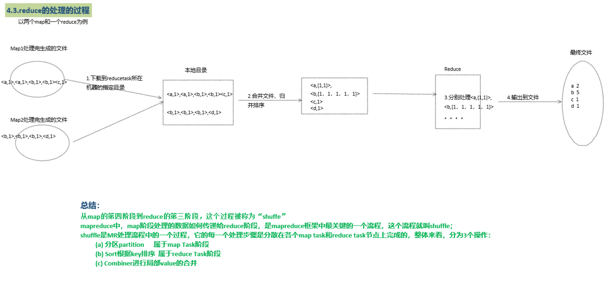

### mapreduce高级特性及shuffle

#### 回顾：

#### 今天任务

```
1.shuffle机制详细讲解
2.MR案例多文件输出
3.MR案例partition使用
4.MR案例内容去重
5.MR案例敏感词汇过滤
6.MR案例自定义combiner的使用
7.MR案例倒排序索引
8.MR案例简单排序
```

#### 教学目标

```
1.深入理解shuffle机制
2.掌握MR典型应用场景案例开发
```

#### 第一节：shuffle机制

##### 1.1  概述

mapreduce中，map阶段处理的数据如何传递给reduce阶段，是mapreduce框架中最关键的一个流程，这个流程就叫shuffle；shuffle:洗牌、发牌——（核心机制：数据分区，排序，缓存）；具体来说：就是将maptask输出的处理结果数据，分发给reducetask，并在分发的过程中，对数据按key进行了分区和排序；

##### 1.2 主要流程

<aa,2>

shuffle是MR处理流程中的一个过程，它的每一个处理步骤是分散在各个map task和reduce task节点上完成的，整体来看，分为3个操作：

- 分区partition      属于map Task阶段 
- Sort根据key排序  属于reduce Task阶段
- Combiner进行局部value的合并

##### 1.3 流程细分

1. 由wordcount案例执行开始分步演示mapreduce运行逻辑（*较粗，但对初学者理解mr有帮助*）

   

2. mr结合yarn运行逻辑

   

3. mr客户端程序业务流程

   

4. MrAppmaster控制map与reduce运行的工作流程

   

5. shuffle流程

   

   

   

   

6. ​

#### 第二节：结合案例讲解mr重要知识点

##### 1.1  获取文件名

在map运行时获取被处理数据所在文件的文件名

1. 待处理数据

   ```
    如chinese.txt 其内容如下    
     	小明  78
     	小红  80
     	小白  79
     
     math.txt:
     	小明  68
     	小红  70
     	小白  69
     
     enlish.txt:
     	小明  88
     	小红  90
     	小白  89
   ```

2. 需求：求出各科的平局分

   ```
    输出：
     	chinese 79
     	math 69
     	english 89
   ```

   

3. 思路

   ```
   （1）怎么得到每个学科的名称。如 chinese、math、english
   （2）将每个文件中的成绩进行累加后，求出平均即可
   （3）关键代码：
   	InputSplit is = context.getInputSplit();
   	String fileName = ((FileSplit)is).getPath().getName();
   ```

4. 代码

```java
import java.io.IOException;
import org.apache.hadoop.conf.Configuration;
import org.apache.hadoop.fs.FileSystem;
import org.apache.hadoop.fs.Path;
import org.apache.hadoop.io.LongWritable;
import org.apache.hadoop.io.Text;
import org.apache.hadoop.mapreduce.InputSplit;
import org.apache.hadoop.mapreduce.Job;
import org.apache.hadoop.mapreduce.Mapper;
import org.apache.hadoop.mapreduce.Reducer;
import org.apache.hadoop.mapreduce.lib.input.FileInputFormat;
import org.apache.hadoop.mapreduce.lib.input.FileSplit;
import org.apache.hadoop.mapreduce.lib.output.FileOutputFormat;


public class AvgDemo {
		
		public static class MyMapper extends Mapper<LongWritable, Text, Text, Text>{

			@Override
			protected void map(LongWritable key, Text value,Context context)
					throws IOException, InterruptedException {
				String line = value.toString();
				String lines [] = line.split(" ");
				//获取文件名字来作为key   <"chines",79>,<"chines",80>
				InputSplit is = context.getInputSplit();
				String fileName = ((FileSplit)is).getPath().getName();
				context.write(new Text(fileName), new Text(lines[1]));
			}
		}
		
		public static class MyReducer extends Reducer<Text, Text, Text, Text>{

			@Override
			protected void reduce(Text key, Iterable<Text> value,Context context)
					throws IOException, InterruptedException {
			
				double counter = 0;
				int sum = 0;
				for (Text t : value) {
					counter += Double.parseDouble(t.toString());
					sum ++;
				}
				context.write(key, new Text((counter/sum)+""));
			}
		}
		
		public static void main(String[] args) {
			try {
			
				Configuration conf = new Configuration();
				conf.set("fs.defaultFS", "hdfs://hadoop01:9000");
				
				Job job = Job.getInstance(conf, "model01");
				
				job.setJarByClass(AvgDemo.class);
				
				job.setMapperClass(MyMapper.class);
				job.setMapOutputKeyClass(Text.class);
				job.setMapOutputValueClass(Text.class);
				FileInputFormat.addInputPath(job, new Path(args[0]));
				
				
				job.setReducerClass(MyReducer.class);
				job.setOutputKeyClass(Text.class);
				job.setOutputValueClass(Text.class);
                
		//判断输出目录是否存在，若存在则删除
		FileSystem fs = FileSystem.get(conf);
		if(fs.exists(new Path(args[1]))){
			fs.delete(new Path(args[1]), true);
		}
				FileOutputFormat.setOutputPath(job, new Path(args[1]));
				
				int isok = job.waitForCompletion(true) ? 0 : 1;
				
				System.exit(isok);
			} catch (IOException | ClassNotFoundException | InterruptedException e) {
				e.printStackTrace();
			}
		}
}
```


##### 1.2 多文件输出

将mr处理后的结果数据输出到多个文件中

1. 待处理数据：

   ```
   hello world
   hi qianfeng
   Hi qianfeng
   Hello Qianfeng
   QQ
   163.com
   1603
   @qq.com
   123
   123
   (123)
   ```

   

2. 需求：

   ```
   单词首字母为a-z的单词放到一个输出文件，并统计
   单词首字母为A-Z的单词放到一个输出文件，并统计
   单词首字母为0-9的单词放到一个输出文件，并统计
   单词首字母为其它的单词放到一个输出文件，并统计
   ```

   

3. 思路：

   ```
   （1）在map阶段和wordcount案例map阶段一样。
   （2）在reduce阶段输出的时候，要根据单词的首字母将kv对输出到不同的文件中去
   （3）关键代码：
    	MyReducer类中：
    		mos = new MultipleOutputs<Text, Text>(context);
    		mos.write("az", key, new Text(counter+""));
    	main函数中：
    		MultipleOutputs.addNamedOutput(job, "az", TextOutputFormat.class, Text.class, Text.class);
   ```

   

4. 代码：

```java
import java.io.IOException;
import java.util.StringTokenizer;

import org.apache.hadoop.conf.Configuration;
import org.apache.hadoop.fs.FileSystem;
import org.apache.hadoop.fs.Path;
import org.apache.hadoop.io.LongWritable;
import org.apache.hadoop.io.Text;
import org.apache.hadoop.mapreduce.Job;
import org.apache.hadoop.mapreduce.Mapper;
import org.apache.hadoop.mapreduce.Reducer;
import org.apache.hadoop.mapreduce.Reducer.Context;
import org.apache.hadoop.mapreduce.lib.input.FileInputFormat;
import org.apache.hadoop.mapreduce.lib.output.FileOutputFormat;
import org.apache.hadoop.mapreduce.lib.output.MultipleOutputs;
import org.apache.hadoop.mapreduce.lib.output.TextOutputFormat;

public class MultipleDemo {
	
		public static class MyMapper extends Mapper<LongWritable, Text, Text, Text>{

			@Override
			protected void map(LongWritable key, Text value,Context context)
					throws IOException, InterruptedException {
				String line = value.toString();
 
				StringTokenizer st = new StringTokenizer(line);
				while (st.hasMoreTokens()) {
					context.write(new Text(st.nextToken()), new Text("1"));
				}
			}
		}
		
		public static class MyReducer extends Reducer<Text, Text, Text, Text>{
            
			//在reduce方法执行之前执行一次。(仅一次)
			MultipleOutputs<Text, Text > mos = null;
			
			@Override
			protected void setup(Context context)
					throws IOException, InterruptedException {
				//获取mos多文件输出对象
				mos = new MultipleOutputs<Text, Text>(context);
			}

			@Override
			protected void reduce(Text key, Iterable<Text> value,Context context)
					throws IOException, InterruptedException {
				/*
				 * qianfeng list(1,1)
				 */
				int counter = 0;
				for (Text t : value) {
					counter += Integer.parseInt(t.toString());
				}
			
				String word = key.toString();
				//判断单词首字母
				String firstChar = word.substring(0,1);
				if(firstChar.matches("[a-z]")){
					mos.write("az", key, new Text(counter+""));
				} else if(firstChar.matches("[A-Z]")){
					mos.write("AZ", key, new Text(counter+""));
				} else if(firstChar.matches("[0-9]")){
					mos.write("09", key, new Text(counter+""));
				} else {
					mos.write("others", key, new Text(counter+""));
				}
			}
            
			//在reduce方法执行之后执行一次。(仅一次)
			@Override
			protected void cleanup(Context context)
					throws IOException, InterruptedException {
				mos.close();
			}
		}
		
	
		public static void main(String[] args) {
			try {
				Configuration conf = new Configuration();
				conf.set("fs.defaultFS", "hdfs://hadoop01:9000");

				Job job = Job.getInstance(conf, "model01")
				job.setJarByClass(MultipleDemo.class);
				
				job.setMapperClass(MyMapper.class);
				job.setMapOutputKeyClass(Text.class);
				job.setMapOutputValueClass(Text.class);
				FileInputFormat.addInputPath(job, new Path(args[0]));
				
				//设置多文件输出
				MultipleOutputs.addNamedOutput(job, "az", TextOutputFormat.class, Text.class, Text.class);
				MultipleOutputs.addNamedOutput(job, "AZ", TextOutputFormat.class, Text.class, Text.class);
				MultipleOutputs.addNamedOutput(job, "09", TextOutputFormat.class, Text.class, Text.class);
				MultipleOutputs.addNamedOutput(job, "others", TextOutputFormat.class, Text.class, Text.class);
				
				job.setReducerClass(MyReducer.class);
				job.setOutputKeyClass(Text.class);
				job.setOutputValueClass(Text.class);
				
				FileOutputFormat.setOutputPath(job, new Path(args[1]));
				
				int isok = job.waitForCompletion(true) ? 0 : 1;
				System.exit(isok);
			} catch (IOException | ClassNotFoundException | InterruptedException e) {
				e.printStackTrace();
			}
		}
}
```

##### 1.3 partition分区

Mapreduce中会将map输出的kv对，按照相同key分组，然后分发给不同的reducetask默认的分发规则为：根据key的hashcode%reducetask数来分发，所以：如果要按照我们自己的需求进行分组，则需要改写数据分发（分组）组件Partitioner。

- 自定义一个CustomPartitioner继承抽象类：Partitioner
- 然后在job对象中，设置自定义partitioner： job.setPartitionerClass(CustomPartitioner.class)


自定义的partition类

```java
import org.apache.hadoop.io.Text;
import org.apache.hadoop.mapreduce.Partitioner;
/**
 * 自定义分区类
 *
 *
 *注意：
 *1、该类需要继承Partitioner类
 *2、分区的类型需要和map端的输出(reduce端的输入)相同
 *3、getPartition()方法只能返回int类型值
 *4、分区数量需要和reduceTask的数量相等
 *5、分区返回值尽量用%(模于)方式做。根据业务做
 *6、默认使用HashPartitoiner。
 */
public class MyPartitioner extends Partitioner<Text, Text>{
	
	@Override
	public int getPartition(Text key, Text value, int numPartitions) {
		String firstChar = key.toString().substring(0, 1);
		//判断
		if(firstChar.matches("[a-z]")){
			return 1%numPartitions;
		} else if (firstChar.matches("[A-Z]")){
			return 2%numPartitions;
		} else if (firstChar.matches("[0-9]")){
			return 3%numPartitions;
		} else {
			return 4%numPartitions;
		}
	}
}
```

PartitionerDemo

```java
import java.io.IOException;
import java.util.StringTokenizer;

import org.apache.hadoop.conf.Configuration;
import org.apache.hadoop.fs.FileSystem;
import org.apache.hadoop.fs.Path;
import org.apache.hadoop.io.LongWritable;
import org.apache.hadoop.io.Text;
import org.apache.hadoop.mapreduce.Job;
import org.apache.hadoop.mapreduce.Mapper;
import org.apache.hadoop.mapreduce.Reducer;
import org.apache.hadoop.mapreduce.Reducer.Context;
import org.apache.hadoop.mapreduce.lib.aggregate.ValueAggregatorBaseDescriptor;
import org.apache.hadoop.mapreduce.lib.input.FileInputFormat;
import org.apache.hadoop.mapreduce.lib.output.FileOutputFormat;


/**
 * 分区
 * 
 *输入数据
 *hello world
 *hi qianfeng
 *Hi qianfeng
 *Hello Qianfeng
 *QQ
 *163.com
 *1603
 *@qq.com
 **123
 **123
 *(123)
 *
 *单词首字母为a-z的单词放到一个输出文件，并统计
 *单词首字母为A-Z的单词放到一个输出文件，并统计
 *单词首字母为0-9的单词放到一个输出文件，并统计
 *单词首字母为其它的单词放到一个输出文件，并统计
 *
 *
 *任务：
 *lh db
 *zyt zy
 *ls zy
 *hgw jc
 *yxx hd
 *hz hb
 *xyd hb
 *hj hb
 *cs hb
 关键代码
 	//设置partitioner的相关属性
	job.setPartitionerClass(MyPartitioner.class);
	job.setNumReduceTasks(4); //设置reduce task数量。该数值需要和分区数相等
 */
public class PartitionerDemo {
	//自定义myMapper
		public static class MyMapper extends Mapper<LongWritable, Text, Text, Text>{

			Text k = new Text();
			Text v = new Text("1");
			
			@Override
			protected void map(LongWritable key, Text value,Context context)
					throws IOException, InterruptedException {
				String line = value.toString();
				StringTokenizer st = new StringTokenizer(line);
				while (st.hasMoreTokens()) {
					k.set(st.nextToken());
					context.write(k, v);
				}
			}
		}
		
		//自定义myReducer
		public static class MyReducer extends Reducer<Text, Text, Text, Text>{
			
			Text v = new Text();
			@Override
			protected void reduce(Text key, Iterable<Text> value,Context context)
					throws IOException, InterruptedException {
				int counter = 0;
				for (Text t : value) {
					counter += Integer.parseInt(t.toString());
				}
				v.set(counter+"");
				context.write(key, v);
			}
		}
		
		/**
		 * job的驱动方法
		 * @param args
		 */
		public static void main(String[] args) {
			try {
				//1、获取Conf
				Configuration conf = new Configuration();
				conf.set("fs.defaultFS", "hdfs://hadoop01:9000");
				//2、创建job
				Job job = Job.getInstance(conf, "model01");
				//3、设置运行job的class
				job.setJarByClass(PartitionerDemo.class);
				//4、设置map相关属性
				job.setMapperClass(MyMapper.class);
				job.setMapOutputKeyClass(Text.class);
				job.setMapOutputValueClass(Text.class);
				FileInputFormat.addInputPath(job, new Path(args[0]));
				
	//设置partitioner的相关属性
	job.setPartitionerClass(MyPartitioner.class);
	job.setNumReduceTasks(4); //设置reduce task数量。该数值需要和分区数相等
				//5、设置reduce相关属性
				job.setReducerClass(MyReducer.class);
				job.setOutputKeyClass(Text.class);
				job.setOutputValueClass(Text.class);
				//判断输出目录是否存在，若存在则删除
				FileSystem fs = FileSystem.get(conf);
				if(fs.exists(new Path(args[1]))){
					fs.delete(new Path(args[1]), true);
				}
				FileOutputFormat.setOutputPath(job, new Path(args[1]));
				
				//6、提交运行job
				int isok = job.waitForCompletion(true) ? 0 : 1;
				
				//退出
				System.exit(isok);
				
			} catch (IOException | ClassNotFoundException | InterruptedException e) {
				e.printStackTrace();
			}
		}
}

```


##### 1.4 去除重复

去除文件中重复的行

```java
import java.io.IOException;
import org.apache.hadoop.conf.Configuration;
import org.apache.hadoop.fs.FileSystem;
import org.apache.hadoop.fs.Path;
import org.apache.hadoop.io.LongWritable;
import org.apache.hadoop.io.Text;
import org.apache.hadoop.mapreduce.Job;
import org.apache.hadoop.mapreduce.Mapper;
import org.apache.hadoop.mapreduce.Reducer;
import org.apache.hadoop.mapreduce.lib.input.FileInputFormat;
import org.apache.hadoop.mapreduce.lib.output.FileOutputFormat;

/**
 *	去重：
 *  
 *	多个文件：
 *		1.file
 *			2017-04-13 北京-重庆 15:30
 *			2017-04-13 北京-上海 17:30
 *			2017-04-13 北京-重庆 16:30
 *			2017-04-13 北京-广东 11:36
 *			2017-04-13 北京-海南 12:59
 *			2017-04-13 北京-拉萨 09:32
 *
 *		2.file
 *			2017-04-13 北京-重庆 15:30
 *			2017-04-13 北京-上海 10:30
 *			2017-04-13 北京-重庆 16:30
 *			2017-04-13 广州-北京 11:36
 *			2017-04-13 海南-北京 12:59
 *			2017-04-13 北京-成都 09:32
 *
 *	输出：
 *	 	2017-04-13 北京-重庆 15:30
 * 		2017-04-13 北京-上海 17:30
 * 		2017-04-13 北京-重庆 16:30
 * 		2017-04-13 北京-广东 11:36
 * 		2017-04-13 北京-海南 12:59
 * 		2017-04-13 北京-拉萨 09:32
 * 		2017-04-13 北京-上海 10:30
 * 		2017-04-13 广州-北京 11:36
 * 		2017-04-13 海南-北京 12:59
 * 		2017-04-13 北京-成都 09:32
 * 
 * 
 * 任务：
 * 统计日登陆次数？？统计日二次以上登陆次数？？统计日三次以上登陆次数？？
 * user/login?uid=7595&pw=fjsj09eu5jituteoowu0
 * user/login?uid=230&pw=fjsj09eu5jitiyt674
 * user/login?uid=7595&pw=fjsj09eu5jiiui654
 * user/login?uid=3323&pw=fjsj09eu5765764567
 * user/login?uid=234&pw=fjsj09eu5jituteoowu0
 * user/login?uid=7595&pw=fjsj09eu5jituteoowu0
 * user/login?uid=6854&pw=fjsj09eu5jituteoowu0
 * user/login?uid=230&pw=fjsj09eu5jituteoowu0
 * user/login?uid=7595&pw=fjsj09eu5jituteoowu0
 * user/login?uid=321&pw=fjsj09eu5jituteoowu0
 * 
 */
public class DistinctDemo {
	
	    //自定义myMapper
		public static class MyMapper extends Mapper<LongWritable, Text, Text, Text>{

			@Override
			protected void map(LongWritable key, Text value,Context context)
					throws IOException, InterruptedException {
				context.write(value, new Text(""));
			}
		}
		
		//自定义myReducer
		public static class MyReducer extends Reducer<Text, Text, Text, Text>{

			@Override
			protected void reduce(Text key, Iterable<Text> value,Context context)
					throws IOException, InterruptedException {
				context.write(key, new Text(""));
                
			}
		}
		
		/**
		 * job的驱动方法
		 */
		public static void main(String[] args) {
			try {
				//1、获取Conf
				Configuration conf = new Configuration();
				conf.set("fs.defaultFS", "hdfs://hadoop01:9000");
				//2、创建job
				Job job = Job.getInstance(conf, "model01");
				//3、设置运行job的class
				job.setJarByClass(DistinctDemo.class);
				//4、设置map相关属性
				job.setMapperClass(MyMapper.class);
				job.setMapOutputKeyClass(Text.class);
				job.setMapOutputValueClass(Text.class);
				FileInputFormat.addInputPath(job, new Path(args[0]));
				
				//5、设置reduce相关属性
				job.setReducerClass(MyReducer.class);
				job.setOutputKeyClass(Text.class);
				job.setOutputValueClass(Text.class);
				//判断输出目录是否存在，若存在则删除
				FileSystem fs = FileSystem.get(conf);
				if(fs.exists(new Path(args[1]))){
					fs.delete(new Path(args[1]), true);
				}
				FileOutputFormat.setOutputPath(job, new Path(args[1]));
				
				//6、提交运行job
				int isok = job.waitForCompletion(true) ? 0 : 1;
				
				//退出
				System.exit(isok);
				
			} catch (IOException | ClassNotFoundException | InterruptedException e) {
				e.printStackTrace();
			}
		}
}
```

##### 1.5 过滤敏感词汇

一篇文章 article.txt  内容如下

```
We ask that you please do not send us emails privately asking for support. We are non-paid volunteers who help out with the project and we do not necessarily have the time or energy to help people on an individual basis. Instead, we have setup mailing lists for each module which often contain hundreds of individuals who will help answer detailed requests for help. The benefit of using mailing lists over private communication is that it is a shared resource where others can also learn from common mistakes and as a community we all grow together.
```

一个敏感词库 sensitive.txt 内容如下

```
ask from all
```

需求：在article.txt中过滤掉sensitive.txt 包含的词

思路：

​	1.加载敏感词库文件

代码：

```java
import java.io.BufferedReader;
import java.io.File;
import java.io.FileReader;
import java.io.IOException;
import java.net.URI;
import java.util.ArrayList;
import java.util.List;
import java.util.StringTokenizer;

import org.apache.hadoop.conf.Configuration;
import org.apache.hadoop.fs.FileSystem;
import org.apache.hadoop.fs.Path;
import org.apache.hadoop.io.LongWritable;
import org.apache.hadoop.io.Text;
import org.apache.hadoop.mapreduce.Job;
import org.apache.hadoop.mapreduce.Mapper;
import org.apache.hadoop.mapreduce.Reducer;
import org.apache.hadoop.mapreduce.filecache.DistributedCache;
import org.apache.hadoop.mapreduce.lib.input.FileInputFormat;
import org.apache.hadoop.mapreduce.lib.output.FileOutputFormat;
import org.apache.hadoop.util.GenericOptionsParser;
import org.apache.hadoop.util.Tool;
import org.apache.hadoop.util.ToolRunner;
/**
 * 敏感词汇过滤并统计：
 */
public class GrepDemo  extends ToolRunner implements Tool{

	/**
	 * 自定义的myMapper
	 */
	static class MyMapper extends Mapper<LongWritable, Text, Text, Text>{

		/**
		 * 读取小文件进行缓存  （分布式缓存）
//在main中设置分布式缓存文件
job.addCacheFile(new URI("hdfs://hadoop01:9000/1603data/dir"));
		 */
		static List<String> li = new ArrayList<String>();
        
		@Override
		protected void setup(Context context)throws IOException, InterruptedException {
			//获取缓存文件路径的数组
			Path [] paths = DistributedCache.getLocalCacheFiles(context.getConfiguration());
			//循环读取每一个缓存文件
			for (Path p : paths) {
				//获取文件名字
				String fileName = p.getName();
				if(fileName.equals("dir")){
					BufferedReader sb = null;
					sb = new BufferedReader(new FileReader(new File(p.toString())));
					//读取BufferedReader里面的数据
					String tmp = null;
					while ( (tmp = sb.readLine()) != null) {
						String ss []= tmp.split(" ");
						for (String s : ss) {
							li.add(s);
						}
					}
					//关闭sb对象
					sb.close();
				} 
			}
		}

		@Override
		protected void map(LongWritable key, Text value,Context context)
				throws IOException, InterruptedException {
			String line = value.toString();
			StringTokenizer lines = new StringTokenizer(line);
			while (lines.hasMoreTokens()) {
				//判断每一个单词是否是敏感词汇
				String word = lines.nextToken();
				if(!li.contains(word)){
					context.write(new Text(word), new Text("1"));
				}
			}
		}
	}
	
	/**
	 * 自定义MyReducer
	 */
	static class MyReducer extends Reducer<Text, Text, Text, Text>{
		
		@Override
		protected void reduce(Text key, Iterable<Text> value,Context context)
				throws IOException, InterruptedException {
			int counter = 0;
			for (Text t : value) {
				counter += Integer.parseInt(t.toString());
			}
			context.write(key, new Text(counter+""));
		}
	}
	
	
	@Override
	public void setConf(Configuration conf) {
		conf.set("fs.defaultFS", "hdfs://hadoop01:9000");
	}

	@Override
	public Configuration getConf() {
		return new Configuration();
	}
	
	/**
	 * 驱动方法
	 */
	@Override
	public int run(String[] args) throws Exception {
		//1、获取conf对象
		Configuration conf = getConf();
		//2、创建job
		Job job = Job.getInstance(conf, "GrepDemo");
		//3、设置运行job的class
		job.setJarByClass(GrepDemo.class);
		//4、设置map相关属性
		job.setMapperClass(MyMapper.class);
		job.setMapOutputKeyClass(Text.class);
		job.setMapOutputValueClass(Text.class);
		FileInputFormat.addInputPath(job, new Path(args[0]));
		
//设置分布式缓存文件
job.addCacheFile(new URI("hdfs://hadoop01:9000/1603data/dir"));
		
		//5、设置reduce相关属性
		job.setReducerClass(MyReducer.class);
		job.setOutputKeyClass(Text.class);
		job.setOutputValueClass(Text.class);
		//判断输出目录是否存在，若存在则删除
		FileSystem fs = FileSystem.get(conf);
		if(fs.exists(new Path(args[1]))){
			fs.delete(new Path(args[1]), true);
		}
		FileOutputFormat.setOutputPath(job, new Path(args[1]));
		
		//6、提交运行job
		int isok = job.waitForCompletion(true) ? 0 : 1;
		return isok;
	}
	
	/**
	 * job的主入口
	 * @param args
	 */
	public static void main(String[] args) {
		try {
			//对输入参数作解析
			String [] argss = new GenericOptionsParser(new Configuration(), args).getRemainingArgs();
			System.exit(ToolRunner.run(new GrepDemo(), argss));
		} catch (Exception e) {
			e.printStackTrace();
		}
	}
}
```

##### 1.6 Combiner   map输出的时候 

- combiner是MR程序中Mapper和Reducer之外的一种组件
- combiner组件的父类就是Reducer
- combiner和reducer的区别在于运行的位置：
  - Combiner是在每一个maptask所在的节点运行
  - Reducer是接收全局所有Mapper的输出结果；
- combiner的意义就是对每一个maptask的输出进行局部汇总，以减小网络传输量。具体实现步骤：
  1. 自定义一个combiner继承Reducer，重写reduce方法
  2. 在job中设置：  job.setCombinerClass(CustomCombiner.class)
- combiner能够应用的前提是不能影响最终的业务逻辑，而且combiner的输出kv应该跟reducer的输入kv类型要对应起来

```java
import java.io.IOException;
import java.util.StringTokenizer;

import org.apache.hadoop.conf.Configuration;
import org.apache.hadoop.fs.FileSystem;
import org.apache.hadoop.fs.Path;
import org.apache.hadoop.io.LongWritable;
import org.apache.hadoop.io.Text;
import org.apache.hadoop.mapreduce.Job;
import org.apache.hadoop.mapreduce.Mapper;
import org.apache.hadoop.mapreduce.Reducer;
import org.apache.hadoop.mapreduce.lib.input.FileInputFormat;
import org.apache.hadoop.mapreduce.lib.output.FileOutputFormat;
import org.apache.hadoop.util.GenericOptionsParser;
import org.apache.hadoop.util.Tool;
import org.apache.hadoop.util.ToolRunner;


public class WordCountCombiner extends ToolRunner implements Tool{

	/**
	 * 自定义的myMapper
	 */
	static class MyMapper extends Mapper<LongWritable, Text, Text, Text>{

		@Override
		protected void map(LongWritable key, Text value,Context context)
				throws IOException, InterruptedException {
			String line = value.toString();
			StringTokenizer st = new StringTokenizer(line);
			while (st.hasMoreTokens()) {
				context.write(new Text(st.nextToken()), new Text(1+""));
			}
		}
	}
	
	/**
	 * 自定义MyReducer
	 */
	static class MyReducer extends Reducer<Text, Text, Text, Text>{

		@Override
		protected void reduce(Text key, Iterable<Text> value,Context context)
				throws IOException, InterruptedException {
			int counter = 0;
			for (Text t: value) {
				counter += Integer.parseInt(t.toString());
			}
			context.write(key, new Text(counter+""));
		}
	}
	
	
	@Override
	public void setConf(Configuration conf) {
		conf.set("fs.defaultFS", "hdfs://hadoop01:9000");
	}

	@Override
	public Configuration getConf() {
		return new Configuration();
	}
	
	/**
	 * 驱动方法
	 */
	@Override
	public int run(String[] args) throws Exception {
		//1、获取conf对象
		Configuration conf = getConf();
		//2、创建job
		Job job = Job.getInstance(conf, "model01");
		//3、设置运行job的class
		job.setJarByClass(WordCountCombiner.class);
		//4、设置map相关属性
		job.setMapperClass(MyMapper.class);
		job.setMapOutputKeyClass(Text.class);
		job.setMapOutputValueClass(Text.class);
		FileInputFormat.addInputPath(job, new Path(args[0]));
		
//设置combiner类
//job.setCombinerClass(WCC.class);
job.setCombinerClass(MyReducer.class);
		
		//5、设置reduce相关属性
		job.setReducerClass(MyReducer.class);
		job.setOutputKeyClass(Text.class);
		job.setOutputValueClass(Text.class);
		//判断输出目录是否存在，若存在则删除
		FileSystem fs = FileSystem.get(conf);
		if(fs.exists(new Path(args[1]))){
			fs.delete(new Path(args[1]), true);
		}
		FileOutputFormat.setOutputPath(job, new Path(args[1]));
		
		//6、提交运行job
		int isok = job.waitForCompletion(true) ? 0 : 1;
		return isok;
	}
	
	/**
	 * job的主入口
	 * @param args
	 */
	public static void main(String[] args) {
		try {
			//对输入参数作解析
			String [] argss = new GenericOptionsParser(new Configuration(), args).getRemainingArgs();
			System.exit(ToolRunner.run(new WordCountCombiner(), argss));
		} catch (Exception e) {
			e.printStackTrace();
		}
	}
}
```

##### 1.7 倒排序

需求：

文章及其内容：
	 index.html :          hadoop is good hadoop hadoop is ok
	 page.html :           hadoop has hbase hbase is good hbase and hive
	 content.html :      hadoop spark hbase are good ok

 输出：
 	and page.html:1
 	are content.html:1
 	hadoop index.html:3 ; page.html:1;content.html:1
 	hbase page.html:3 ; content.html:1

思路：

 1. map中  输出  <"单词 文件名 "，1>  如< "and page.html"  ,  1>

 2. 在combiner中的

    输入效果：

    ​	< "and page.html"  ,  1>

    ​	< "are content.htmll"  ,  1>

    ​	<"hadoop index.html", {1，1，1}>

    ​	<"hadoop page.html", 1>

    ​	<"hadoop content.html", 1>

    输出效果：

    ​	<"and" , "page.html:1">

    ​	<"are" , "content.html:1">

    ​	<"hadoop" , "index.html:3">

    ​	<"hadoop" , "page.html:1">

    ​	<"hadoop" , "content.html:1">

    3 在reduce的

    ​	输入效果：

    ​	<"and" , "page.html:1">

    ​	<"are" , "content.html:1">

    ​	<"hadoop" , {"index.html:3", "page.html:1"，"content.html:1"}>

    ​	输出效果：

    ​	<"and" , "page.html:1">

    ​	<"are" , "content.html:1">
     	<"hadoop" , "index.html:3 ; page.html:1;content.html:1">

DescSortCombiner

```java
import java.io.IOException;
import org.apache.hadoop.io.Text;
import org.apache.hadoop.mapreduce.Reducer;

public class DescSortCombiner extends Reducer<Text, Text, Text, Text>{

	/**
		key  文件名+"_"+word    value 1
	 * index.html_hadoop   list(1,1,1)
	 * index.html_is       list(1,1)
	 * index.html_good     list(1)
	 * index.html_ok       list(1)
	 * page.html_hadoop    list(1)
	 * 
	 * 
	 * hadoop index.html:3
	 * hadoop page.html:1
	 * 
	 * 
	 */
	@Override
	protected void reduce(Text key, Iterable<Text> value,Context context) throws IOException,
			InterruptedException {
                
		 int counter = 0;
		 Text k = new Text();
		 Text v = new Text();
		String s [] = key.toString().split("_");
		for (Text t : value) {
			counter += Integer.parseInt(t.toString());
		}
		k.set(s[1]);
		v.set(s[0]+":"+counter);
		context.write(k, v);
	}
	
}
```

DescSort

```java
import java.io.IOException;
import java.util.ArrayList;
import java.util.List;
import org.apache.hadoop.conf.Configuration;
import org.apache.hadoop.conf.Configured;
import org.apache.hadoop.fs.FileSystem;
import org.apache.hadoop.fs.Path;
import org.apache.hadoop.io.LongWritable;
import org.apache.hadoop.io.Text;
import org.apache.hadoop.mapreduce.InputSplit;
import org.apache.hadoop.mapreduce.Job;
import org.apache.hadoop.mapreduce.Mapper;
import org.apache.hadoop.mapreduce.Reducer;
import org.apache.hadoop.mapreduce.lib.input.FileInputFormat;
import org.apache.hadoop.mapreduce.lib.input.FileSplit;
import org.apache.hadoop.mapreduce.lib.output.FileOutputFormat;
import org.apache.hadoop.util.GenericOptionsParser;
import org.apache.hadoop.util.Tool;
import org.apache.hadoop.util.ToolRunner;

/**
 * 倒排索引：
 */
public class DescSort  extends Configured implements Tool{
	/**
	 * 自定义的myMapper
	 */
	static class MyMapper extends Mapper<LongWritable, Text, Text, Text>{

		@Override
		protected void map(LongWritable key, Text value,Context context)
				throws IOException, InterruptedException {
			String line = value.toString();
			//获取文件名
			InputSplit is = context.getInputSplit();
			String fileName = ((FileSplit)is).getPath().getName();
			String lines [] = line.split(" ");
			for (String s: lines) {
				context.write(new Text(fileName+"_"+s), new Text(1+""));
			}
			/**
			 * index.html_hadoop 1
			 * index.html_is 1
			 * index.html_good 1
			 * index.html_hadoop 1
			 * index.html_hadoop 1
			 * index.html_is 1
			 * index.html_ok 1
			 * page.html_hadoop 1
			 */
		}
	}
	
	/**
	 * 自定义MyReducer
	 * @author lyd
	 *
	 */
	static class MyReducer extends Reducer<Text, Text, Text, Text>{
		
		List<String> li = new ArrayList<String>();
        
		@Override
		protected void reduce(Text key, Iterable<Text> value,Context context)
				throws IOException, InterruptedException {
		
			/**
			 * index.html_hadoop list(1,1,1)
			 * index.html_is list(1,1)
			 * index.html_good list(1)
			 * index.html_ok list(1)
			 * page.html_hadoop list(1)
			 * 
			 * 
			 *hadoop list(index.html:3,page.html:1)
			 */
			
			/*
			 int counter = 0;
			 for (Text t : value) {
				counter += Integer.parseInt(t.toString());
			}
			String s [] = key.toString().split("_");
			li.add(s[1]+" "+s[0]+":"+counter);*/
			String v = "";
			for (Text t : value) {
				v += t.toString() +";";
			}
			context.write(key, new Text(v.substring(0, v.length()-1)));
		}
		
		@Override
		protected void cleanup(Context context)throws IOException, InterruptedException {
			/*for (String s : li) {
				String ss [] = s.split(" ");
			}*/
		}
	}
	
	@Override
	public int run(String[] args) throws Exception {
		//1、获取conf对象
		Configuration conf = super.getConf();
		//2、创建job
		Job job = Job.getInstance(conf, "model03");
		//3、设置运行job的class
		job.setJarByClass(DescSort.class);
		//4、设置map相关属性
		job.setMapperClass(MyMapper.class);
		job.setMapOutputKeyClass(Text.class);
		job.setMapOutputValueClass(Text.class);
		FileInputFormat.addInputPath(job, new Path(args[0]));
		
//设置commbiner
job.setCombinerClass(DescSortCombiner.class);
		
		//5、设置reduce相关属性
		job.setReducerClass(MyReducer.class);
		job.setOutputKeyClass(Text.class);
		job.setOutputValueClass(Text.class);
		//判断输出目录是否存在，若存在则删除
		FileSystem fs = FileSystem.get(conf);
		if(fs.exists(new Path(args[1]))){
			fs.delete(new Path(args[1]), true);
		}
		FileOutputFormat.setOutputPath(job, new Path(args[1]));
		
		//6、提交运行job
		int isok = job.waitForCompletion(true) ? 0 : 1;
		return isok;
	}
	
	/**
	 * job的主入口
	 * @param args
	 */
	public static void main(String[] args) {
		try {
			//对输入参数作解析
			String [] argss = new GenericOptionsParser(new Configuration(), args).getRemainingArgs();
			System.exit(ToolRunner.run(new DescSort(), argss));
		} catch (Exception e) {
			e.printStackTrace();
		}
	}
}

```

##### 1.8 简单排序

```java
import java.io.IOException;
import org.apache.hadoop.conf.Configuration;
import org.apache.hadoop.fs.FileSystem;
import org.apache.hadoop.fs.Path;
import org.apache.hadoop.io.IntWritable;
import org.apache.hadoop.io.LongWritable;
import org.apache.hadoop.io.Text;
import org.apache.hadoop.mapreduce.Job;
import org.apache.hadoop.mapreduce.Mapper;
import org.apache.hadoop.mapreduce.lib.input.FileInputFormat;
import org.apache.hadoop.mapreduce.lib.output.FileOutputFormat;

/**
 *	简单排序
 *
 *	数据：
 *		899
 *		45
 *		654564
 *		432
 *		45236
 *		76
 *		654
 *		32
 *		643
 *		45
 *		754
 *		34
 *
 *词频统计并按照次数高低排序？？取前三个？？
 *hello qianfeng hello qianfeng world hello hadoop hello qianfeng hadoop
 hello 4
 qianfeng 3
 hadoop 2
 *
 */
public class SortSample {
	//自定义myMapper
	public static class MyMapper extends Mapper<LongWritable, Text, IntWritable, Text>{

		@Override
		protected void map(LongWritable key, Text value,Context context)
				throws IOException, InterruptedException {
			context.write(new IntWritable(Integer.parseInt(value.toString())), new Text(""));
		}
	}
	
	/*//自定义myReducer
	public static class MyReducer extends Reducer<Text, Text, Text, Text>{
		//在reduce方法执行之前执行一次。(仅一次)
		@Override
		protected void setup(Context context)
				throws IOException, InterruptedException {
		}

		@Override
		protected void reduce(Text key, Iterable<Text> value,Context context)
				throws IOException, InterruptedException {
			context.write(new Text(value.toString()), new Text(""));
		}
		//在reduce方法执行之后执行一次。(仅一次)
		@Override
		protected void cleanup(Context context)
				throws IOException, InterruptedException {
		}
	}*/
	
	/**
	 * job的驱动方法
	 * @param args
	 */
	public static void main(String[] args) {
		try {
			//1、获取Conf
			Configuration conf = new Configuration();
			conf.set("fs.defaultFS", "hdfs://hadoop01:9000");
			//2、创建job
			Job job = Job.getInstance(conf, "model01");
			//3、设置运行job的class
			job.setJarByClass(SortSample.class);
			//4、设置map相关属性
			job.setMapperClass(MyMapper.class);
			job.setMapOutputKeyClass(IntWritable.class);
			job.setMapOutputValueClass(Text.class);
			FileInputFormat.addInputPath(job, new Path(args[0]));
			
			//5、设置reduce相关属性
			/*job.setReducerClass(MyReducer.class);
			job.setOutputKeyClass(Text.class);
			job.setOutputValueClass(Text.class);*/
			//判断输出目录是否存在，若存在则删除
			FileSystem fs = FileSystem.get(conf);
			if(fs.exists(new Path(args[1]))){
				fs.delete(new Path(args[1]), true);
			}
			FileOutputFormat.setOutputPath(job, new Path(args[1]));
			
			//6、提交运行job
			int isok = job.waitForCompletion(true) ? 0 : 1;
			
			//退出
			System.exit(isok);
			
		} catch (IOException | ClassNotFoundException | InterruptedException e) {
			e.printStackTrace();
		}
	}
}
```


##### 

