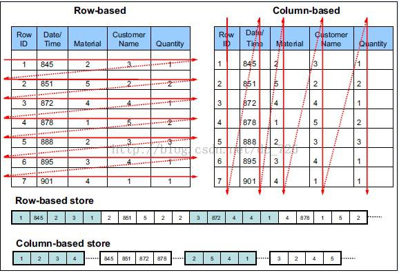

# Parquet 列式存储格式

1. **背景**

## **背景**

```
随着大数据时代的到来，越来越多的数据流向了 Hadoop 生态圈，同时对于能够快速的从TB 甚至PB 级别的数据中获取有价值的数据对于一个产品和公司来说更加重要，在Hadoop 生态圈的快速发展过程中，涌现了一批开源的数据分析引擎，例如 Hive、Spark SQL、Impala、
Presto 等，同时也产生了多个高性能的列式存储格式，例如 RCFile、ORC、Parquet 等。在spark Sql 中已经默认是parquet格式
```

##  **Parquet** **存储格式**

```
Apache Parquet 是 Hadoop 生态圈中一种新型列式存储格式，它可以兼容 Hadoop 生态圈中大多数计算框架(Mapreduce、Spark 等)，被多种查询引擎支持（Hive、Impala、Drill 等），并且它是语言和平台无关的。Parquet 最初是由Twitter 和Cloudera 合作开发完成并开源，2015年 5 月从 Apache 的孵化器里毕业成为 Apache 顶级项目，目前最新版本 1.9.0。
```

##  **列式存储**

```
由于 OLAP 查询的特点，列式存储可以提升其查询性能，但是它是如何做到的呢？这就要从列式存储的原理说起，从图 1 中可以看到，相对于关系数据库中通常使用的行式存储，在使用列式存储时每一列的所有元素都是顺序存储的。由此特点可以给查询带来如下的优化：
①查询的时候不需要扫描全部的数据，而只需要读取每次查询涉及的列，这样可以将
I/O 消耗降低 N 倍。
②由于每一列的成员都是同构的，可以针对不同的数据类型使用更高效的数据压缩算  法，进一步减小 I/O。
③适配多种计算框架
Parquet 是语言无关的，而且不与任何一种数据处理框架绑定在一起，适配多种语言和组件，能够与 Parquet 配合的组件有：
查询引擎: Hive, Impala, Pig, Presto, Drill, IBM Big SQL
计算框架: MapReduce, Spark, Cascading, Kite
```

## 优点

Parquet是列式存储格式的一种文件类型，列式存储有以下的核心优势：

```
 a.可以跳过不符合条件的数据，只读取需要的数据，降低IO数据量。  
 b.压缩编码可以降低磁盘存储空间。由于同一列的数据类型是一样的，可以使用更高效的压缩编码（例如Run Length Encoding和Delta Encoding）进一步节约存储空间, 由于每一列中的数据类型相同，所以可以针对不同类型的列使用不同的编码和压缩方式，这样可以大大降低数据存储空间。  
 c.只读取需要的列，支持向量运算，能够获取更好的扫描性能。
 d.读取数据的时候可以把映射(Project)下推，只需要读取需要的列，这样可以大大减少每次查询的I/O数据量，更甚至可以支持谓词下推，跳过不满足条件的列。
e.由于每一列的数据类型相同，可以使用更加适合CPU pipeline的编码方式，减小CPU的缓存失效。
```



## 文件结构

```
Parquet 文件是以二进制方式存储的，是不可以直接读取和修改的，Parquet 文件是自解析的，文件中包括该文件的数据和元数据。Parquet 文件中存在如下几个概念：
①行组(Row Group)：按照行将数据物理上划分为多个单元，每一个行组包含一定的行数，在一个 HDFS 文件中至少存储一个行组，Parquet 读写的时候会将整个行组缓存在内存中，所以每一个行组的大小是由内存大的小决定的。
②列块(Column Chunk)：在一个行组中每一列保存在一个列块中，行组中的所有列连续的存储在这个行组文件中。不同的列块可能使用不同的算法进行压缩。
③页(Page)：每一个列块划分为多个页，一个页是最小的编码的单位，在同一个列块  的不同页可能使用不同的编码方式。
```

总结:列式存储，多行划分为行组，每个行组包含多个列块（每一列），每一个列块的压缩算法不一样，因为存储格式不一样，String,Int等，不同类型有不同的压缩算法。

****


上图展示了一个 Parquet 文件的内容，一个文件中可以存储多个行组，文件的首位都是该文件的 Magic Code，用于校验它是否是一个 Parquet 文件，Footer length 了文件元数据的大小，通过该值和文件长度可以计算出元数据的偏移量，文件的元数据中包括每一个行组的元数据信息和该文件存储数据的 Schema 信息。

## 还原嵌套结构

```
● 难点
处理嵌套的数据结构才是真正的挑战。
多个 field 可以形成一个 group，一个 field 可以重复出现（叫做 repeated field）。用 group 和 repeated field 的各种组合来描述。
● Definition Level
知道到底是从哪一级开始没定义的，这是还原整条记录所必须知道的。
不要让 definition level 太大，这很重要，目标是所用的比特越少越好。
● Repetition level
标示着新 List 出现的层级。
repetition level 告诉我们，在从列式表达，还原嵌套结构的时候，是在哪一级插入新值。
示意图：http://lastorder.me/tag/parquet.html
每一个基本类型的列，都要创建三个子列（R, D, Value）。
三个子列的总开销其实并不大. 因为两种 Levels的最大值，是由 schema 的深度决定的，并且通常只用几个 bit 就够用了（1个bit 就可表达1层嵌套，2个bit就可以表达3层嵌套了，3个bit就能够表达7层嵌套。
为了通过列是存储，还原重建这条嵌套结构的记录，写一个循环读列中的值。
R=0, D=2, Value = “555 987 6543”:
R = 0 这是一个新的 record. 从根开始按照schema 重建结构，直到 repetition level 达到 2
D = 2 是最大值，值是有定义的，所以此时将值插入.
R=1, D=1:
R = 1 level1 的 contact list 中一条新记录
D = 1 contacts 有定义，但 phoneNumber 没定义，所建一个空的 contacts 即可.
R=0, D=0:
R = 0 一条新 record. 可以重建嵌套结构，直到达到 definition level 的值.
D = 0 => contacts 是 null，所以最后拼装出来的是一个空的 Address Book
```

## 数据处理流程

● 离线数据挖掘：HDFS(JSON) -> Spark/Hive(ETL) -> HDFS Parquet -> Spark SQL / ML / GraphX
● 实时即时分析：Kafka -> Spark Streaming -> HDFS(JSON) -> HDFS Parquet -> Spark SQL / ML / GraphX
● 实时流式计算：Kafka -> Spark Streaming -> Redis

### Spark Streaming完成以下工作

1. 原始日志的保存。将Kafka中的原始日志以JSON格式无损的保存在HDFS中
2. 数据清洗和转换，清洗和标准化之后，转变为Parquet格式，存储在HDFS中，方便后续的各种数据计算任务
3. 定义好的流式计算任务，比如基于频次规则的标签加工等等，计算结果直接存储在MongoDB中

### 将文件转换为Parquet格式

```scala
cd /usr/local/hadoop
./sbin/start-dfs.sh
./sbin/start-yarn.sh

# 上传行为日志文件至HDFS
hdfs dfs -mkdir /user/hadoop/test
hdfs dfs -put /home/hadoop/test/user_behavior.txt /user/hadoop/test/

# 启动Spark
cd /usr/local/spark
./bin/spark-shell

// 读取HDFS上的JSON文件
val df = sqlContext.read.json("hdfs://localhost:9000/user/hadoop/test/user_behavior.txt")

// 保存为parquet文件
df.saveAsParquetFile("hdfs://localhost:9000/user/hadoop/test/userBehavior.parquet")


// 读取parquet文件
val parquetData = sqlContext.parquetFile("hdfs://localhost:9000/user/hadoop/test/userBehavior.parquet")
parquetData.show()
parquetData.printSchema()

// 执行计算
df.groupBy("Behavior").count().show()
parquetData.groupBy("Behavior").count().show()
```

## 详细参考地址：

https://blog.csdn.net/yu616568/article/details/50993491

## 使用

```
"spark.sql.parquet.compression.codec","gzip"
```

