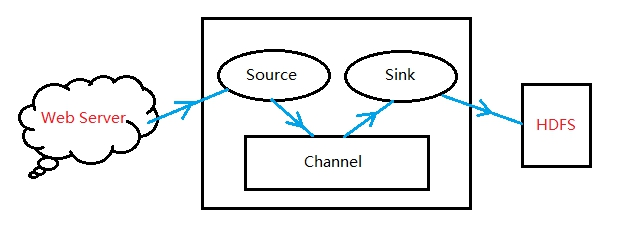

#  FLUME

## 1、FLUME介绍

Flume是Cloudera提供的一个高可用的，高可靠的，分布式的海量日志采集、聚合和传输的系统，Flume支持在日志系统中定制各类数据发送方，用于收集数据；同时，Flume提供对数据进行简单处理，并写到各种数据接受方（可定制）的能力。

## 2、FLUME的特点

- 可靠性

  保证数据的不丢失

- 可扩展

  各组件的数目可扩展

- 高性能

  吞吐率很高，能满足海量数据的收集需求

- 可管理性

  可动态增加和删除组件

## 3、系统功能

### 3.1 日志收集

Flume最早是Cloudera提供的日志收集系统，目前是Apache下的一个孵化项目，Flume支持在日志系统中定制各类数据发送方，用于收集数据。

### 3.2 数据处理

Flume提供对数据进行简单处理，并写到各种数据接受方（可定制）的能力 Flume提供了从Console（控制台）、RPC（Thrift-RPC）、Text（文件）、Tail（UNIX tail）、Syslog（Syslog日志系统，支持TCP和UDP等2种模式），exec（命令执行）等数据源上收集数据的能力。

## ３、FLUME的两个版本

###  3.1 FLUME OG  

OG  Original Generation

由agent、collector、master等组件组成

这个版本已经过时，这里已经不再讨论  

### 3.2 FLUME NG

#### 3.2.1架构


Flume-NG最明显的改动就是取消了集中管理配置的 Master 和 Zookeeper，变为一个纯粹的传输工具。Flume NG另一个主要的不同点是读入数据和写出数据现在由不同的工作线程处理（称为Runner）。在 Flume-NG 中，读入线程同样做写出工作（除了故障重试）。如果写出慢的话（不是完全失败），它将阻塞 Flume 接收数据的能力。这种异步的设计使读入线程可以顺畅的工作而无需关注下游的任何问题。  

#### 3.2.2 FLUME NG 的特点

1. NG 只有一种角色的节点：代理节点（agent）  
2. 没有 collector、master 节点。这是核心组件最核心的变化。  
3. 去除了 physical nodes、logical nodes 的概念和相关内容。  
4. agent 节点的组成也发生了变化。Flume NG的 agent 由source、sink、Channel 组成。   

#### 3.2.3　FLUME　NG 的组件

- Flume以Agent为最小的独立运行单位。Agent是Flume中产生数据流的地方，一个Agent就是一个JVM。单Agent由Source、Sink和Channel三大组件构成，如下图：

 

- Source:完成对日志数据的收集，分成 transtion 和 event 打入到Channel之中。
- Channel:主要提供一个队列的功能，对source提供中的数据进行简单的缓存。 
-  Sink:取出Channel中的数据，进行相应的存储文件系统，数据库，或者提交到远程服务器。 

对现有程序改动最小的使用方式是使用是直接读取程序原来记录的日志文件，基本可以实现无缝接入，不需要对现有程序进行任何改动。 

- Source

flume有许多类型的Source，见官网用户手册：

http://flume.apache.org/FlumeUserGuide.html#flume-sources

#### 3.2.4　Source类型：

| Source类型                | 说明                                                         |
| ------------------------- | ------------------------------------------------------------ |
| Avro Source               | 支持Avro协议（实际上是Avro RPC），提供一个Avro的接口，需要往设置的地址和端口发送Avro消息，Source就能接收到,如：Log4j Appender通过Avro Source将消息发送到Agent |
| Thrift Source             | 支持Thrift协议，提供一个Thrift接口，类似Avro                 |
| Exec Source               | Source启动的时候会运行一个设置的UNIX命令（比如 cat file），该命令会不断地往标准输出（stdout）输出数据，这些数据就会被打包成Event，进行处理 |
| JMS Source                | 从JMS系统（消息、主题）中读取数据，类似ActiveMQ              |
| Spooling Directory Source | 监听某个目录，该目录有新文件出现时，把文件的内容打包成Event，进行处理 |
| Netcat Source             | 监控某个端口，将流经端口的每一个文本行数据作为Event输入      |
| Sequence Generator Source | 序列生成器数据源，生产序列数据                               |
| Syslog Sources            | 读取syslog数据，产生Event，支持UDP和TCP两种协议              |
| HTTP Source               | 基于HTTP POST或GET方式的数据源，支持JSON、BLOB表示形式       |
| Legacy Sources            | 兼容老的Flume OG中Source（0.9.x版本）                        |
| 自定义Source              | 使用者通过实现Flume提供的接口来定制满足需求的Source。        |

对于直接读取文件Source, 主要有两种方式： 

- Exec source

可通过写Unix command的方式组织数据，最常用的就是tail -F [file]。

可以实现实时传输，但在flume不运行和脚本错误时，会丢数据，也不支持断点续传功能。因为没有记录上次文件读到的位置，从而没办法知道，下次再读时，从什么地方开始读。特别是在日志文件一直在增加的时候。flume的source挂了。等flume的source再次开启的这段时间内，增加的日志内容，就没办法被source读取到了。不过flume有一个execStream的扩展，可以自己写一个监控日志增加情况，把增加的日志，通过自己写的工具把增加的内容，传送给flume的node。再传送给sink的node。要是能在tail类的source中能支持，在node挂掉这段时间的内容，等下次node开启后在继续传送，那就更完美了。

- Spooling Directory Source

SpoolSource:是监测配置的目录下新增的文件，并将文件中的数据读取出来，可实现准实时。需要注意两点：

1、拷贝到spool目录下的文件不可以再打开编辑。

2、spool目录下不可包含相应的子目录。在实际使用的过程中，可以结合log4j使用，使用log4j的时候，将log4j的文件分割机制设为1分钟一次，将文件拷贝到spool的监控目录。log4j有一个TimeRolling的插件，可以把log4j分割的文件到spool目录。基本实现了实时的监控。Flume在传完文件之后，将会修改文件的后缀，变为.COMPLETED（后缀也可以在配置文件中灵活指定）

<u>**注：ExecSource，SpoolSource对比**</u>

ExecSource可以实现对日志的实时收集，但是存在Flume不运行或者指令执行出错时，将无法收集到日志数据，无法何证日志数据的完整性。SpoolSource虽然无法实现实时的收集数据，但是可以使用以分钟的方式分割文件，趋近于实时。如果应用无法实现以分钟切割日志文件的话，可以两种收集方式结合使用 

#### 3.2.5  **Channel**类型

当前有几个 Channel 可供选择，分别是 **Memory Channel**, **JDBC Channel** , **File Channel**，**Psuedo Transaction Channel**。比较常见的是前三种 Channel。

- Memory Channel 可以实现高速的吞吐，但是无法保证数据的完整性。
- Memory Recover Channel 在官方文档的建议上已经建义使用File Channel来替换。
- File Channel保证数据的完整性与一致性。在具体配置File Channel时，建议File Channel设置的目录和程序日志文件保存的目录设成不同的磁盘，以便提高效率。

File Channel :是一个持久化的隧道（Channel），它持久化所有的事件，并将其存储到磁盘中。因此，即使 Java 虚拟机当掉，或者操作系统崩溃或重启，再或者事件没有在管道中成功地传递到下一个代理（agent），这一切都不会造成数据丢失。  

Memory Channel:  是一个不稳定的隧道，其原因是由于它在内存中存储所有事件。如果 Java 进程死掉，任何存储在内存的事件将会丢失。另外，内存的空间收到 RAM大小的限制,而 File Channel 这方面是它的优势，只要磁盘空间足够，它就可以将所有事件数据存储到磁盘上。

- Flume Channel 支持的类型：

| Channel类型                | 说明                                                         |
| -------------------------- | ------------------------------------------------------------ |
| Memory Channel             | Event数据存储在内存中                                        |
| JDBC Channel               | Event数据存储在持久化存储中，当前Flume Channel内置支持Derby  |
| File Channel               | Event数据存储在磁盘文件中                                    |
| Spillable Memory Channel   | Event数据存储在内存中和磁盘上，当内存队列满了，会持久化到磁盘文件（当前试验性的，不建议生产环境使用） |
| Pseudo Transaction Channel | 测试用途                                                     |
| Custom Channel             | 自定义Channel实现                                            |

#### 3.2.6 Sink类型

Sink在设置存储数据时，可以向文件系统中，数据库中，Hadoop中储数据，在日志数据较少时，可以将数据存储在文件系中，并且设定一定的时间间隔保存数据。在日志数据较多时，可以将相应的日志数据存储到Hadoop中，便于日后进行相应的数据分析。 

Flume Sink支持的类型

| **Sink类型**        | **说明**                                            |
| ------------------- | --------------------------------------------------- |
| HDFS Sink           | 数据写入HDFS                                        |
| Logger Sink         | 数据写入日志文件                                    |
| Avro Sink           | 数据被转换成Avro Event，然后发送到配置的RPC端口上   |
| Thrift Sink         | 数据被转换成Thrift Event，然后发送到配置的RPC端口上 |
| IRC Sink            | 数据在IRC上进行回放                                 |
| File Roll Sink      | 存储数据到本地文件系统                              |
| Null Sink           | 丢弃到所有数据                                      |
| HBase Sink          | 数据写入HBase数据库                                 |
| Morphline Solr Sink | 数据发送到Solr搜索服务器（集群）                    |
| ElasticSearch Sink  | 数据发送到Elastic Search搜索服务器（集群）          |
| Kite Dataset Sink   | 写数据到Kite Dataset，试验性质的                    |
| Custom Sink         | 自定义Sink实现                                      |

Flume提供了大量内置的Source、Channel和Sink类型。不同类型的Source,Channel和Sink可以自由组合。组合方式基于用户设置的配置文件，非常灵活。比如：Channel可以把事件暂存在内存里，也可以持久化到本地硬盘上。Sink可以把日志写入HDFS, HBase，甚至是另外一个Source等等。Flume支持用户建立多级流，也就是说，多个Agent可以协同工作，并且支持Fan-in、Fan-out、Contextual Routing、Backup Routes。如下图所示:


## ４、**小结：**

Flume是一个分布式、可靠、和高可用的海量日志采集、聚合和传输的系统。支持在日志系统中定制各类数据发送方，用于收集数据;同时，Flume提供对数据进行简单处理，并写到各种数据接受方(比如文本、HDFS、Hbase等)的能力。

Flume的数据流由事件(Event)贯穿始终。事件是Flume的基本数据单位，它携带日志数据（字节数组形式）并且携带有头信息，这些Event由Agent外部的Source生成，当Source捕获事件后会进行特定的格式化，然后Source会把事件推入(单个或多个)Channel中。你可以把Channel看作是一个缓冲区，它将保存事件直到Sink处理完该事件。Sink负责持久化日志或者把事件推向另一个Source。还有注意的是，每一个条消息就是有个event

当节点出现故障时，日志能够被传送到其他节点上而不会丢失。Flume提供了三种级别的可靠性保障，从强到弱依次分别为：

- end-to-end：收到数据agent首先将event写到磁盘上，当数据传送成功后，再删除；如果数据发送失败，可以重新发送
- Store on failure：这也是scribe采用的策略，当数据接收方crash时，将数据写到本地，待恢复后，继续发送
-  Besteffort：数据发送到接收方后，不会进行确认

## 5、实战演练

### 5.1  Avro(start source)

Avro可以发送一个给定的文件给Flume，Avro 源使用AVRO RPC机制。

Ø 创建agent配置文件

```
# > vi /hadoop/flume/conf/avro.conf

添加以下内容：

a1.sources = r1

a1.sinks = k1

a1.channels = c1

 

# Describe configure the source

a1.sources.r1.type = avro

a1.sources.r1.bind = 0.0.0.0

a1.sources.r1.port = 4141

 

# Describe the sink

a1.sinks.k1.type = logger

 

# Use a channel which buffers events in memory

a1.channels.c1.type = memory

a1.channels.c1.capacity = 1000

a1.channels.c1.transactionCapacity = 100

 

# Bind the source and sink to the channel

a1.sources.r1.channels = c1

a1.sinks.k1.channel = c1

```

**对以上内容解释：**

指定名称：a1是我们要启动的Agent名字

```
a1.sources = r1		命名Agent的sources为r1

a1.sinks = k1		命名Agent的sinks为k1

a1.channels = c1		命名Agent的channels 为c1

 

# Describe configure the source

a1.sources.r1.type = avro		指定r1的类型为AVRO

a1.sources.r1.bind = 0.0.0.0 	将Source与IP地址绑定（这里指本机）

a1.sources.r1.port = 4141	指定通讯端口为4141

 

# Describe the sink

a1.sinks.k1.type = logger		指定k1的类型为Logger

 

# Use a channel which buffers events in memory

a1.channels.c1.type = memory			

a1.channels.c1.capacity = 1000			

a1.channels.c1.transactionCapacity = 100

 

指定Channel的类型为Memory

设置Channel的最大存储event数量为1000

每次最大可以source中拿到或者送到sink中的event数量也是100

 

这里还可以设置Channel的其他属性：

a1.channels.c1.keep-alive=1000			event添加到通道中或者移出的允许时间（秒）

a1.channels.c1.byteCapacity = 800000	event的字节量的限制，只包括eventbody

a1.channels.c1.byteCapacityBufferPercentage = 20

event的缓存比例为20%（800000的20%），即event的最大字节量为800000*120%

 

# Bind the source and sink to the channel

a1.sources.r1.channels = c1

a1.sinks.k1.channel = c1

将source、sink分别与Channel c1绑定


```

 

-   **启动flume agent a1**

\# > flume-ng agent -c . -f /hadoop/flume/conf/avro.conf -n a1 -Dflume.root.logger=INFO,console

```
-c：使用配置文件所在目录（这里指默认路径，即$FLUME_HOME/conf）

-f：flume定义组件的配置文件 

-n：启动Agent的名称，该名称在组件配置文件中定义 

-Dflume.root.logger：flume自身运行状态的日志，根据需要配置

```


 

- 创建指定文件

```
# > echo "hello world" > /hadoop/flume/log.00

Ø 使用avro-client发送文件

# > flume-ng avro-client -c . -H master -p 4141 -F /hadoop/flume/log.00

-H：指定主机

-p：指定端口

-F：制定要发送的文件

Ø 在a1的控制台，可以看到以下信息，注意最后一行：

```


 

 

注：Flume框架对Hadoop和zookeeper的依赖只是在jar包上，并不要求flume启动时必须将Hadoop和zookeeper服务也启动。

### 5.2  Spool 

Spool监测配置的目录下新增的文件，并将文件中的数据读取出来。需要注意两点：

-  拷贝到spool目录下的文件不可以再打开编辑。
- spool目录下不可包含相应的子目录

```
创建agent配置文件

# > vi /hadoop/flume/conf/spool.conf

添加以下内容：

a1.sources = r1

a1.sinks = k1

a1.channels = c1

 

# Describe configure the source

a1.sources.r1.type = spooldir

a1.sources.r1.spoolDir = /hadoop/flume/logs

a1.sources.r1.fileHeader = true

 

# Describe the sink

a1.sinks.k1.type = logger

 

# Use a channel which buffers events in memory

a1.channels.c1.type = memory

a1.channels.c1.capacity = 1000

a1.channels.c1.transactionCapacity = 100

 

# Bind the source and sink to the channel

a1.sources.r1.channels = c1

a1.sinks.k1.channel = c1


```


**启动flume agent a1**

- 创建/hadoop/flume/logs文件夹

\# > mkdir /hadoop/flume/logs

\# > flume-ng agent -c . -f /hadoop/flume/conf/spool.conf -n a1 -Dflume.root.logger=INFO,console

 

- 追加文件到/hadoop/flume/logs目录

  ```
  # > echo "spool test1" > /hadoop/flume/logs/spool_text.log
  ```

  

  

 在a1的控制台，可以看到以下相关信息：

 

 

### 5.3 Exec

 创建agent配置文件

```
# > vi /hadoop/flume/conf/exec_tail.conf

添加以下内容：

a1.sources = r1

a1.sinks = k1

a1.channels = c1

 

# Describe/configure the source

a1.sources.r1.type = exec

a1.sources.r1.command = tail -F /hadoop/flume/log_exec_tail

 

# Describe the sink

a1.sinks.k1.type = logger

 

# Use a channel which buffers events in memory

a1.channels.c1.type = memory

a1.channels.c1.capacity = 1000

a1.channels.c1.transactionCapacity = 100

 

# Bind the source and sink to the channel

a1.sources.r1.channels = c1

a1.sinks.k1.channel = c1


```


Ø 启动flume agent a1

\# > flume-ng agent -c . -f /hadoop/flume/conf/exec_tail.conf -n a1 -Dflume.root.logger=INFO,console

 

Ø 制作log_exec_tail文件

\# > echo "exec tail 1" >> /hadoop/flume/log_exec_tail

 

Ø 在master的控制台，可以看到以下信息：

 

Ø 向log_exec_tail文件中追加数据

\# > echo "exec tail 2" >> /hadoop/flume/log_exec_tail

Ø 在master的控制台，可以看到以下信息：

 

 

4)Syslogtcp

Syslogtcp监听TCP的端口做为数据源

Ø 创建agent配置文件

\# > vi /hadoop/flume/conf/syslog_tcp.conf

添加以下内容：

a1.sources = r1

a1.sinks = k1

a1.channels = c1

 

\# Describe/configure the source

a1.sources.r1.type = syslogtcp

a1.sources.r1.port = 5140

a1.sources.r1.host = localhost

 

\# Describe the sink

a1.sinks.k1.type = logger

 

\# Use a channel which buffers events in memory

a1.channels.c1.type = memory

a1.channels.c1.capacity = 1000

a1.channels.c1.transactionCapacity = 100

 

\# Bind the source and sink to the channel

a1.sources.r1.channels = c1

a1.sinks.k1.channel = c1

Ø 启动flume agent a1

\# > flume-ng agent -c . -f /hadoop/flume/conf/syslog_tcp.conf -n a1 -Dflume.root.logger=INFO,console

 

Ø 测试产生syslog

\# > echo "hello idoall.org syslog" | nc localhost 5140

Ø 在master的控制台，可以看到以下信息：

 

5)JSONHandler

Ø 创建agent配置文件

\# > vi /hadoop/flume/conf/post_json.conf

添加如下内容：

a1.sources = r1

a1.sinks = k1

a1.channels = c1

 

\# Describe/configure the source

a1.sources.r1.type = org.apache.flume.source.http.HTTPSource

a1.sources.r1.port = 8888

 

\# Describe the sink

a1.sinks.k1.type = logger

 

\# Use a channel which buffers events in memory

a1.channels.c1.type = memory

a1.channels.c1.capacity = 1000

a1.channels.c1.transactionCapacity = 100

 

\# Bind the source and sink to the channel

a1.sources.r1.channels = c1

a1.sinks.k1.channel = c1

Ø 启动flume agent a1

\# > flume-ng agent -c . -f /hadoop/flume/conf/post_json.conf -n a1 -Dflume.root.logger=INFO,console

 

Ø 生成JSON 格式的POST request

\# > curl -X POST -d '[{ "headers" :{"a" : "a1","b" : "b1"},"body" : "idoall.org_body"}]' <http://localhost:8888>

Ø 在master的控制台，可以看到以下信息：

 

6)Hadoop sink

 

Ø 创建agent配置文件

\# > vi /hadoop/flume/conf/hdfs_sink.conf

添加以下内容：

a1.sources = r1

a1.sinks = k1

a1.channels = c1

 

\# Describe/configure the source

a1.sources.r1.type = syslogtcp

a1.sources.r1.port = 5140

a1.sources.r1.host = localhost

 

\# Describe the sink

a1.sinks.k1.type = hdfs

a1.sinks.k1.hdfs.path = hdfs://master:9000/user/flume/syslogtcp

a1.sinks.k1.hdfs.filePrefix = Syslog

a1.sinks.k1.hdfs.round = true

a1.sinks.k1.hdfs.roundValue = 10

a1.sinks.k1.hdfs.roundUnit = minute

 

\# Use a channel which buffers events in memory

a1.channels.c1.type = memory

a1.channels.c1.capacity = 1000

a1.channels.c1.transactionCapacity = 100

 

\# Bind the source and sink to the channel

a1.sources.r1.channels = c1

a1.sinks.k1.channel = c1

Ø 启动flume agent a1

\# > flume-ng agent -c . -f /hadoop/flume/conf/hdfs_sink.conf -n a1 -Dflume.root.logger=INFO,console

 

Ø 测试产生syslog

\# > echo "hello idoall flume -> hadoop testing one" | nc localhost 5140

Ø 在master的控制台，可以看到以下信息：

 

Ø 在master上再打开一个窗口，去hadoop上检查文件是否生成

\# > hadoop fs -ls /user/flume/syslogtcp

 

\# > hadoop fs -cat /user/flume/syslogtcp/Syslog.1407644509504

 

7)File Roll Sink

Ø 创建agent配置文件

\# > vi /hadoop/flume/conf/file_roll.conf

添加以下内容：

a1.sources = r1

a1.sinks = k1

a1.channels = c1

 

\# Describe/configure the source

a1.sources.r1.type = syslogtcp

a1.sources.r1.port = 5555

a1.sources.r1.host = localhost

 

\# Describe the sink

a1.sinks.k1.type = file_roll

a1.sinks.k1.sink.directory = /hadoop/flume/logs

 

\# Use a channel which buffers events in memory

a1.channels.c1.type = memory

a1.channels.c1.capacity = 1000

a1.channels.c1.transactionCapacity = 100

 

\# Bind the source and sink to the channel

a1.sources.r1.channels = c1

a1.sinks.k1.channel = c1

Ø 启动flume agent a1

\# > flume-ng agent -c . -f /hadoop/flume/conf/file_roll.conf -n a1 -Dflume.root.logger=INFO,console

 

Ø 测试产生log

\# > echo "hello idoall.org syslog" | nc localhost 5555

\# > echo "hello idoall.org syslog 2" | nc localhost 5555

 

Ø 查看/hadoop/flume/logs下是否生成文件,默认每30秒生成一个新文件

\# > ll /hadoop/flume/logs

 

