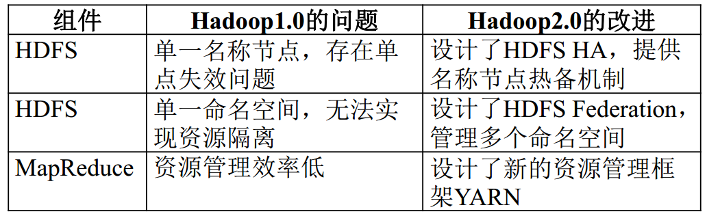
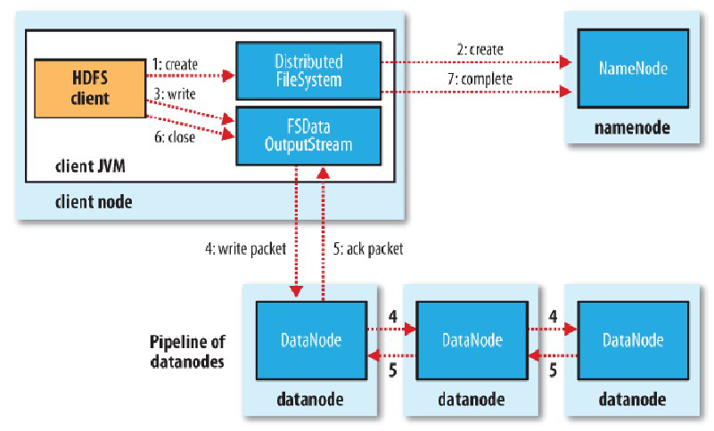
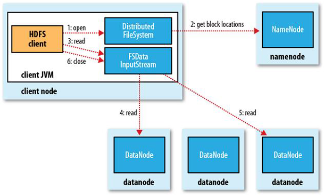
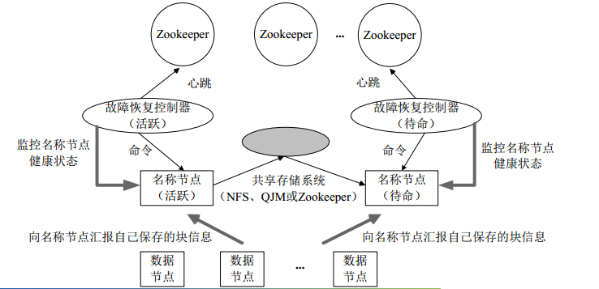
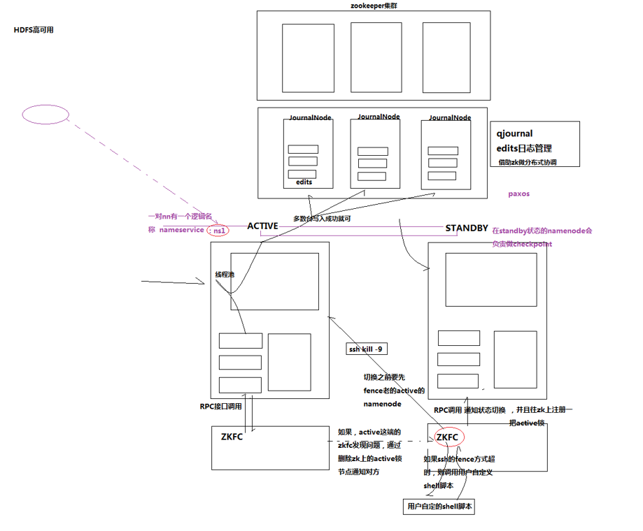
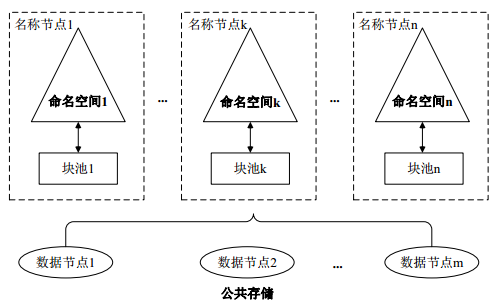

## HDFS

### 改进




### HDFS的写流程



```
1、hdfs　Client　创建DistributeFileSystem对象,
２、调用namenode对象，namenode创建一个没有blocks关联的新文件，并且检查该文件是否存在，并且检查客户端是否有权限写入文件，若存在则返回*IO*异常信息,检验通过后，在自己的元数据中为新文件分配文件名，同时为此文件分配数据块的备份数（此备份数可以在搭建时的参数文件中设定，也可以后来改变，系统默认3份），并为不同的备份副本分配不同的DataNode，并生成列表，将列表返回客户端并创建一个FSDataOutputStream对象
３、FSDataOutputStream协调namenode与datanode向Distribute对象的buffer中写入数据，然后数据被切分为一个个packet，形成data queue 与namenode通信，获取该队列的新的block适合往那些datanode中写入，然后把他们排成pipline，
４.DataStreamer把packet按队列输出到管道的第一个DataNode中，同时把NameNode生成的列表也带给第一个DataNode，当第1个packet传递完成时（注意是packet而不是整个数据传递完成），第一个DataNode传递信息给第二个DataNode开始把传递完成的pakage以管道的形式再传递给第二个DataNode，同时把除掉第一个DataNode节点信息的列表把传给第二个DataNode，依此类推，直到传递到最后一个DataNode，它会返回Akc到前一个DataNode，
５、最终由Pipeline中第一个DataNode节点将Pipeline ack发送给Client(此时packet等待队列会将这个packet删除)。
６.完成向文件写入数据，Client在文件输出流（FSDataOutputStream）对象上调用close方法，关闭流
７、调用DistributedFileSystem对象的complete方法，通知NameNode文件写入成功。
```

### **HDFS的读流程**



```
１、客户端调用open方法，创建DistributedFileSystem对象
２、他与nameNode RPC通信，得到块的位置信息(会检查客户端的权限，与是否存在元数据)，同一个块会有多个块位置，但是利用hadoop扩普结构，将离客户端的最近的块位置放在最前面，此时会返回一个FSDATAInputStream对象,该对象可以方便的管理datanode,namenode数据流
３．客户端调用read方法，FSSteam会选取离client最近的datanode进行连接
４、数据此时源源不断的流向客户端，
５、此时如果第一个数据块读完，会立马读取下一个
６、如果第一批的块读完，会获取下一批的blocks
７、如果数据块全部读完会关闭所有流
```

**注意**：如果在读数据的时候，DFSInputStream和datanode的通讯发生异常　会尝试正在读的block的排第二近的datanode，并且会记录哪个datanode发生错误，剩余的blocks读的时候就会直接跳过该datanode。
　DFSInputStream也会检查block数据校验和，如果发现一个坏的block,就会先报告到namenode节点，然后DFSInputStream在其他的datanode上读该block的镜像。该设计的方向就是客户端直接连接datanode来检索数据并且namenode来负责为每一个block提供最优的datanode，namenode仅仅处理block location的请求，这些信息都加载在namenode的内存中，hdfs通过datanode集群可以承受大量客户端的并发访问。

###  HDFS为什么不适合存储小文件

- NameNode将文件系统的元数据存储在内存中，每个文件、目录、数据块的存储信息大约占**150字节**，小文件过多，元数据对**内存**消耗过大

- 文件过小，寻道时间大于数据读写时间，不符合HDFS的设计*

#### **那么应该如何存储小文件？**

- 使用Hadoop Archive或者HAR，是一个高效地将小文件放入HDFS块中的文件存档工具，它能够将多个小文件打包成一个HAR文件，这样在减少namenode内存使用的同时，仍然允许对文件进行透明的访问。(https://www.cnblogs.com/clnchanpin/p/6963714.html)

- sequence file由一系列的二进制key/value组成，如果为key小文件名，value为文件内容，则可以将大批小文件合并成一个大文件。Hadoop-0.21.0中提供了SequenceFile，包括Writer，Reader和SequenceFileSorter类进行写，读和排序操作

-  CombineFileInputFormat是一种新的inputformat，用于将多个文件合并成一个单独的split，另外，它会考虑数据的存储位置。

### HDFS优缺点

#### **HDFS优点**

(1)高容错性：数据自动保存多个副本，副本丢失后，会自动恢复。

(2)适合批处理：移动计算而非数据、数据位置暴露给计算框架。

(3)适合大数据处理：GB、TB、甚至PB级数据、百万规模以上的文件数量，1000以上节点规模。

(4)流式文件访问：一次性写入，多次读取；保证数据一致性。

(5)可构建在廉价机器上：通过多副本提高可靠性，提供了容错和恢复机制。

#### **HDFS缺点**

(1)不适合低延迟数据访问： 如果要处理一些用户要求时间比较短的低延迟应用请求，则HDFS不适合。HDFS是为了处理大型数据集分析任务的，主要是为达到高的数据吞吐量而设计的，这就可能要求以高延迟作为代价。

(2)不支持小文件存取：占用NameNode大量内存，寻道时间超过读取时间

(3)不支持并发写入、文件随机修改：一个文件只能有一个写者，仅支持append**

### HDFS数据写入模式

```
HDFS中的文件写入只支持单个写入者，而且操作总是也 只添加 的方式在文件末尾追加写数据。他不只支持多个
写入者的操作，也不支持在文件的任意位置进行修改。

HDFS以流式数据访问模式来存储超大文件
```

### HDFS中的块为什么这么大

```
其他概念：普通文件系统的磁盘块大约512字节，文件系统的文件系统块一般几千字节
Hdfs中小于一个块大小的文件不会占据整个块的空间

HDFS中的块比磁盘块大，其目的是为了最小化寻址开销。如果块足够大，从磁盘传输数据的时间会明显大于定位这个块开始位置所需要的时间。把更多的时间用来传输数据而不是用来查找块的位置，因此，传输一个由多个块组成的大文件的时间取决于磁盘传输速率。
```

### HDFS可靠性策略

1）文件完整性

在文件建立时，每个数据块都产生校验和，校验和会保存在.meta文件内；客户端获取数据时可以检查校验和是否相同，从而发现数据块是否损坏；如果正在读取的数据块损坏，则可以继续读取其它副本。NameNode标记该块已经损坏，然后复制block达到预期设置的文件备份数；DataNode 在其文件创建后三周验证其checksum。

2）网络或者机器失效

```
(1)副本冗余
(2)机架感知策略（副本放置策略）
(3)心跳机制策略
```

3）namenode挂掉

```
(1)主备切换（高可用）
(2)镜像文件和操作日志磁盘存储
(3)镜像文件和操作日志可以存储多份，多磁盘存储
```

4）其他机制

```
(1)快照（和虚拟机快照意义相同，保存了系统某一时刻的影像，可以还原到该时刻）
(2)回收站机制
(3)安全模式
```

### 什么是块缓存

```
通常DataNode从磁盘中读取块，但对于访问频繁的文件，其对应的块可能被显示地缓存在DataNode地内存中，
以堆外块缓存(off-heap block cache)的形式存在。默认情况下，一个块仅缓存在一个datanode的内存中，
当然可以针对每个文件配置datanode的数量。作业调度器(TaskSchduler,用于MapReduce、Spark和其他框架的)通过在缓存块的datanode上运行任务，可以利用块
缓存的优势提高读操作的性能。
```

### 元数据相关

```
1、Namenode将所有的文件和文件夹的元数据保存在一个文件系统树中，元数据存储在内存中
2、元数据中存放着文件包括哪些数据块以及这些数据分布在哪些DataNode上(文件目录信息、位置信息、副本数、权限信息)
3、Version -java properties文件、保存了HDFS的版本号                      4、fsimage-元数据的镜像文件，可以理解为元数据保存在磁盘上的一个副本，每个fsimage都是文件系统
元数据的一个完整的永久检查点。写操作时对日记进行编辑然后元数据随着更行，并不会直接修改镜像文件
5、edits-修改日志文件，记录引发元数据改变的操作
6、fstime-合并fstime和edits的时间
${dfs.name.dir}/current/version/edits/fsimage/fstime
7、当NameNode启动时，会将镜像加载到内存中

文件系统客户端执行写操作时，这些事物首先被记录到编辑日志中。namenode在内存中维护文件
系统的元数据，当编辑日志被修改时，相关的元数据信息也随着更新。内存中的元数据可支持
客户端的读请求
```

### 节点故障集合

**文件写入时：**

````
1、传输第一个块时，如果DataNode3宕机，怎么处理，如果DN3又启动了，怎么处理？
不做处理，当DataNode对NameNode心跳机制时，反馈副本数量，NameNode会再
分配DataNode去复制一份副本(前提是还有别的DN存在)。没有的话直接删除。
如果DN3又启动了了，会向NN发送块报告，NN会让DN3删除之前没有发送完的数据
2、客户端建立连接通道时，DN3连接不上了，怎么处理？
DN3连接不上，客户端会尝试4次重连，如果还是得不到DN3的回应，会重新像NameNode申请
三个DataNode，重复申请4次都不能连接上，则认为数据写入失败
3、客户端建立传输通道时，DN3挂了怎么处理？
会重新向NameNode申请三个DataNode
4、如果传输过程中，packet传输出错，怎么处理？
实际上传输数据是有缓存的，传输的数据包是有队列的，packet出错，
会重新从缓存中读取数据，再次发送。重传的次数有限，超过4次判定
为整个传输过程失败
5、如果block1、block2都上传成功了，block3在传输过程中失败了，怎么处理？
上传block3时，DN1挂了，怎么处理？
判定文件传输失败，等DataNode向NameNode报告时，NameNode
会通知这个数据的块包括副本所在的DataNode，删除这些块的信息
6、如果block3在上传的过程中，客户端挂了，怎么处理？
NameNode会等待客户端的状态返回，超时没有等到客户端的响应，
没有等待到的话，则会判定文件传输失败，然而等待DataNode向NameNode
发送块报告，NameNode会通知DataNode删除该文件的块
7、NameNode磁盘故障导致宕机，如何恢复集群？如何做到数据不丢失？
可以读取SeconaryNameNode中的镜像文件加载到新的NameNode中，
但是会丢失一部分数据
不丢失的话通过其他文件系统的磁盘挂载来恢复数据
注意：NameNode宕机的时候，HDFS不能对外提供服务
````

### NameNode、DataNode和Client之间通信方式

```
client和namenode之间是通过rpc通信；
datanode和namenode之间是通过rpc通信；
client和datanode之间是通过简单的socket通信。
```

### NameNode和DataNode时间集合

```
DataNode每3秒向NameNode发送一次心跳
DataNode每过60分钟向NameNode发送块报告
NameNode10分30秒收不到DataNode的心跳，则判定DataNode宕机
NameNode处理超过一百万次请求或时间达到一小时，会像SecondaryNameNode发送checkpoint请求
```

### 什么情况下会进入安全模式、解决办法

```
1、块的数量低于阈值（数据完整性不够0.9999）
2、DataNode启动数量不够
3、NameNode启动时，HDFS先进入安全模式，等DataNode启动完毕向NameNode汇报完块状态，
整个系统达到安全标准后，HDFS自动推出安全模式
注意：刚格式化完的HDFS 启动NameNode后不会进入安全模式，因为此时没有数据
```

**解决**

```
1、降低阈值
hdfs-site.xml
<name>dfs.namenode.safe</name>
<value>0.999f</value>
2、强制离开
hdfs dfsadmin -safemode leave
3、重新格式化集群
4、修复损坏的块文件
```

### NameNode职责

```
1、保存元数据信息(在内存中保存的是块位置的映射信息)，维护文件系统树
元数据信息大体包括：
文件信息(name、updates、replication等)
文件块的信息和位置(来自于DataNode的块报告，块的位置由DataNode维护)
文件的访问权限
集群中文件的数量
集群DataNode的数量
2、处理客户端的请求
3、接收DataNode心跳和块报告
```

### NameNode工作机制

```
a、第一次启动namenode格式化后，创建fsimage和edits文件，如果不是第一次启动，则直接加载日志和镜像文件到内存
b、客户端对元数据进行操作请求
c、namenode操作日志，更新滚动日志
d、namenode在内存中对元数据进行相应的操作
e、namenode与secondarynamenode通信是否需要checkpoint
```

### DataNode工作机制、职责

```
1、存储块内容到磁盘，从磁盘中检索块内容
2、以块列表的形式维护每个块的位置
3、向NameNode发送心跳(3s)、块状态报告(60min)
```

### NameNode启动流程

```
首次启动：
格式化namenode，生成fsimage
将文件系统的fsimage加载到内存
启动datanode
datanode向namenode注册
datanode向namenode发送块报告

再次启动：
加载磁盘中的fsimage文件和edits日志文件
等待datanode注册
等待datanode发送心跳和快报告
```

### Secondary NameNode工作机制、日志合并步骤

#### 工作机制

```
1、协助NameNode恢复元数据
2、定期合并fsimage与edits文件
3、保存最新检查目录与namenode相同
```

#### 日志合并步骤

```
1、NameNode向SecondaryNameNode发出checkpoint请求(NameNode处理客户端的请求达到100万次或者时间超过一小时或日志文件达到设置大小)
2、Secondary NameNode收到如果可以进行checkpointd则会请求NameNode停止使用正在进行中的日志文件，这样新的编辑操作记录到新的日志文件中
3、Secondary NameNode使用HTTP GET的方式从NameNode获得镜像和日志文件
4、Secondary NameNode将镜像文件和日志文件载入内存中，逐一执行日志文件中的事物，
然后创建新的合并后的镜像文件并保存到磁盘fsimage.checkpoint
5、Secondary NameNode将新的镜像文件以HTTP PUT的方式发送到NameNode中
6、NameNode将其保存为临时的.ckpt文件然后检查数据的完整性
7、NameNode重命名临时的镜像文件，便于之后使用
```

### 分块与分片的区别

```
分片时逻辑概念，分片有冗余
分块是物理概念，将数据拆分，块大小相等 有副本
```

### 大规模的数据的随机存取适合使用HDFS么，如果不适合给出其他存储方案

```
不适合，当对海量进行查询的时候，HDFS不适合查询数据，所以采用HBASE（实时随机数据库）
```

### HDFS的HA

```
HA 机制出现的作用主要是为了：
1.解决单点故障；
2.提升集群容量和集群性能。
```

#### 出现的原因

对于分布式文件系统HDFS ，NN是系统的核心节点，存储了各类元数据信息，并负责管理文件系统的命名空间和客户端对文件的访问。**但是，在HDFS1.0中，只存在一个NN，一旦发生“单点故障”，就会导致整个系统失效**。虽然有个SNN，但是它并不是NN的热备份，SNN主要功能在于周期性的从NN中获取FsImage和EditLog，进行合并后再发送给NN，替换掉原来的FsImage，以防止EditLog文件过大，导致NN失败恢复时消耗太多时间。合并后的FsImage在SNN中也保存一份，当NN失效时，可以利用SNN中的FsImage进行恢复。

#### 解决方案

由于SNN无法提供“热备份”功能，在NN发生故障时，无法立即切换到SNN对外提供服务，仍需要停机恢复。HDFS2.0采用了HA（High Availability）架构。在HA集群中，一般设置两个NN，其中一个处于“活跃（Active）”状态，另一个处于“待命（Standby）”状态。处于Active状态的NN负责对外处理所有客户端的请求，处于Standby状态的NN作为热备份节点，保存了足够多的元数据，在Active节点发生故障时，立即切换到活跃状态对外提供服务。




**具体实现如下：**



### HDFS联邦机制

```
Federation解决了整个HDFS集群中只有一个名字空间，并且只有单独的一个NameNode管理所有DataNode的问题
```

虽然HDFS HA解决了“单点故障”问题，但是在系统扩展性、整体性能和隔离性方面仍然存在问题。

-  （1）   系统扩展性方面，元数据存储在NN内存中，受内存上限的制约。
- （2）   整体性能方面，吞吐量受单个NN的影响。
- （3）   隔离性方面，一个程序可能会影响其他运行的程序，如一个程序消耗过多资源导致其他程序无法顺利运行。HDFS HA本质上还是单名称节点。

**HDFS联邦可以解决以上三个方面问题。**

在HDFS联邦中，设计了**多个相互独立的NN**，使得HDFS的**命名服务能够水平扩展**，这些NN分别进行**各自命名空间和块的管理**，不需要彼此协调。**每个DN要向集群中所有的NN注册**，并周期性的发送心跳信息和块信息，报告自己的状态。

HDFS联邦拥有**多个独立的命名空间**，其中，每一个命名空间管理属于自己的一组块，这些**属于同一个命名空间的块组成一个“块池”**。每个DN会为多个块池提供块的存储，块池中的各个块实际上是存储在不同DN中的。




可以参考 ：https://www.cnblogs.com/DarrenChan/p/6492574.html?utm_source=itdadao&utm_medium=referral

### HDFS的Fencing机制（预防脑裂）

所谓**brain split**，就是一台NameNode出现假死，而另外一台NameNode以为它真死了，所以也变成active了，等一下假死的NameNode恢复了，这样就会两台NameNode都处于active状态，显然这是不可以的。
我们有两个解决办法：

- 1.ssh发送kill指令，直接杀死对方NameNode进程，再进行切换。

- 2.ssh指令不能保证每次都执行成功，那就设置一个时间，如果一定时间ssh指令还没有返回值，就会运行自定义的脚本，将对方NameNode杀死，再进行切换。

  这种解决的机制叫做**fencing机制**。

我们将上面一对NameNode叫做一个nameservice，访问它可以用ns1(name service 1)来表示。若干个这样的NameNode对叫做Federation。

**这里需要提醒一下**：不光HDFS有高可用，YARN也有高可用，只不过相对HDFS就简单多了，ResourceManager主从切换即可。


