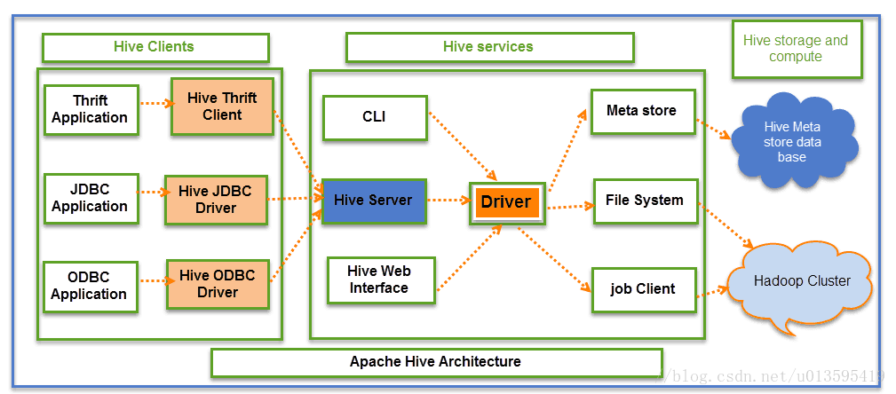
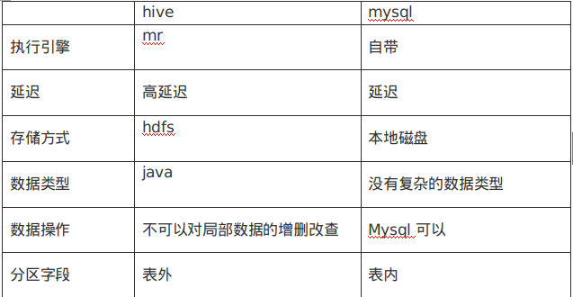

# HIVE学习之路

## Hive的架构？

### 用户接口

#### CLI：

​	hive客户端命令行

#### Client：

​	Client是Hive的客户端，用户连接这hiveSercvice，在启动CLlient模式的时候，需要指出Hive Service所在的节点，并且在节点启动Hive Service
	 	三种:
	 	a,Thrift Client
	 	b,JDBC Client
	 	c,ODBC Client
		

#### WUI

​	Web Interface是通过浏览器访问Hive。
	

### Hive Services

### HIve Storge and computing

## Hive与mysql的区别

## 内部表与外部表的相同与区别？

	相同点：
	a、使用load数据都会移动到当前表下
	不同点:
	a、如果删除内部表,则会把数据删除,外部表不会

## hive与hbase区别？

​	