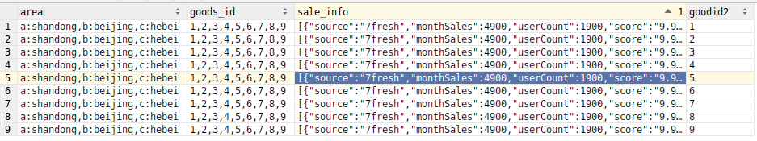

## 通用函数

### if

```
1.if

表达式：IF( expr1 , expr2 , expr3 )

expr1条件，条件为true，则值是expr2 ，false，值就是expr3
```

### ifnull

```
IFNULL( expr1 , expr2 )
在 expr1 的值不为 NULL的情况下都返回 expr1，否则返回 expr2
```

### case when

```
case 列名
when 条件 then 结果
else 其它结果
end 别名
```

### 字符串函数：cancat(s1,s2)

```
拼接s1与s2
```

### 字符串函数：split(s1,s2)

```
将s1以s2进行切分，并且切分成数组
```

### 字符串函数：upper（s1）

```
将s1转换为小写
```

### 字符串函数：lower(s1)

```
将s1转换为大写
```

### 字符串函数：length(s1)

```
求s1的长度
```

### 字符串函数： concat_ws(string SEP, string A, string B…)

```
返回值: string
说明：返回输入字符串连接后的结果。SEP表示各个字符串间的分隔符
举例：
hive> select concat_ws(',','abc','def','gh') from lxw_dual;
abc,def,gh
```

### 字符串函数：get_json_object

```
语法: get_json_object(string json_string, string path)
返回值: string
说明：解析json的字符串json_string,返回path指定的内容。假设输入的json字符串无效，那么返回NULL。
hive> select get_json_object('{"store":
>  {"fruit":\[{"weight":8,"type":"apple"},{"weight":9,"type":"pear"}],
>   "bicycle":{"price":19.95,"color":"red"}
>   },
> "email":"amy@only_for_json_udf_test.net",
>  "owner":"amy"
> }
> ','$.owner') from lxw_dual;
amy
```

### 字符串函数：substr,substring

```
语法: substr(string A, int start),substring(string A, int start)
返回值: string
说明：返回字符串A从start位置到结尾的字符串
举例：
hive> select substr('abcde',3) from lxw_dual;
cde
hive> select substring('abcde',3) from lxw_dual;
cde
hive>  selectsubstr('abcde',-1) from lxw_dual;  （和ORACLE同样）
e

6. 字符串截取函数：substr,substring
语法: substr(string A, int start, int len),substring(string A, intstart, int len)
返回值: string
说明：返回字符串A从start位置開始，长度为len的字符串
举例：
hive> select substr('abcde',3,2) from lxw_dual;
cd
hive> select substring('abcde',3,2) from lxw_dual;
cd
hive>select substring('abcde',-2,2) from lxw_dual;
de
```

### Hql函数：explode与lateral view与collect_sets

```
在此引用一篇博客上的话：
explode与lateral view在关系型数据库中本身是不该出现的，因为他的出现本身就是在操作不满足第一范式的数据（每个属性都不可再分），
本身已经违背了数据库的设计原理（不论是业务系统还是数据仓库系统），不过大数据技术普及后，很多类似pv，uv的数据，在业务系统中是存贮在非关系型数据库中，
用json存储的概率比较大，直接导入hive为基础的数仓系统中，就需要经过ETL过程解析这类数据，explode与lateral view在这种场景下大显身手。
--------------------- 
https://blog.csdn.net/guodong2k/article/details/79459282 
```

样例数据：

```
第一列省份:a:shandong,b:beijing,c:hebei
第二列商品id:1,2,3,4,5,6,7,8,9
第三列[{"source":"7fresh","monthSales":4900,"userCount":1900,"score":"9.9"},{"source":"jd","monthSales":2090,"userCount":78981,"score":"9.8"},{"source":"jdmart","monthSales":6987,"userCount":1600,"score":"9.0"}]
```

#### explode

explode作用是处理map结构的字段，如map，struct，array

```sql
select explode(split(goods_id,',')) as goods_id from explode_lateral_view;
效果：
goods_id
9
8
7
6
5
4
3
2
1
```

注意单独使用explode会报错

```
select explode(split(goods_id,',')) as goods_id,sale_info from explode_lateral_view;
报错：
[42000][40000] Error while compiling statement: FAILED: SemanticException 1:48 Only a single expression in the SELECT clause is supported with UDTF's. Error encountered near token 'sale_info'
```

所以就衍生出了later_view

#### later_view

later_view就是一个视图。这个视图会与表产生笛卡尔积


```sql
select *
from explode_lateral_view --表名
LATERAL VIEW explode(split(goods_id,',')) goods as goodid2; --视图名
```

效果：



#### collect_sets

去重的集合

#### collect_list

不去重的集合

## 行列相互转换语法

数据举例

```
a表
id math china
a 70 80
b 34 45

b表
id course score
a math 70
a china 80
b math 34
b china 45

a到b表是列转行
b到a表行转列
```


### 行转列

由b表到a表

```sql
--解法一
select id
sum(case course when 'math' then score end) `math`
sum(case course when 'china' then score end) `china`
-- 也可以case也可以替换为用if(,,)
from b
group by id

-- 解法二 pivot
select *
from b
pivot(max(score) for coure in ('china','math'))

-- 解法三 
select id,collect_set(course)
from
group by id
```

### 列转行

有a表到b表

```sql
--解法一 union法
select id,case when 'math' then score end course
from a
union
select id,case when 'china' then score end course
from a

```

