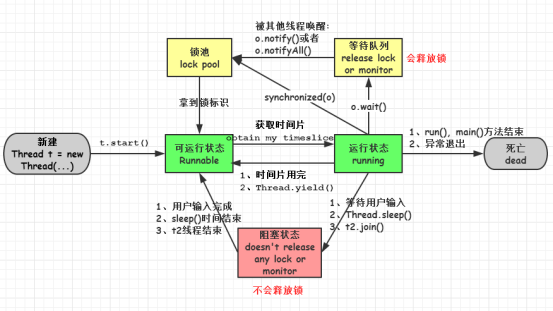

一、线程周期

```
运行：获得cpu时间片，当执行
就绪：线程对象被创建调用了该对象的start方法，该状态的对象位于线程池中
等待：线程被创建后加入到了线程池，还没有拿到时间片
死亡：线程run，main（）结束。或者中途异常
阻塞：不会释放锁资源，sleep,或者join
```



死锁

```
两个进程相互等待，也就是相互持有对方的锁
满足下列条件之一就不会发生死锁
资源互斥：只有一个进程可以获得当前资源
不剥夺条件：进程已经获得的资源，未使用完之前不强行剥夺
循环等待：头尾连接
```

sql练习

内存模型

```
运行时模型

```


线程池

集合

ES基本的了解

jvm优化方面

scala那些基本简单面试

重要的项目的梳理：那些指标，

58的业务：楼