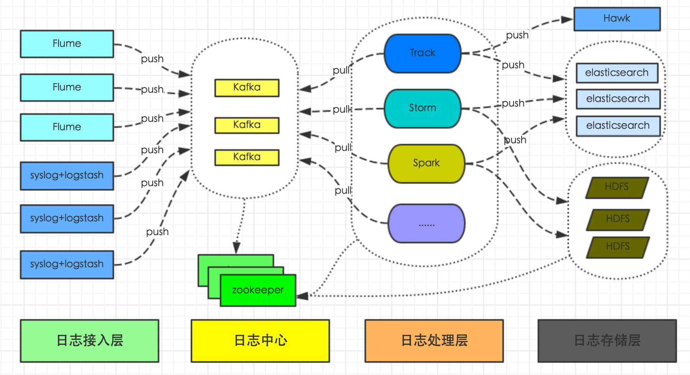
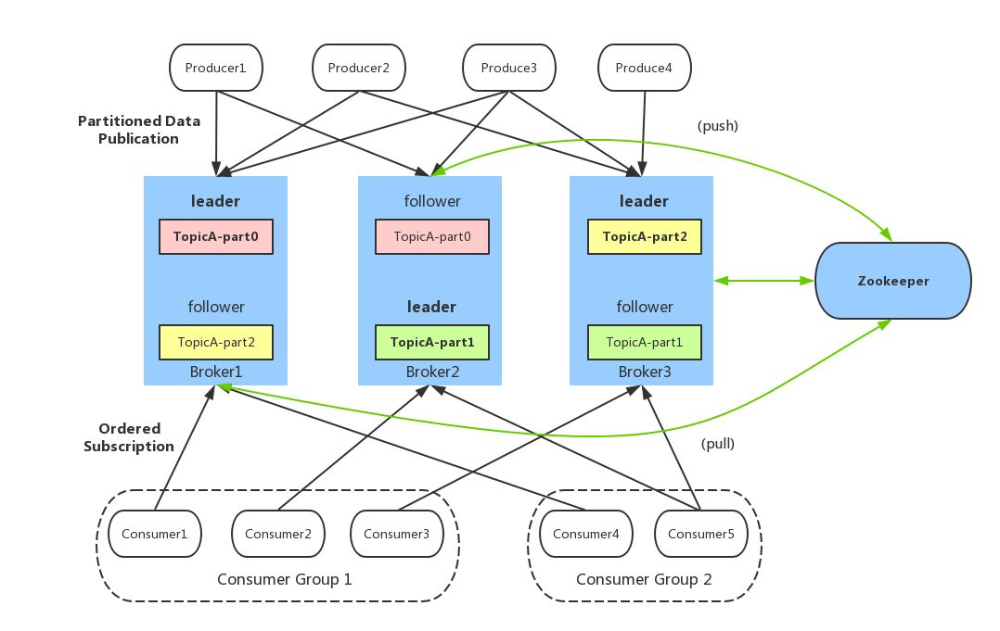
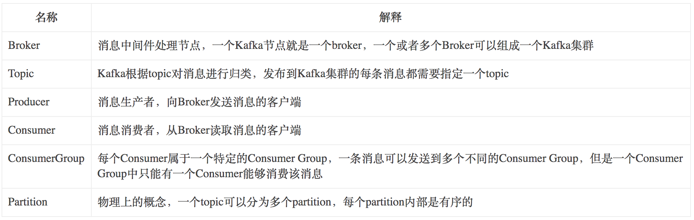
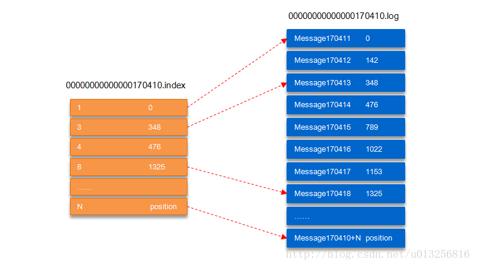

https://blog.csdn.net/zy_281870667/article/details/79946919
经典必读
#　      kafka
## 1、kafka概念
## 2、kafka在系统中的角色
   

## 3、kafka的应用场景 
### 3.1异步处理
***场景说明***：用户注册后需要发送注册邮件和注册短信传统的做法有两种
    
    串行方式：用户注册信息写入数据库 -> 发送注册短信 -> 发送注册邮箱 -> 返回给客户端
    并行方式：用户注册信息写入数据库 -> 发送注册短信 -> 返回给客户端
                                -> 发送注册邮箱 
    总结：以上是传统系统解决方案，但是随着用户量的增加，系统的性能（并发量、吞吐量、响应时间）都会有瓶颈
**引入消息队列**
    
    用户的响应时间相当于是注册信息写入数据库的时间，也就是50毫秒。注册邮件，发送短信写入消息队列后，直接返回
    因此写入消息队列的速度很快，基本可以忽略，因此用户的响应时间可能是50毫秒。因此架构改变后，系统的吞吐量提高到每秒20 QPS。比串行提高了3倍，比并行提高了两倍。  
### 3.2应用解耦

***场景说明***：用户下单后，订单系统需要通知库存系统。传统的做法是，订单系统调用库存系统的接口
    

    传统模式的缺点：
    1）  假如库存系统无法访问，则订单减库存将失败，从而导致订单失败；
    2）  订单系统与库存系统耦合；
**引入消息队列**
    
​    
    订单系统：用户下单后，订单系统完成持久化处理，将消息写入消息队列，返回用户订单下单成功。
    库存系统：订阅下单的消息，采用拉/推的方式，获取下单信息，库存系统根据下单信息，进行库存操作。
    假如：在下单时库存系统不能正常使用。也不影响正常下单，因为下单后，订单系统写入消息队列就不再关心其他的后续操作了。实现订单系统与库存系统的应用解耦。

### 3.3流量削锋

***场景说明***：秒杀活动，一般会因为流量过大，导致流量暴增，应用挂掉。为解决这个问题，一般需要在应用前端加入消息队列
**引入消息队列**
    
​    

    可以控制活动的人数；
    可以缓解短时间内高流量压垮应用；
    用户的请求，服务器接收后，首先写入消息队列。假如消息队列长度超过最大数量，则直接抛弃用户请求或跳转到错误页面；
    秒杀业务根据消息队列中的请求信息，再做后续处理。
### 3.4日志处理

***场景说明***

    每天都有大量日志信息
**引入消息队列&新浪的框架**

    日志采集客户端，负责日志数据采集，定时写受写入Kafka队列；
    Kafka消息队列，负责日志数据的接收，存储和转发；
    日志处理应用：订阅并消费kafka队列中的日志数据；
    以下是新浪kafka日志处理应用案例：
    (1)Kafka：接收用户日志的消息队列。
    (2)Logstash：做日志解析，统一成JSON输出给Elasticsearch。
    (3)Elasticsearch：实时日志分析服务的核心技术，一个schemaless，实时的数据存储服务，通过index组织数据，兼具强大的搜索和统计功能。
    (4)Kibana：基于Elasticsearch的数据可视化组件，超强的数据可视化能力是众多公司选择ELK stack的重要原因。   
### 3.5消息通信

***场景说明&引入消息队列***
    

    点对点：A与B使用同一消息队列进行通信
    聊天室(订阅发布):客户端A，客户端B，......客户端N订阅同一主题，进行消息发布和接收。实现类似聊天室效果。
## kafka的架构

 
 

    每当一个message被发布到一个topic上的partition,broker应会将message追加到这个`逻辑`log文件的最后一个segment上，这些segments会被flush到磁盘上。flush时可以按照时间来进行也可以按照message数来执行。
    每个parttion会有一个有序的、不可变的结构化的提交日志记录的序列
    一个partition会有多个segment文件
    在每个partition上每一条日志记录都会被分配一个序号-------通常被称为offset，offset在每个partition内是唯一的。论点逻辑文件会被分化为多个文件的segment（每个segment的大小一样的）
    partion是物理概念，每个分区表示（TOPIC+序号）,topic是逻辑概念
    
    	每个partition(目录)相当于一个巨型文件被平均分配到多个大小相等的segment(段)数据文件中（每个segment 文件中消息数量不一定相等）这种特性也方便old segment的删除，即方便已被消费的消息的清理，提高磁盘的利用率。每个partition只需要支持顺序读写就行，segment的文件生命周期由服务端配置参数（log.segment.bytes，log.roll.{ms,hours}等若干参数）决定。
    	segment文件由两部分组成，分别为“.index”文件和“.log”文件，分别表示为segment索引文件和数据文件。这两个文件的命令规则为：partition全局的第一个segment从0开始，后续每个segment文件名为上一个segment文件最后一条消息的offset值，数值大小为64位，20位数字字符长度，没有数字用0填充，如下
    	00000000000000000000.index
    	00000000000000000000.log
    	00000000000000170410.index
    	00000000000000170410.log
    	00000000000000239430.index
    	00000000000000239430.log
   
如上图，“.index”索引文件存储大量的元数据，“.log”数据文件存储大量的消息，索引文件中的元数据指向对应数据文件中message的物理偏移地址。其中以“.index”索引文件中的元数据[3, 348]为例，在“.log”数据文件表示第3个消息，即在全局partition中表示170410+3=170413个消息，该消息的物理偏移地址为348。
==那么如何从partition中通过offset查找message呢？==
以上图为例，读取offset=170418的消息，首先查找segment文件，其中00000000000000000000.index为最开始的文件，第二个文件为00000000000000170410.index（起始偏移为170410+1=170411），而第三个文件为00000000000000239430.index（起始偏移为239430+1=239431），所以这个offset=170418就落到了第二个文件之中。其他后续文件可以依次类推，以其实偏移量命名并排列这些文件，然后根据二分查找法就可以快速定位到具体文件位置。其次根据00000000000000170410.index文件中的[8,1325]定位到00000000000000170410.log文件中的1325的位置进行读取。
###问题1 kafka如何进行partition、replica 分配的？
#### Kafka Topic 的创建方式

   1、创建topic时直接指定Topic Partition Replica与Kafka Broker的依赖关系
    
         用法： /usr/lib/kafka_2.10-0.8.2.1/bin/kafka-topics.sh --zookeeper ZooKeeperHost:ZooKeeperPort --create --topic TopicName --replica-assignment id0:id1:id2,id3:id4:id5,id6:id7:id8
    	其中，“id0:id1:id2,id3:id4:id5,id6:id7:id8”表示Topic TopicName一共有3个Partition（以“,”分隔），每个Partition均有3个Replica（以“:”分隔），Topic Partition Replica与Kafka Broker之间的对应关系如下：
    	Partition0 Replica：Broker id0、Broker id1、Broker id2；
    	Partition1 Replica：Broker id3、Broker id4、Broker id5；
    	Partition2 Replica：Broker id6、Broker id7、Broker id8；

 2、创建Topic时由Kafka自动分配Topic Partition Replica与Kafka Broker之间的存储映射关系
 		
 		DFSD	
 		
   http://www.cnblogs.com/yurunmiao/p/5550906.html
#### Kafka Topic Partition Replica Assignment实现原理
   http://www.cnblogs.com/yurunmiao/p/5550906.html
   ：注意文中有错，文中间隔是指包括自己

#### kafka的ISR机制（ISR (In-Sync Replicas)，副本同步队列）

每个partition都有一个leader，多个fllower，由broker的参数offsets.topic.replication.factor指定，默认是１个，采用异步，即leader写入成功后，，才会复制到fllower中，由leader来维护ISR列表，当超过延迟时间与延迟条数才会将这个fllower加入OSR（Outof-Sync Replicas）中，所以factor=ISR+OSR
在kafka0.10.x中移除了延迟条数这个参数，延迟条数是指leader与fllower中消息总数的差，当一下发送大于这个参数的数量是，会把fllower移除，当fllow追上leader时，再加入ISR，来回移除增加，降低了机器的性能。
在消费者拉取消息的时候采用只拉取带HW标记位位置（HW俗称高水位,HighWatermark的缩写），这个就是所有fllower中最小的的消息，也就是都拉取的消息，这样做是保证leader挂了以后数据可以同步。而Kafka的这种使用ISR的方式则很好的均衡了确保数据不丢失以及吞吐率。
这个ISR机制的维护都会在zookeeper上维护,在/brokers/topics/[topic]/partitions/[partition]/state
通常会有
1,Controller
(一个broker):Partition管理和副本状态管理，也会执行类似于重分配partition之类的管理任务
2,leader来维护:leader有单独的线程定期检测ISR中follower是否脱离ISR, 如果发现ISR变化，则会将新的ISR的2信息返回到Zookeeper的相关节点中。

#### 怎么保证数据的可靠性

1.acks机制，将request.required.acks＝－１（fllow同步成功才确认消息成功）配合这最小副本数来保证，因为当只剩一个leader的时候，容易丢失消息

#### kafka的选举机制

一般采用少数服从多数机制，当有２f+1个副本是，保证有f+1个副本复制完毕，就ok，这样就可以从正确的leader,缺点是：会有大量副本，也就是说容许一个fllower挂掉就必须有三个副本。
Kafka在Zookeeper中为每一个partition动态的维护了一个ISR，这个ISR里的所有replica都跟上了leader（同步了leader），只有ISR里的成员才能有被选为leader的可能（unclean.leader.election.enable=false）。在这种模式下，对于f+1个副本，一个Kafka topic能在保证不丢失已经commit消息的前提下容忍f个副本的失败。
==unclean.leader.election.enable＝true==这个参数对与leader的选举，系统的可用性，以及数据的可靠性有至关重要的关系

### 问题1 kafka为什么采用拉去模式

​    

    消费者与生产者没有关系，当生产者生产力强的时候，全部推给消费者时候，会造成阻塞
    所以采取消费者拉去数据的模式

### 问题1 怎么实现单播与广播

​    消费者的放置，广播放在不同组，单播同一组

https://www.cnblogs.com/seaspring/p/6138080.html
###问题1 怎么计算分区个数
###怎么将消息发送到相应的分区下？
     
​        
​        
​        

## kafka在zookeeper上的节点信息和查看方式

    zookeeper的作用：
        集群管理，负载均衡

https://blog.csdn.net/qq_36838191/article/details/80553637
https://blog.csdn.net/lizhitao/article/details/23744675         
##kafka的丢包问题，与重复消费问题
==丢包问题：==
丢包问题：消息推送服务，每天早上，手机上各终端都会给用户推送消息，这时候流量剧增，可能会出现kafka发送数据过快，导致服务器网卡爆满，或者磁盘处于繁忙状态，可能会出现丢包现象。     
==解决方案==：首先对kafka进行限速， 其次启用重试机制，重试间隔时间设置长一些，最后Kafka设置acks=all，即需要相应的所有处于ISR的分区都确认收到该消息后，才算发送成功。 
检测方法：使用重放机制，查看问题所在。 
==重复消费问题：==
重发问题：当消费者重新分配partition的时候，可能出现从头开始消费的情况，导致重发问题。当消费者消费的速度很慢的时候，可能在一个session周期内还未完成，导致心跳机制检测报告出问题。 
==底层根本原因==：已经消费了数据，但是offset没提交。 
配置问题：设置了offset自动提交 
==解决办法==：至少发一次+去重操作（幂等性） 
问题场景：
①.设置offset为自动提交，正在消费数据，kill消费者线程；
②.设置offset为自动提交，关闭kafka时，如果在close之前，调用 consumer.unsubscribe() 则有可能部分offset没提交，下次重启会重复消费；
③.消费kafka与业务逻辑在一个线程中处理，可能出现消费程序业务处理逻辑阻塞超时，导致一个周期内，offset还未提交；继而重复消费，但是业务逻辑可能采用发送kafka或者其他无法回滚的方式； 
==重复消费最常见的原因==：
==re-balance==问题,通常会遇到消费的数据，处理很耗时，导致超过了Kafka的session timeout时间（0.10.x版本默认是30秒），那么就会re-balance重平衡，此时有一定几率offset没提交，会导致重平衡后重复消费。 
==解决思路==
==去重问题==：消息可以使用唯一id标识 
保证不丢失消息：
①生产者（ack=all 代表至少成功发送一次) 
②消费者 （offset手动提交，业务逻辑成功处理后，提交offset） 
==保证不重复消费==：落表（主键或者唯一索引的方式，避免重复数据） 
业务逻辑处理（选择唯一主键存储到Redis或者mongdb中，先查询是否存在，若存在则不处理；若不存在，先插入Redis或Mongdb,再进行业务逻辑处理）

​    

### 面试汇总

==如果从checkpoint恢复后，如果数据累积太多处理不过来，怎么办?==

1限速2增强机器的处理能力3放到数据缓冲池中。

==WAL机制有什么缺点？==
降低了receivers的性能，因为数据还要存储到HDFS等分布式文件系统
对于一些resources，可能存在重复的数据，比如Kafka，在Kafka中存在一份数据，在Spark Streaming也存在一份（以WAL的形式存储在Hadoop API兼容的文件系统中）
==kafka中存储目录data/dir.....topic1和topic2怎么存储的，存储结构，data.....目录下有多少个分区，每个分区的存储格式是什么样的？==
1,按照主题名－分区号
２，分区各位个数由配置文件决定
３，每个分区下最重要的两个文件是0000000000.log和000000.index，0000000.log以默认1G大小回滚。

