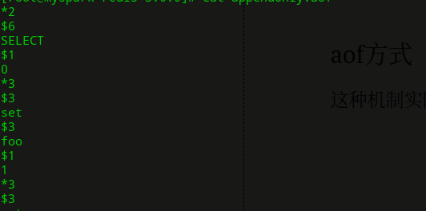

[TOC]

## Redis持久化机制

### SnapShotting方式

这是redis默认的持久化方式，将内存中的数据二进制的方式备份到磁盘中，生成dump.rdb

```
设置
save 900 1 #如果900s内，超过1个key被修改或者保存将会持久化
```

快照保存过程

````
后台会调用fork进程，有一个子进程和父进，子负责将内存中的数据入到临时文件（也就是备份的数据，此时内存会翻倍），父子进程是共享同一个物理磁盘，会处理写请求，然后将要写入的数据库的页面创建副本，而不是共享页面。当fork完毕之后会里临时文件会覆盖原来的备份文件。
注意点，①redis作，当在工作时，会阻塞一些请求
②：在redis备份条件未被触发的时候，如果挂了，会丢失内存数据
③：每次备份都是全量备份内存数据，数据量过大的时候容易造成大量io，=导致磁盘性能下降
````


### aof方式（apply-only-file）

这种机制实际就是将每个命令保存下来，当重启数据库的时候会根据日志文件的命令重构数据库，这也是比snap方式的慢的原因，1G需要20-30s，文件中格式如下，默认是在appendonly.aof中，需要我们在redis.conf中设置appendonly 为yes,也可以更改文件名。



这种方式虽然会将每一个命令都缓存在aof文件中，但是在os中并未立即写入到磁盘中，可能会到缓存，这就有可能导致数据丢失。

解决方法：通过fysnc机制（同步磁盘机制），同步到磁盘中

```
appendonly yes           #启用aof持久化方式
# appendfsync always   #每次收到写命令就立即强制写入磁盘，最慢的，但是保证完全的持久化，不推荐使用
appendfsync everysec     #每秒钟强制写入磁盘一次，在性能和持久化方面做了很好的折中，推荐
# appendfsync no    #完全依赖os，性能最好,持久化没保证
```

缺点：随着数据量的增加，aof的文件就会越来越来大，因为命令越来越多，所有有好多命令都是重复的比如,所有有一种类似压缩机制，将aof文件进行压缩，

```
①命令强制进行：bgrewriteaof
```

其实就是将当前数据库的快照写入到一个备份文件，过程和snapShot一样。

过程如下：

```
  1.  redis调用fork ，现在有父子两个进程
       2. 子进程根据内存中的数据库快照，往临时文件中写入重建数据库状态的命令
       3. 父进程继续处理client请求，除了把写命令写入到原来的aof文件中。同时把收到的写命令缓存起来。这样就能保证如果子进程重写失败的话并不会出问题。
       4. 当子进程把快照内容写入已命令方式写到临时文件中后，子进程发信号通知父进程。然后父进程把缓存的写命令也写入到临时文件。
       5. 现在父进程可以使用临时文件替换老的aof文件，并重命名，后面收到的写命令也开始往新的aof文件中追加。
       需要注意到是重写aof文件的操作，并没有读取旧的aof文件，而是将整个内存中的数据库内容用命令的方式重写了一个新的aof文件，这点和快照有点类似
```

## redis主从复制

## Redis悲观锁与乐观锁（分布式锁）

#### 悲观锁

总是假设最坏的情况，每次去拿数据的时候都认为别人会修改，所以每次在拿数据的时候都会上锁，这样别人想拿这个数据就会阻塞直到它拿到锁（共享资源每次只给一个线程使用，其它线程阻塞，用完后再把资源转让给其它线程）。传统的关系型数据库里边就用到了很多这种锁机制，比如行锁，表锁等，读锁，写锁等，都是在做操作之前先上锁。Java中synchronized和ReentrantLock等独占锁就是悲观锁思想的实现。

#### 乐观锁

总是假设最好的情况，每次去拿数据的时候都认为别人不会修改，所以不会上锁，但是在更新的时候会判断一下在此期间别人有没有去更新这个数据，可以使用版本号机制和CAS算法实现。乐观锁适用于多读的应用类型，这样可以提高吞吐量，像数据库提供的类似于write_condition机制，其实都是提供的乐观锁。在Java中java.util.concurrent.atomic包下面的原子变量类就是使用了乐观锁的一种实现方式CAS实现的。

业务问题：秒杀商品

业务角度：

````
在短的时间内多个用户争抢资源，这里的资源就是大部分指的是商品
````

技术角度：

```
就是多进程下多一个资源的抢夺。
```

解决：

```	
控制线程对资源的抢夺，既要保证高效并发，也要保证操作正确
①加锁（synchronized）获得资源的方法加锁（加入购物车）
②解决高并发，就是让线程排队（放入队列中）
以上方案发生的问题：
当同时操作不同商品，会发生问题，所以我们需要更细粒度加锁，比如对同一的商品的唯一标示符，设置互斥锁，所以就引入了分布式锁可以正好解决这个问题
```

具体的实现：


## Redis优化

eredis的读取和处理性能非常强大，一般[服务器](https://www.baidu.com/s?wd=%E6%9C%8D%E5%8A%A1%E5%99%A8&tn=24004469_oem_dg&rsv_dl=gh_pl_sl_csd)的cpu都不会是性能瓶颈。redis的性能瓶颈主要集中在内存和网络方面。所以，如果使用的redis命令多为O(N)、O(log(N))时间复杂度，那么基本上不会出现cpu瓶颈的情况。 

方案一：增加单机cpu核数


## Redis热点key问题

## Redis实现分布式锁

1.   　根据lockKey区进行setnx（set not exist，如果key值为空，则正常设置，返回1，否则不会进行设置并返回0）操作，如果设置成功，表示已经获得锁，否则并没有获取锁。
2. 　如果没有获得锁，去Redis上拿到该key对应的值，在该key上我们存储一个时间戳（用毫秒表示，t1），为了避免死锁以及其他客户端占用该锁超过一定时间（5秒），使用该客户端当前时间戳，与存储的时间戳作比较。
3. 　如果没有超过该key的使用时限，返回false，表示其他人正在占用该key，不能强制使用；如果已经超过时限，那我们就可以进行解锁，使用我们的时间戳来代替该字段的值。
4. 　但是如果在setnx失败后，get该值却无法拿到该字段时，说明操作之前该锁已经被释放，这个时候，最好的办法就是重新执行一遍setnx方法来获取其值以获得该锁。
5. 　释放锁：删除redis中key

