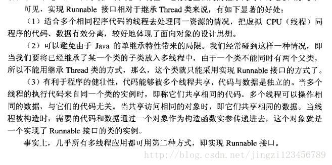
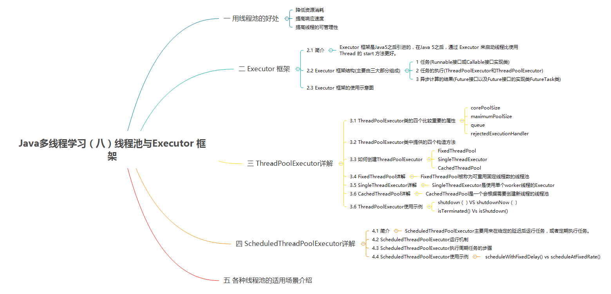

# Java多线程
目录  
一、进程与线程　　
- 1.1　进程的概念
- 1.2　线程的概念
- 1.3　多线程
- 1.4　线程的生命周期
二、异步与同步  
- 2.1 　同步的概念
- 2.2　异步的概念
三、并发(concurrency)与并行(parallelism)  
- 3.1　并发与并行的概念
- 3.2　高并发的概念及其指标
- 3.3　临界区
四、多线程用法详解  
- 4.1　继承Thread类与实现Runnable结构
- 4.2　线程池结构
- 4.3    使用线程池的好处
- 4.4    Exector架构的组成部分
- 4.5   线程池的使用步骤

## 多线程入门
### 一、进程与线程的概念及其区别？
#### 进程的概念：
程序一次执行的过程，是系统执行程序的基本单位，是一个程序从创建，运行，消亡的完整过程
#### 线程的概念：
比进程更小的执行单元，有一个程序有多个线程，一个程序的多个同类线程可以共享同一块内存空间与同一组系统资源，所以线程间切换，负担要小一点，所以也被称为轻量级进程，每个线程都有自己的内存栈空间  
#### 多线程
就是一个程序的多个线程“同时运行”在单核cpu中，是各个线程交替运行，在多核cpu，每个cpu有自己的运算器  
**注意**：线程可以跨核，进程不可以，多线程可以提高系统的并发能力以及性能
####线程的生命周期

-----------------
 ### 二、异步与同步
 #### 同步的概念
调用者需等到同步方法方法返回才可以执行后续的操作
#### 异步的概念
调用者直接调用异步方法，立即执行后续的操作
	
	扩充：在异步中最经典的场景就是消息队列，比如用户注册，等待手机验证成功后，在验证邮箱，数据库有序响应请求。
		利用消息队列，只发送消息，业务逻辑交给消息队列。
 ### 三、并发(concurrency)与并行(parallelism)
两者字面意思都表示同时执行，但是也侧重点不同  
①并发：表示多个任务之间，可以交替执行.  
②并行:真正意义上的并行执行，多个任务同时执行，在多核cpu中，因为每个cpu都有自己的运算器，所以可以同时计算  
 #### 高并发(High Concurrency)
在分布式架构中，指集群可以同时并行处理多个请求  
指标：响应时间(Response Time)，吞吐量(Throughput)，每秒查询率（QPS  Query per second ,并发用户数  
 #### 临界区
临界区，是用来表示一种公共资源或者共享数据，同时只能被一个线程所占有，此时想要占有必须等待被释放，在并行程序中临界区是保护对象  
 #### synchronized关键字
 ##### 为什么有synchronized
 #### volatile关键字
等待/通知（wait/notify）机制
 ### 四、多线程用法详解
 #### 继承Thread类与实现Runnable接口
通过源码发现Thread实现了Runnable接口

 #### 线程池结构
使用线程池的方式也是最推荐的一种方式，另外，《阿里巴巴Java开发手册》在第一章第六节并发处理这一部分也强调到“线程资源必须通过线程池提供，不允许在应用中自行显示创建线程”。这里就不给大家演示代码了，线程池这一节会详细介绍到这部分内容。

 #### 使用线程池的好处

·降低资源消耗。通过重复利用已创建的线程，来降低线程的创建和销毁的消耗  
·提高响应速度。当任务到达时，任务不需要等待线程创建就能立即执行  
·提高线程的可管理性。线程是稀缺资源，如果无限制的创建，不仅会消耗系统资源，还会减低系统的稳定性，使用线程池会可以进行统一的分配、调优和监控  

 #### Exector架构的组成部分
 ##### 1.任务
任务的（多线程的类）执行都要实现Runnale与Callable接口，这俩个都可以被ThreadPoolExector，SchedulePoolExector执行

	两者的区别：
	Runnale:无返回值
	Callable：可以返回结果
	两者可以转换
 ##### 2.任务执行
任务执行机制的核心接口Executor ，以及继承自Executor 接口的ExecutorService接口。**ScheduledThreadPoolExecutor**和**ThreadPoolExecutor**这两个关键类实现了**ExecutorService**接口。
注意： 通过查看ScheduledThreadPoolExecutor源代码我们发现**ScheduledThreadPoolExecutor实际上是继承了ThreadPoolExecutor并实现了ScheduledExecutorService ，而ScheduledExecutorService又实现了ExecutorService**，正如我们下面给出的类关系图显示的一样。

 ##### 3.异步计算的结果
Future接口以及Future接口的实现类FutureTask类.  
当我们把Runnable接口或Callable接口的实现类提交（调用submit方法）给ThreadPoolExecutor或ScheduledThreadPoolExecutor时，会返回一个FutureTask对象。  

我们以AbstractExecutorService接口中的一个submit方法为例子来看看源代码：  
**==架构示意图==**

 #### 线程池的使用步骤
步骤：
①主线程首先要创建的对象实现Callable或者Runnanle接口
	
		备注：Exectors中提供Exectors.Callable()方法，使得Callable的任务可以和Runnble的任务进行切换
②然后可以把创建好的Runnable与Runnable的任务直接交给==ExectorService.exectue==(Runnable)去执行，==ExectorService.submit==(Runnable task),ExectorService.submit(Callable task)去执行
	
	备注：ExectorService.exectue与ExectorService.submit区别？
	exectue：是提交的无返回值的任务，所以执行是否完毕，无法得知
	submit：与Exectue相反，可以通过get方法得到一个futureTask对象，来得到返回值结果，get(方法可以设置时间参数，此时任务也可能没有完成)
③如果执行ExecutorService.submit（…），ExecutorService将返回一个实现Future接口的对象（我们刚刚也提到过了执行execute()方法和submit()方法的区别，到目前为止的JDK中，返回的是FutureTask对象）。由于FutureTask实现了Runnable，程序员也可以创建FutureTask，然后直接交给ExecutorService执行。  
④主线程是可以通过FurtureTask.get来获取任务结果，FurtureTask.cancel()可以取消这个任务的执行。  
 #### ThreadPoolExector的四个重要属性
①：corePoolSize:核心线程池的大小  
②：MaximumPoolSize:最大线程池的大小  
③：rejectedExectionHandler:当线程池已经关闭或者线程池已经饱和的时候会执行Execute方法，（提供策略，默认是直接抛出异常）  
④：queue:等待的线程  
		
	备注：Exectors提供了四中封装好的线程池方法，底层都是这几个参数不一样，阿里巴巴公司建议我们手动去创建，否则可能会造成资源耗尽的情况。

