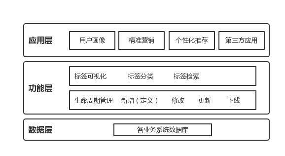

# 用户标签的体系架构

## 数据层

### 数据处理

数据通过各业务系统获取后，往往是杂乱无章的，需要对数据进行一定的处理，主要包含：数据整合、数据清洗、特征提取三个步骤。

### 数据整合

将不同业务系统中用户数据通过某一个关键字段关联，形成维度更全的数据，还以运营商数据为例，通常通过用户手机号码将用户基础信息、通话信息、上网信息以及位置信息等等进行关联，形成一个全维度的用户数据体系。

### 数据清洗

不同业务系统的用户数据包含的数据字段较多，通过分析发现很多数据字段对于生成用户标签没有过多的参考作用，同时在对数据进行处理过程中会发现一些数据质量的问题，如数据缺失，数据异常等等。数据清洗的作用就是去除无效数据，保留有价值数据。通过数据清洗，提升生成用户标签的准确性。特征提取。特征提取，即对处理过的用户数据进行特征识别，寻找有价值的字段数据，如针对于用户上网行为偏好标签的定义，需要提取用户上网行为字段的数据，通过对该字段数据的解析分析用户上网行为偏好。

## 功能层

### 标签生命周期管理

#### 标签新增（定义）

标签类型：定性标签、定量标签、衍生标签

1. **定性标签**，又可以称为静态标签，指不会随着时间以及用户行为变化而变化的标签，如用户的性别标签、年龄标签，这些标签都是不会随着时间或用户行为而变化的。
2. **定量标签**，又可以称为动态标签，指挥随着时间以及用户行为变化的标签，如用户活跃度标签，会根据特定时间段内用户特定行为的变化而变化。
3. **衍生标签**，又可以称为预测标签，指基于用户行为对用户未来行为进行预测的标签，如用户在过去一段时间经常访问汽车类APP，那么可以依据用户行为给用户打上有买车需求的标签.

#### 标签口径，与业务场景的深度结合

根据标签类型的不同，定义标签的规则也会不同。定性标签以事实为依据，而定量以及衍生标签则需要结合具体的业务场景而定义，这就需要标签的具体使用者即业务方深度参与定制，因为只有具体使用标签的人才会对业务、对行业有深刻的认知，基于这样的前提定义的标签的准确性以及价值才会最高。

#### 签的标注方法

基于标签的类型以及标签的口径，标签的标注主要有两种方式：基于人工的标注以及基于机器的标注。

1. 基于人工的标注方式更多依赖于人的经验，通过人为定义给出标注规则
2. 基于机器的标注方式更多依赖于机器学习算法，通过将影响因子提供给机器算法模型，通过机器的自学习给出不同权重并形成标签。

#### 标签更新

- 基于人工的标注方式，标签的更新往往通过标签实际效果以及具体使用标签人的经验对标签标注规则进行更新。

- 基于机器的标注方式，更为智能，通过数据的不断更新，机器会根据标签的反馈效果自动更新标签的规则。

#### 标签下线

对于无价值以及无时效性的标签进行下线操作，减少无效数据冗余，也减少标签使用者的选择成本。

### 标签可视化

#### 标签分类

标签的分类维度以及分类级别往往取决于标签的具体应用场景，如对用户APP偏好的标签分类，通常根据APP的类型分为工具类、购物类、社交类等多个类别。

如对用户访问内容的标签分类，则会更为深入，如对新闻资讯类内容的访问，又细分为时政要闻、体育资讯、科技资讯等等颗粒度更新的标签。

#### 标签检索

基于标签类型以及标签分类维度，帮助具体使用标签的用户找到符合需求的标签。

## 应用层

标签体系是对底层数据的整合与精细化管理，其作用是为上层应用提供数据支持的。

- 用户画像

  在精细化运营的时代，新用户的获取成本越来越高，产品以及运营的关注重点已经从对新客的获取转移到对存量用户的运营上。

  通过标签体系的搭建，可以形成更精确的用户画像，对用户群体进行分层，对不同类型的用户群进行针对性的运营和服务，提升存量用户的活跃以及付费转化。

- 精准营销

  精准营销场景更多体现在需要用户付费购买的产品上，与传统全量用户营销不同。

  精准营销可以通过标签定位目标用户群，针对不同目标用户群营销不同类型的产品及服务，极大程度提升用户的转化率以及营销效率。

- 个性化推荐

  个性化推荐的场景更多出现在内容社区、电商平台，给不同的用户推荐不同的内容或商品，提升用户感知，提高用户付费转化率。

- 第三方应用

  标签体系的搭建除了可以提供给内部业务部门做运营、分析使用，也可以作为数据基础服务提供给第三方用户使用，对第三方来说，看中的是数据的价值。