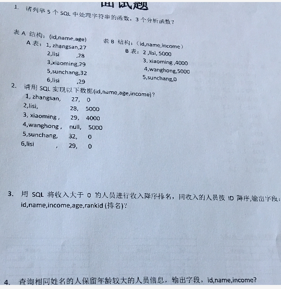
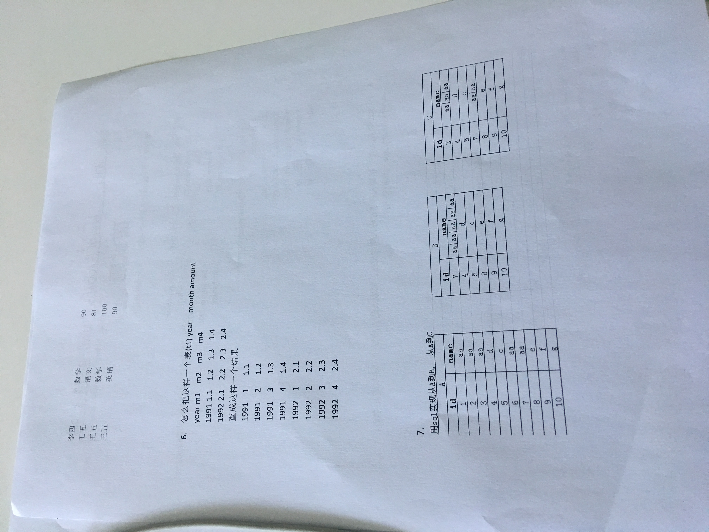

第一题：

```
五个字符串函数:concat_ws,split，concat，upper,lower,trim,reverse,substr,substring
三个分析函数:count，avg，max
```


第二题

```sql
--解法一:
select a.id,a.name,a.age,case b.income when null then 0 else b.income end 
from a
left join b
on a.id=b.id
--解法二:
select a.id,a.name,a.age,ifnull（b.income,0）
from a
left join b
on a.id=b.id
--解法三：
select a.id,a.name,a.age,if（b.income=null,0,b.income）
from a
left join b
on a.id=b.id

```

第三题

```sql
-- hql解法：
--考察排名函数的掌握程度
-- rank 15 15 17
-- row_number 15 16
-- dense_rank 15 15 16 16
select 
a.name,a.id,a.age,a.income,
rank(a.income) over(sort by a.income asc,a.id asc)
from a
where a.income > 0;

```

第四题

```sql
方案一：group by name 求最大年龄，然后根据name 与age获得id
方案二：用开窗函数 dense_rank() 然后 where  rank=1
```



第五题

```sql
select stu.name
from stu
group by stu.id stu.name
having sum(stu.fenshu)/count(1) > 80

```


第六题

```sql
-- 列转行
解法一
select substr(m1,1,1) `m`, m1 `score`
from a
union 
select substr(m2,1,1) `m`, m2 `score`
from a
union 
select substr(m3,1,1) `m`, m3 `score`
from a
```

第七题

```sql
--b表
--sql
select max(id) as id,group_concat(name separator '|')
from a
group by name
--hql
select max(id) as id,concat_ws('|',collect_list(name))(
from a
group by name
--c表


```


```
awk：
sed：sed ‘hellow’ ./abc
tr：
chmod: chomd 700 ./abc
grep cat ./abc | grep 'hellow'
```

